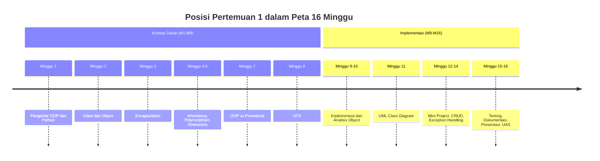
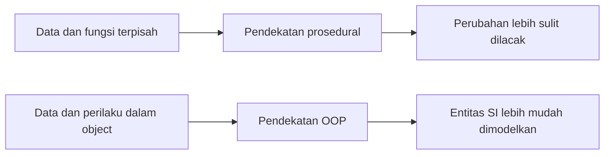
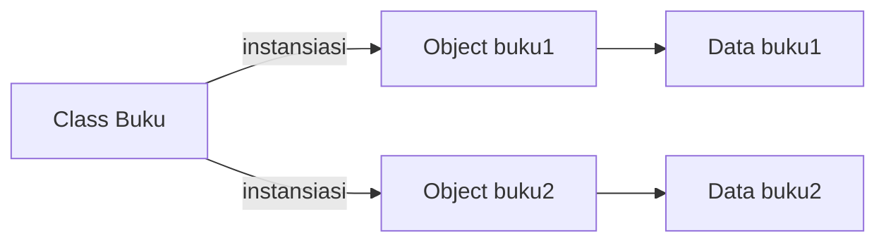
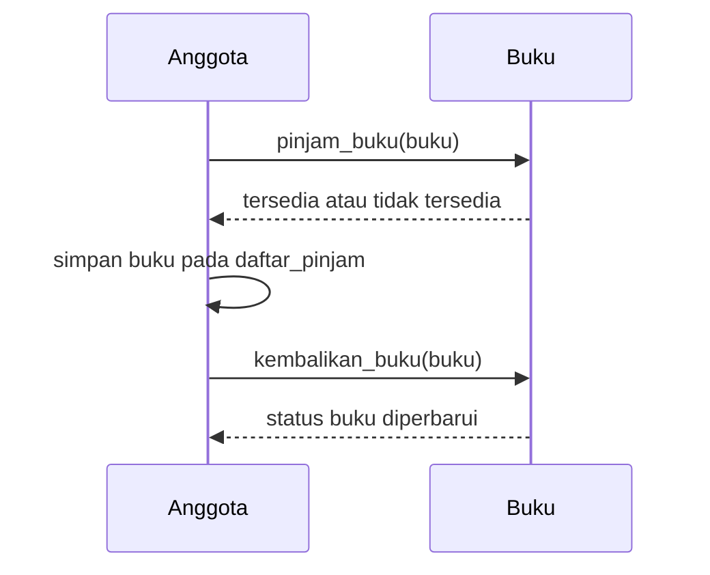

# Pertemuan 1 — Pengantar OOP & Python

| | |
|:--|:--|
| **Mata Kuliah** | USA-WP2360214 — Pemrograman Berorientasi Objek |
| **Pertemuan** | 1 dari 16 |
| **Tanggal** | Rabu, 16 September 2026 |
| **CPMK** | CPMK114 |
| **Materi** | Pengantar OOP & Python — paradigma OOP, class, object, attribute, method, constructor |
| **Model Pembelajaran** | Case Based Learning / Problem Based Learning |
| **Stack** | Python 3 |

> **Catatan penting:** Pertemuan 1 memperkenalkan konsep dasar OOP menggunakan Python melalui studi kasus Sistem Informasi. Materi ini menjadi dasar untuk class dan object pada pertemuan berikutnya, kemudian dilanjutkan dengan encapsulation, inheritance, polymorphism, abstraction, UML, dan mini project sesuai `Timeline.md`.

---

## Daftar Isi

- [Pertemuan 1 — Pengantar OOP \& Python](#pertemuan-1--pengantar-oop--python)
  - [Daftar Isi](#daftar-isi)
  - [1. Keterkaitan Pertemuan dengan RPS OBE](#1-keterkaitan-pertemuan-dengan-rps-obe)
  - [2. Capaian Pembelajaran Pertemuan](#2-capaian-pembelajaran-pertemuan)
  - [3. Relevansi OOP untuk Sistem Informasi](#3-relevansi-oop-untuk-sistem-informasi)
  - [4. Python untuk Pembelajaran OOP](#4-python-untuk-pembelajaran-oop)
  - [5. Paradigma Procedural dan OOP](#5-paradigma-procedural-dan-oop)
  - [6. Class dan Object](#6-class-dan-object)
  - [7. Attribute](#7-attribute)
  - [8. Method](#8-method)
  - [9. Constructor](#9-constructor)
  - [10. `self`](#10-self)
  - [11. Anatomi Class Python](#11-anatomi-class-python)
  - [12. Contoh Class Mahasiswa](#12-contoh-class-mahasiswa)
  - [13. CBL: Sistem Informasi Perpustakaan](#13-cbl-sistem-informasi-perpustakaan)
  - [14. Contoh Sistem Perpustakaan](#14-contoh-sistem-perpustakaan)
  - [15. Menjalankan Kode Praktikum](#15-menjalankan-kode-praktikum)
  - [16. Latihan Terbimbing](#16-latihan-terbimbing)
  - [17. Latihan Mandiri](#17-latihan-mandiri)
  - [18. Mini Challenge](#18-mini-challenge)
  - [19. Kesalahan Umum](#19-kesalahan-umum)
  - [20. Pemanfaatan AI sebagai Coding Assistant](#20-pemanfaatan-ai-sebagai-coding-assistant)
  - [21. Rangkuman](#21-rangkuman)
  - [22. Asesmen dan Penugasan](#22-asesmen-dan-penugasan)
    - [23. Persiapan menuju Pertemuan 2](#23-persiapan-menuju-pertemuan-2)
    - [24. Referensi](#24-referensi)
    - [25. Kode Praktikum Pertemuan 1](#25-kode-praktikum-pertemuan-1)

---

## 1. Keterkaitan Pertemuan dengan RPS OBE

Pertemuan 1 mendukung **CPMK114** dan `SUB-CPMK11401` pada RPS:

> Mahasiswa mampu menjelaskan paradigma OOP serta class, object, attribute, method, dan constructor.

Materi ini sesuai dengan `Timeline.md` Minggu 1: pengantar OOP dan Python, class, object, attribute, method, constructor, studi kasus Sistem Informasi, quiz, dan diskusi.



---

## 2. Capaian Pembelajaran Pertemuan

Setelah mengikuti pertemuan ini, mahasiswa mampu:

1. **Menjelaskan** alasan OOP penting dalam pengembangan Sistem Informasi
2. **Membedakan** paradigma *procedural* dan *object-oriented*
3. **Menjelaskan** konsep **class, object, attribute, method,** dan **constructor**
4. **Menjelaskan** peran `self` dan `__init__()` dalam Python
5. **Menulis** program Python sederhana berbasis class dan object
6. **Memodelkan** entitas Sistem Informasi Perpustakaan sebagai class Python

**Asesmen:** Quiz (Minggu 1) + Praktikum terbimbing + Latihan mandiri

---

## 3. Relevansi OOP untuk Sistem Informasi

Sistem Informasi (SI) memodelkan **dunia nyata**: mahasiswa, dosen, buku, transaksi, pegawai...

**Masalah pendekatan prosedural saat program membesar:**

- Data (variabel) dan perilaku (fungsi) **terpisah** → mudah tidak sinkron
- Perubahan kecil bisa merusak bagian lain (*ripple effect*)
- Sulit memetakan kode ke entitas bisnis yang dihadapi user

**Yang ditawarkan OOP:**

| Dunia Nyata / SI | OOP |
| ---------------- | --- |
| Mahasiswa, Buku, Transaksi | **Class** |
| Data yang dimiliki entitas | **Attribute** |
| Apa yang bisa dilakukan entitas | **Method** |
| Satu mahasiswa konkret | **Object** |

> 💡 Kode yang lebih mudah **dimengerti**, **diperbaiki**, dan **dikembangkan** — skill yang paling dicari saat membangun aplikasi SI skala industri.

---

## 4. Python untuk Pembelajaran OOP

**Python = bahasa #1 dunia** (indeks TIOBE & IEEE Spectrum, 2021–sekarang)

- **AI & Machine Learning:** PyTorch, TensorFlow, scikit-learn
- **Data Engineering & Analytics:** pandas, Polars, Apache Airflow
- **Backend Web & API:** Django, FastAPI
- **Otomasi & DevOps:** scripting, CI/CD, testing
- **LLM Engineering:** LangChain, integrasi OpenAI/Anthropic API

**Mengapa Python untuk belajar OOP?**

- Sintaks bersih → fokus pada **konsep OOP**, bukan tata bahasa
- `python3`, `pip`, `venv` tersedia di semua OS
- Tool AI coding assistant (Copilot, Cursor, ChatGPT/Claude) paling matang untuk Python

> 📈 Karier SI 2026: *Data Analyst* → *Data Engineer* → *AI Engineer* — semuanya Python-first.

---

## 5. Paradigma Procedural dan OOP

**Procedural:** program = urutan instruksi + fungsi yang memproses data terpisah

```python
# PROSEDURAL
mahasiswa_nama = "Budi"
mahasiswa_nim = "SI-101"
mahasiswa_sks = 24

def tampilkan(nama, nim, sks):
    print(f"{nama} ({nim}) - {sks} SKS")

tampilkan(mahasiswa_nama, mahasiswa_nim, mahasiswa_sks)
```

**OOP:** data + perilaku dibungkus jadi satu (**object**)

```python
# OOP
class Mahasiswa:
    def __init__(self, nama, nim, sks):
        self.nama = nama
        self.nim = nim
        self.sks = sks

    def perkenalan(self):
        print(f"{self.nama} ({self.nim}) - {self.sks} SKS")

mhs = Mahasiswa("Budi", "SI-101", 24)
mhs.perkenalan()
```

**Perbedaan inti:**

| Aspek | Procedural | OOP |
| ----- | ---------- | --- |
| Unit utama | Fungsi | Object (class) |
| Data & perilaku | Terpisah | Menyatu (*encapsulation*) |
| Cocok untuk | Script kecil | Aplikasi SI besar |



Diagram tersebut membandingkan lokasi data dan perilaku pada pendekatan prosedural dan OOP.

---

## 6. Class dan Object

**Class** = *blueprint/cetakan* → mendefinisikan data & perilaku
**Object** = *instansiasi* class → wujud nyata di memori

```python
class Buku:
    pass  # blueprint kosong dulu

# Membuat object (instansiasi)
buku1 = Buku()
buku2 = Buku()
```

**Analogi:** Class = cetakan kue 🍪, Object = kue jadi.
Satu cetakan → banyak kue, tiap kue bisa berbeda isi (coklat, keju...).

```
     Class Buku            Object buku1        Object buku2
  ┌─────────────────┐    ┌──────────────┐    ┌──────────────┐
  │ judul           │    │ judul="AI 101"│   │ judul="PBO"  │
  │ penulis         │ →  │ penulis="Ani" │   │ penulis="Ben"│
  │ tersedia        │    │ tersedia=True │   │ tersedia=False│
  └─────────────────┘    └──────────────┘    └──────────────┘
```

> Ingat: **class sekali dibuat, object bisa banyak** — masing-masing punya data sendiri.



Satu class dapat digunakan untuk membuat beberapa object dengan data instance yang berbeda.

---

## 7. Attribute

**Attribute** = variabel yang menempel pada object.

**Dua jenis:**

```python
class Mahasiswa:
    jumlah_mahasiswa = 0          # class attribute (dibagi semua object)

    def __init__(self, nama, nim):
        self.nama = nama          # instance attribute (milik tiap object)
        self.nim = nim
        Mahasiswa.jumlah_mahasiswa += 1

m1 = Mahasiswa("Budi", "SI-101")
m2 = Mahasiswa("Ani", "SI-102")

print(m1.nama)                    # Budi
print(m2.nama)                    # Ani
print(Mahasiswa.jumlah_mahasiswa) # 2
```

- **Instance attribute:** `m1.nama` ≠ `m2.nama` — tiap object beda
- **Class attribute:** satu nilai untuk semua object (misal counter, konstanta)

---

## 8. Method

**Method** = fungsi yang didefinisikan di dalam class → perilaku object.

```python
class Buku:
    def __init__(self, judul, penulis):
        self.judul = judul
        self.penulis = penulis
        self.tersedia = True

    def info(self):                      # method menampilkan info
        status = "Tersedia" if self.tersedia else "Dipinjam"
        print(f"'{self.judul}' — {self.penulis} [{status}]")

    def pinjam(self):                    # method mengubah state
        if self.tersedia:
            self.tersedia = False
            print(f"Buku '{self.judul}' dipinjam.")
        else:
            print(f"Maaf, '{self.judul}' sedang dipinjam.")

buku = Buku("OOP dengan Python", "Andi")
buku.info()      # 'OOP dengan Python' — Andi [Tersedia]
buku.pinjam()    # Buku 'OOP dengan Python' dipinjam.
buku.info()      # 'OOP dengan Python' — Andi [Dipinjam]
```

> Method bisa **membaca** dan **mengubah** attribute object itu sendiri.

---

## 9. Constructor

**Constructor** = method khusus yang otomatis dipanggil saat object dibuat.

```python
class Mahasiswa:
    def __init__(self, nama, nim):   # dipanggil oleh Mahasiswa(...)
        self.nama = nama
        self.nim = nim
        print(f"Object Mahasiswa {nama} berhasil dibuat!")

mhs = Mahasiswa("Budi", "SI-101")
# Output: Object Mahasiswa Budi berhasil dibuat!
```

**Kegunaan constructor:**

- Memberi **nilai awal** attribute saat object lahir
- Memastikan object **selalu valid** sejak awal (misal `tersedia = True`)
- Menerima **parameter** dari pemanggil: `Mahasiswa("Budi", "SI-101")`

> Tanpa `__init__`, object dibuat "kosong" — kita harus mengisi attribute satu per satu.

---

## 10. `self`

**`self`** = referensi ke **object sendiri** yang sedang memanggil method.

```python
class Mahasiswa:
    def perkenalan(self):
        print(f"Saya {self.nama}")   # self = object yang memanggil

m1 = Mahasiswa(); m1.nama = "Budi"
m2 = Mahasiswa(); m2.nama = "Ani"

m1.perkenalan()   # self → m1  → "Saya Budi"
m2.perkenalan()   # self → m2  → "Saya Ani"
```

**Cara Python menerjemahkan:**

```python
m1.perkenalan()           # bentuk panggilan
Mahasiswa.perkenalan(m1)  # makna sebenarnya: m1 dikirim sebagai self
```

**Aturan penting:**

- `self` **wajib** menjadi **parameter pertama** setiap instance method
- Nama `self` hanyalah **kesepakatan** — tapi **jangan ganti** (konvensi seluruh komunitas Python)
- Di dalam method, akses attribute selalu lewat `self.attribute`

---

## 11. Anatomi Class Python

Semua konsep dalam satu gambar:

```python
class Mahasiswa:                    # 1. definisi class (CamelCase)
    universitas = "UNSAP"           # 2. class attribute

    def __init__(self, nama, nim):  # 3. constructor
        self.nama = nama            # 4. instance attribute
        self.nim = nim

    def perkenalan(self):           # 5. instance method
        print(f"Saya {self.nama} dari {self.universitas}")

    def __str__(self):              # 6. method khusus (magic method)
        return f"Mahasiswa({self.nama}, {self.nim})"


mhs = Mahasiswa("Budi", "SI-101")   # 7. instansiasi → __init__ jalan otomatis
print(mhs)                          # Mahasiswa(Budi, SI-101)
mhs.perkenalan()                    # Saya Budi dari UNSAP
```

**Ingat penomoran:** 1 definisi → 2 class attribute → 3 constructor → 4 instance attribute → 5 method → 6 magic method → 7 instansiasi.

---

## 12. Contoh Class Mahasiswa

📄 **File:** `../code/pertemuan-01/mahasiswa.py`

```python
class Mahasiswa:
    """Class Mahasiswa untuk data akademik sederhana."""

    jumlah_mahasiswa = 0  # class attribute

    def __init__(self, nama, nim, prodi="Sistem Informasi"):
        self.nama = nama
        self.nim = nim
        self.prodi = prodi
        self.sks = 0
        Mahasiswa.jumlah_mahasiswa += 1

    def tambah_sks(self, jumlah):
        self.sks += jumlah
        print(f"{self.nama}: total {self.sks} SKS")

    def perkenalan(self):
        print(f"Halo, saya {self.nama} ({self.nim}) - {self.prodi}")

    def __str__(self):
        return f"Mahasiswa({self.nama}, {self.nim})"


# === Program utama ===
if __name__ == "__main__":
    m1 = Mahasiswa("Jhon Doe", "SI-101")
    m2 = Mahasiswa("Ani Lestari", "SI-102")

    m1.perkenalan()
    m2.perkenalan()

    m1.tambah_sks(3)
    m1.tambah_sks(2)
    m2.tambah_sks(4)

    print(m1)
    print(f"Total mahasiswa: {Mahasiswa.jumlah_mahasiswa}")
```

**Output yang diharapkan:**
```
Halo, saya Jhon Doe (SI-101) - Sistem Informasi
Halo, saya Ani Lestari (SI-102) - Sistem Informasi
Jhon Doe: total 3 SKS
Jhon Doe: total 5 SKS
Ani Lestari: total 4 SKS
Mahasiswa(Jhon Doe, SI-101)
Total mahasiswa: 2
```

---

## 13. CBL: Sistem Informasi Perpustakaan

**Skenario:** Perpustakaan kampus meminjamkan buku ke mahasiswa.

**Langkah analisis object (minggu 10 akan kita dalami):**

1. Cari **kata benda** penting → calon class: `Buku`, `Anggota`
2. Cari **data** yang dimiliki tiap benda → attribute
3. Cari **aksi/peristiwa** → method

| Entitas | Attribute | Method |
| ------- | --------- | ------ |
| `Buku` | judul, penulis, tersedia | `info()`, `pinjam()`, `kembalikan()` |
| `Anggota` | nama, id_anggota, daftar_pinjam | `pinjam_buku()`, `kembalikan_buku()`, `lihat_pinjaman()` |

**Interaksi antar-object:**

```
Anggota --pinjam_buku(buku)--> Buku
   │                             │
   │ tambah ke daftar_pinjam     │ tersedia = False
   ▼                             ▼
```

> 🎯 Ini yang dimaksud "OOP memodelkan dunia nyata": object **saling bekerja sama** lewat pemanggilan method.



Diagram ini menunjukkan hubungan method antara object `Anggota` dan `Buku` pada studi kasus perpustakaan.

---

## 14. Contoh Sistem Perpustakaan

📄 **File:** `../code/pertemuan-01/perpustakaan.py`

```python
class Buku:
    """Merepresentasikan satu buku di perpustakaan."""

    def __init__(self, judul, penulis):
        self.judul = judul
        self.penulis = penulis
        self.tersedia = True

    def pinjam(self):
        if self.tersedia:
            self.tersedia = False
            return True
        return False

    def kembalikan(self):
        self.tersedia = True

    def __str__(self):
        status = "Tersedia" if self.tersedia else "Dipinjam"
        return f"'{self.judul}' oleh {self.penulis} [{status}]"


class Anggota:
    """Merepresentasikan anggota perpustakaan."""

    def __init__(self, nama, id_anggota):
        self.nama = nama
        self.id_anggota = id_anggota
        self.daftar_pinjam = []   # list berisi object Buku

    def pinjam_buku(self, buku):
        if buku.pinjam():                       # object Buku bekerja
            self.daftar_pinjam.append(buku)
            print(f"{self.nama} meminjam '{buku.judul}'")
        else:
            print(f"'{buku.judul}' sedang tidak tersedia")

    def kembalikan_buku(self, buku):
        if buku in self.daftar_pinjam:
            buku.kembalikan()
            self.daftar_pinjam.remove(buku)
            print(f"{self.nama} mengembalikan '{buku.judul}'")
        else:
            print(f"{self.nama} tidak meminjam '{buku.judul}'")

    def lihat_pinjaman(self):
        print(f"Pinjaman {self.nama}:")
        if not self.daftar_pinjam:
            print("  (tidak ada)")
        for buku in self.daftar_pinjam:
            print(f"  - {buku.judul}")


# === Program utama ===
if __name__ == "__main__":
    buku1 = Buku("Pemrograman Python", "Andi")
    buku2 = Buku("Basis Data", "Budi")
    anggota = Anggota("Citra", "A-001")

    anggota.pinjam_buku(buku1)
    anggota.pinjam_buku(buku2)
    anggota.lihat_pinjaman()

    anggota.kembalikan_buku(buku1)
    anggota.lihat_pinjaman()
    print(buku1)
```

**Output yang diharapkan:**
```
Citra meminjam 'Pemrograman Python'
Citra meminjam 'Basis Data'
Pinjaman Citra:
  - Pemrograman Python
  - Basis Data
Citra mengembalikan 'Pemrograman Python'
Pinjaman Citra:
  - Basis Data
'Pemrograman Python' oleh Andi [Tersedia]
```

---

## 15. Menjalankan Kode Praktikum

Cara menjalankan file contoh (lihat juga `01-IDE.md`):

```bash
# 1. Pastikan Python 3 ter-install
python --version

# 2. Masuk folder kode
cd ../code/pertemuan-01

# 3. Jalankan
python mahasiswa.py
python perpustakaan.py
```

**Eksperimen yang disarankan saat praktikum:**

1. Tambah attribute `tahun` pada class `Buku` → update `__str__`
2. Buat object ke-3 `Mahasiswa`, cek `jumlah_mahasiswa` menjadi 3
3. Coba pinjam buku yang sama dua kali — amati pesan error-nya
4. Panggil `buku1.pinjam()` langsung tanpa lewat `Anggota` — apa yang terjadi?

> 💡 Jangan hanya membaca kode — **ubah, jalankan, rusak, perbaiki**. Itu cara belajar OOP tercepat.

---

## 16. Latihan Terbimbing

**Bersama-sama di kelas (± 30 menit):**

Buat class `Dosen` dengan spesifikasi:

| Bagian | Isi |
| ------ | --- |
| Attribute | `nama`, `nidn`, `mata_kuliah` |
| Constructor | menerima 3 parameter di atas |
| Method `mengajar()` | cetak `"Dosen {nama} mengajar {mata_kuliah}"` |
| Method `perkenalan()` | cetak `"Saya {nama}, NIDN {nidn}"` |

**Kerangka awal (lengkapi):**

```python
class Dosen:
    def __init__(self, nama, nidn, mata_kuliah):
        # TODO 1: simpan ketiga parameter sebagai attribute
        pass

    def mengajar(self):
        # TODO 2: cetak "Dosen {nama} mengajar {mata_kuliah}"
        pass

    def perkenalan(self):
        # TODO 3: cetak "Saya {nama}, NIDN {nidn}"
        pass


dosen = Dosen("Pak Yofi", "001234", "PBO")
dosen.mengajar()      # Dosen Pak Yofi mengajar PBO
dosen.perkenalan()    # Saya Pak Yofi, NIDN 001234
```

**Target:** mahasiswa menyelesaikan 3 TODO bersama, lalu jalankan dan cocokkan output.

---

## 17. Latihan Mandiri

**Kerjakan di rumah, serahkan sebelum pertemuan berikutnya:**

Buat file `latihan_mandiri_1.py` berisi class `Produk`:

1. **Attribute:** `nama`, `harga`, `stok`
2. **Constructor:** mengisi ketiga attribute dari parameter
3. **Method `info()`:** mencetak `"{nama} - Rp{harga} (stok: {stok})"`
4. **Method `jual(jumlah)`:** mengurangi stok; tolak jika stok kurang dari `jumlah` (cetak pesan)
5. **Method `restock(jumlah)`:** menambah stok
6. **Bonus:** tambahkan class attribute `total_produk` yang menghitung jumlah object `Produk` yang dibuat

**Contoh pemakaian:**

```python
p = Produk("Laptop", 8000000, 5)
p.info()          # Laptop - Rp8000000 (stok: 5)
p.jual(2)
p.info()          # Laptop - Rp8000000 (stok: 3)
p.jual(10)        # Stok tidak cukup!
p.restock(10)
p.info()          # Laptop - Rp8000000 (stok: 13)
```

**Kriteria penilaian:** constructor benar (30%), method jalan sesuai output (50%), gaya penulisan rapi & PEP 8 (20%).

---

## 18. Mini Challenge

**"Perpustakaan Plus" — tingkatkan sistem perpustakaan:**

Tambahkan ke class `Buku` (dari `perpustakaan.py`):

1. Attribute `kode` (misal `BK-001`) — unik untuk tiap buku
2. Attribute `dipinjam_oleh` — menyimpan nama anggota yang meminjam (atau `None`)
3. Update `__str__` agar menampilkan kode dan peminjam
4. Di class `Anggota`, saat pinjam → set `buku.dipinjam_oleh = self.nama`

**Level 2 (untuk yang cepat selesai):**

- Tambah class `Perpustakaan` dengan attribute `daftar_buku` (list)
- Method `tambah_buku(buku)` dan `cari_buku(judul)` yang mengembalikan object `Buku` atau `None`

**Ketentuan:**

- ⏱️ 20 menit di kelas, boleh berpasangan (*pair programming*)
- ✅ Wajib jalan tanpa error
- 🚀 Demo 1 menit di depan: tunjukkan object berinteraksi

> Pertanyaan pemantik: bagaimana memastikan dua buku tidak punya kode sama?

---

## 19. Kesalahan Umum

| # | Kesalahan | Contoh Salah | Perbaikan |
| - | --------- | ------------ | --------- |
| 1 | Lupa `self` di method | `def pinjam(self):` ditulis `def pinjam():` | Selalu tulis `self` pertama |
| 2 | Lupa `self.` saat akses attribute | `judul = judul` | `self.judul = judul` |
| 3 | Memanggil `__init__` manual | `mhs.__init__("Budi")` | `mhs = Mahasiswa("Budi")` |
| 4 | Nama class tidak CamelCase | `class mahasiswa:` | `class Mahasiswa:` |
| 5 | Indentasi salah (bukan 4 spasi) | campur tab & spasi | konsisten 4 spasi |
| 6 | Kirim `self` saat memanggil method | `m1.perkenalan(m1)` | `m1.perkenalan()` |
| 7 | Pakai `=` bukan `==` di kondisi | `if tersedia = True:` | `if self.tersedia:` |

**Error yang paling sering muncul malam ini:**

```python
TypeError: pinjam() takes 0 positional arguments but 1 was given
```
→ artinya kamu lupa menulis `self` di parameter method. 🙂

**Class attribute vs instance attribute:**

```python
class Kucing:
    suara = "Meong"     # class attribute — akses: Kucing.suara / self.suara

k = Kucing()
k.nama = "Kitty"        # instance attribute — hanya milik k
```

---

## 20. Pemanfaatan AI sebagai Coding Assistant

**AI assistant (GitHub Copilot, ChatGPT, Claude, Gemini) boleh dipakai — dengan cara yang benar:**

**✅ Gunakan AI untuk:**

- Menjelaskan perbedaan `class`, `object`, class attribute, dan instance attribute.
- Membantu membaca pesan `TypeError` atau `AttributeError` setelah Anda mencoba menjalankan kode.
- Mereview penggunaan `self` dan `__init__()` pada class yang sudah Anda tulis.
- Membuat contoh pemakaian method untuk diuji secara mandiri.
- Menjelaskan kode contoh `mahasiswa.py` atau `perpustakaan.py` baris demi baris.

**❌ Jangan gunakan AI untuk:**

- Menuliskan seluruh tugas atau latihan yang seharusnya Anda kerjakan.
- Menyalin solusi class `Produk` tanpa memahami constructor dan method-nya.
- Mengabaikan error karena kode yang dihasilkan AI terlihat benar.
- Memasukkan data pribadi atau kredensial ke dalam prompt.

**Etika di kelas ini:**

1. Anda wajib dapat menjelaskan setiap class, object, attribute, method, dan constructor yang diserahkan.
2. Jika memakai AI, cantumkan pada komentar kode atau refleksi. Contoh yang sesuai dengan materi class attribute dan instance attribute:

   ```python
   # Bantuan: ChatGPT — penjelasan class attribute dan instance attribute.
   class Mahasiswa:
       jumlah_mahasiswa = 0

       def __init__(self, nama):
           self.nama = nama
           Mahasiswa.jumlah_mahasiswa += 1
   ```

3. AI digunakan sebagai asisten, bukan pengganti. Anda tetap bertanggung jawab memahami, menjalankan, dan menguji kode yang diserahkan.

---

## 21. Rangkuman

**Konsep hari ini:**

| Konsep | Satu Kalimat |
| ------ | ------------ |
| **OOP** | Paradigma yang membungkus data + perilaku dalam object |
| **Class** | Blueprint/cetakan object |
| **Object** | Wujud nyata dari class, punya data sendiri |
| **Attribute** | Data yang dimiliki object (instance & class attribute) |
| **Method** | Perilaku/fungsi milik object |
| **Constructor `__init__`** | Method otomatis yang mengisi nilai awal object |
| **`self`** | Referensi object yang sedang memanggil method |

**Alur berpikir OOP:** identifikasi entitas → definisikan class → tentukan attribute & method → instansiasi object → object berinteraksi.

**Pertemuan depan (Minggu 2):** *Class & Object dengan Python* — praktikum penuh membuat class, object, attribute, method, dan constructor dari studi kasus Sistem Informasi.

---

## 22. Asesmen dan Penugasan

**Penilaian pertemuan ini:**

| Komponen | Bentuk | Bobot |
| -------- | ------ | ----- |
| Quiz | 5 soal singkat (konsep class/object/self) | skor quiz minggu ini |
| Latihan terbimbing | Class `Dosen` selesai di kelas | partisipasi |
| Latihan mandiri | `latihan_mandiri_1.py` (class `Produk`) | diserahkan |
| Mini challenge | "Perpustakaan Plus" | bonus |

**Batas penyerahan:** Latihan mandiri diserahkan **sebelum pertemuan ke-2** (Rabu, 23 September 2026, 15:30).

**Cara kumpul:** commit & push ke repo pribadi masing-masing dengan pesan:
`feat: latihan mandiri pertemuan 1 - class Produk`

**Checklist sebelum kumpul:**

- [ ] Kode jalan tanpa error (`python latihan_mandiri_1.py`)
- [ ] Semua method sesuai spesifikasi bagian Latihan Mandiri
- [ ] Output cocok dengan contoh
- [ ] Sudah coba jelaskan kode ke teman tanpa melihat

---

## 23. Persiapan menuju Pertemuan 2

Pada Pertemuan 2, mahasiswa akan membuat dan menggunakan class, object, attribute, method, dan constructor secara lebih terstruktur.

Persiapkan hal berikut:

- Baca ulang bagian class, object, attribute, method, constructor, dan `self`.
- Jalankan ulang `mahasiswa.py` dan `perpustakaan.py`.
- Selesaikan `latihan_mandiri_1.py` sesuai spesifikasi class `Produk`.
- Bawa satu contoh entitas Sistem Informasi yang dapat dimodelkan sebagai class.

---

## 24. Referensi

Materi berikutnya membahas class dan object dengan Python sesuai urutan pembelajaran pada `Timeline.md`.

**Referensi belajar:**

- [Python Docs — Classes (Bab 9 Tutorial)](https://docs.python.org/3/tutorial/classes.html)
- [Real Python — Object-Oriented Programming (OOP) in Python 3](https://realpython.com/python3-object-oriented-programming/)
- [W3Schools — Python Classes and Objects](https://www.w3schools.com/python/python_classes.asp)
- [Refactoring Guru — Prinsip OOP](https://refactoring.guru/design-patterns)

---

## 25. Kode Praktikum Pertemuan 1

- [`../code/pertemuan-01/mahasiswa.py`](../code/pertemuan-01/mahasiswa.py) — contoh class `Mahasiswa`, class attribute, instance attribute, method, dan constructor.
- [`../code/pertemuan-01/perpustakaan.py`](../code/pertemuan-01/perpustakaan.py) — contoh interaksi object `Buku` dan `Anggota`.
- [`../code/pertemuan-01/latihan_terbimbing.py`](../code/pertemuan-01/latihan_terbimbing.py) — scaffold latihan class `Dosen`.
- [`../code/pertemuan-01/latihan_mandiri_1.py`](../code/pertemuan-01/latihan_mandiri_1.py) — scaffold latihan class `Produk`.

