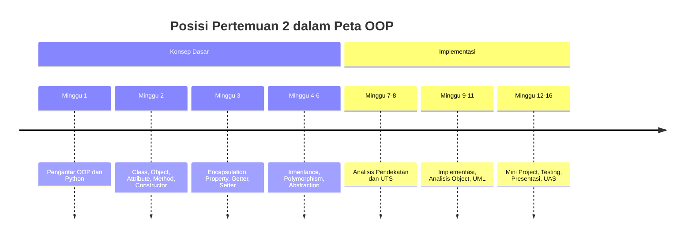
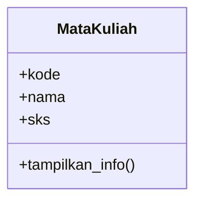
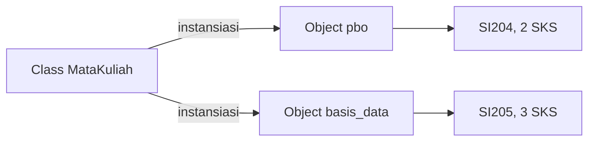
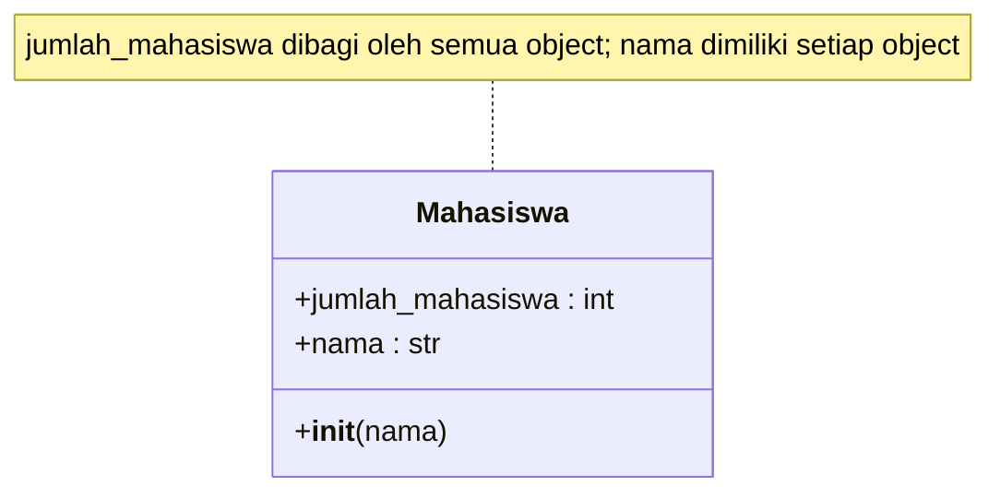
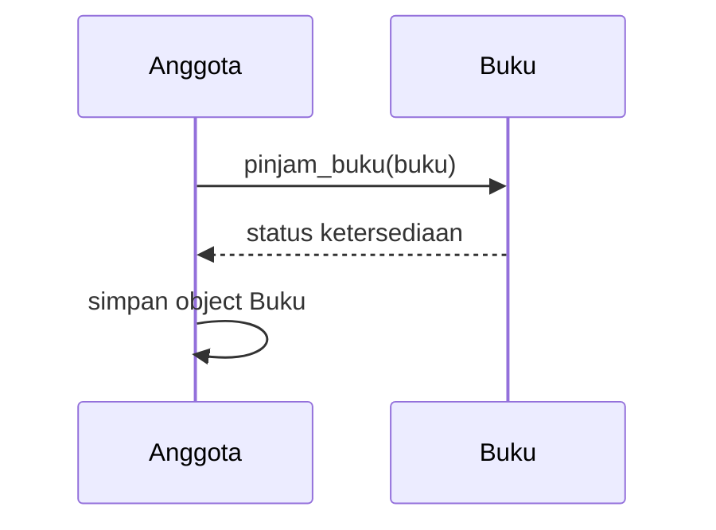
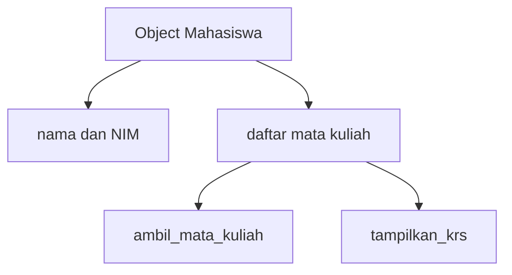

# Pertemuan 2 — Class dan Object dengan Python

| | |
|:--|:--|
| **Mata Kuliah** | USA-WP2360214 — Pemrograman Berorientasi Objek |
| **Pertemuan** | 2 dari 16 |
| **Tanggal** | Rabu, 23 September 2026 |
| **CPMK** | CPMK114 |
| **Materi** | Class, object, attribute, method, constructor, dan interaksi object |
| **Model Pembelajaran** | Case Based Learning / Problem Based Learning / Pair Programming |
| **Stack** | Python 3 |

> **Catatan penting:** Pertemuan 2 berfokus pada kemampuan membuat dan menggunakan class, object, attribute, method, dan constructor. Anda akan mengembangkan contoh Pertemuan 1 menjadi object yang memiliki data dan perilaku, lalu menerapkan interaksi antar-object pada studi kasus Sistem Informasi.

---

## Daftar Isi

- [Pertemuan 2 — Class dan Object dengan Python](#pertemuan-2--class-dan-object-dengan-python)
  - [Daftar Isi](#daftar-isi)
  - [1. Keterkaitan Pertemuan dengan RPS OBE](#1-keterkaitan-pertemuan-dengan-rps-obe)
  - [2. Capaian Pembelajaran Pertemuan](#2-capaian-pembelajaran-pertemuan)
  - [3. Pemantik Kasus: Data Akademik yang Perlu Dimodelkan](#3-pemantik-kasus-data-akademik-yang-perlu-dimodelkan)
  - [4. Class sebagai Definisi Data dan Perilaku](#4-class-sebagai-definisi-data-dan-perilaku)
  - [5. Object dan Instansiasi](#5-object-dan-instansiasi)
  - [6. Constructor dan Nilai Awal](#6-constructor-dan-nilai-awal)
  - [7. Instance Attribute dan Class Attribute](#7-instance-attribute-dan-class-attribute)
  - [8. Method dan Perubahan State](#8-method-dan-perubahan-state)
  - [9. Interaksi Antar-Object](#9-interaksi-antar-object)
  - [10. Object Representation dengan `__str__`](#10-object-representation-dengan-__str__)
  - [11. Studi Kasus: KRS Mahasiswa](#11-studi-kasus-krs-mahasiswa)
  - [12. Case Based Learning: Perpustakaan](#12-case-based-learning-perpustakaan)
  - [13. Aktivitas Kelompok](#13-aktivitas-kelompok)
  - [14. Latihan Individu](#14-latihan-individu)
  - [15. Pemanfaatan AI sebagai Coding Assistant](#15-pemanfaatan-ai-sebagai-coding-assistant)
  - [16. Kuis Formatif](#16-kuis-formatif)
    - [17. Asesmen dan Penugasan](#17-asesmen-dan-penugasan)
    - [18. Persiapan menuju Pertemuan 3](#18-persiapan-menuju-pertemuan-3)
    - [19. Referensi dan Kode Praktikum](#19-referensi-dan-kode-praktikum)

---

## 1. Keterkaitan Pertemuan dengan RPS OBE

Pertemuan 2 mendukung **CPMK114** dan `SUB-CPMK11401` pada RPS:

> Mahasiswa mampu membuat dan menggunakan class, object, attribute, method, dan constructor.

Indikator RPS pada minggu ini adalah mahasiswa mampu membuat program Python sederhana yang mendefinisikan class, membuat object, dan memanggil method. Materi menggunakan demonstrasi, praktikum terbimbing, dan pair programming.



---

## 2. Capaian Pembelajaran Pertemuan

Setelah mengikuti pertemuan ini, mahasiswa mampu:

| No. | Kemampuan | Indikator |
| :-: | --------- | --------- |
| 1 | Membuat class Python | Mendefinisikan class dengan nama dan struktur yang sesuai |
| 2 | Membuat object | Melakukan instansiasi class dan menyimpan object pada variable |
| 3 | Menggunakan constructor | Mengisi nilai awal object melalui `__init__()` |
| 4 | Membedakan attribute dan method | Menentukan data dan perilaku pada class |
| 5 | Mengubah state object | Membuat method yang memperbarui attribute object |
| 6 | Menjelaskan interaksi object | Menunjukkan satu object memanggil method object lain |

---

## 3. Pemantik Kasus: Data Akademik yang Perlu Dimodelkan

Sistem Informasi akademik perlu menyimpan data mahasiswa dan mata kuliah. Data mahasiswa tidak hanya berupa nama dan NIM, tetapi juga daftar mata kuliah yang diambil. Setiap mata kuliah memiliki kode, nama, dan jumlah SKS.

Analisis kasus berikut:

- Data apa yang harus dimiliki object `Mahasiswa`?
- Method apa yang diperlukan untuk menambahkan mata kuliah?
- Bagaimana mencegah mata kuliah yang sama ditambahkan dua kali?
- Mengapa data dua mahasiswa tidak boleh disimpan pada attribute yang sama?
- Bagaimana object `Mahasiswa` dapat berinteraksi dengan object `MataKuliah`?

Pada akhir pertemuan, Anda akan membuat class dengan constructor, method perubahan data, dan object yang menyimpan state masing-masing.

---

## 4. Class sebagai Definisi Data dan Perilaku

Class mendefinisikan attribute dan method yang dimiliki object. Class belum mewakili satu data mahasiswa tertentu; class menjadi struktur yang digunakan saat object dibuat.

```python
class MataKuliah:
    def __init__(self, kode, nama, sks):
        self.kode = kode
        self.nama = nama
        self.sks = sks

    def tampilkan_info(self):
        print(f"{self.kode} - {self.nama} ({self.sks} SKS)")
```



Gunakan class untuk mendefinisikan struktur yang dapat digunakan secara konsisten oleh banyak object.

---

## 5. Object dan Instansiasi

Instansiasi adalah proses membuat object dari class. Setiap object memiliki identitas dan dapat memiliki nilai attribute yang berbeda.

```python
pbo = MataKuliah("SI204", "Pemrograman Berorientasi Objek", 2)
basis_data = MataKuliah("SI205", "Basis Data", 3)

pbo.tampilkan_info()
basis_data.tampilkan_info()
```



Class yang sama dapat menghasilkan object dengan data berbeda.

---

## 6. Constructor dan Nilai Awal

Method `__init__()` dijalankan ketika object dibuat. Constructor digunakan untuk memastikan attribute awal tersedia.

```python
class Mahasiswa:
    def __init__(self, nama, nim):
        self.nama = nama
        self.nim = nim
        self.mata_kuliah = []

mahasiswa = Mahasiswa("Jhon Doe", "SI-101")
```

Constructor menerima argument dari pemanggil dan menyimpannya sebagai instance attribute menggunakan `self`.

---

## 7. Instance Attribute dan Class Attribute

Instance attribute berbeda untuk setiap object. Class attribute berada pada class dan dapat digunakan sebagai nilai bersama atau penghitung.

```python
class Mahasiswa:
    jumlah_mahasiswa = 0

    def __init__(self, nama):
        self.nama = nama
        Mahasiswa.jumlah_mahasiswa += 1

m1 = Mahasiswa("Budi")
m2 = Mahasiswa("Ani")
print(m1.nama)
print(m2.nama)
print(Mahasiswa.jumlah_mahasiswa)
```



Jangan menyimpan data pribadi setiap mahasiswa pada class attribute karena nilainya akan digunakan bersama oleh semua object.

---

## 8. Method dan Perubahan State

Method dapat membaca dan mengubah state object. Perubahan hanya berlaku pada object yang memanggil method tersebut.

```python
class Mahasiswa:
    def __init__(self, nama):
        self.nama = nama
        self.sks = 0

    def tambah_sks(self, jumlah):
        self.sks += jumlah

mahasiswa = Mahasiswa("Budi")
mahasiswa.tambah_sks(3)
print(mahasiswa.sks)
```

Pastikan method memiliki `self` sebagai parameter pertama dan menggunakan `self.attribute` ketika membaca atau mengubah data object.

---

## 9. Interaksi Antar-Object

Object dapat menerima object lain sebagai argument method. Pada contoh berikut, object `Anggota` memanggil method milik object `Buku`.

```python
class Anggota:
    def pinjam_buku(self, buku):
        if buku.pinjam():
            self.daftar_buku.append(buku)
```



Interaksi antar-object membantu memisahkan tanggung jawab. `Buku` mengelola status ketersediaannya, sedangkan `Anggota` mengelola daftar buku yang dipinjam.

---

## 10. Object Representation dengan `__str__`

Method `__str__()` menentukan representasi teks ketika object dicetak:

```python
class Buku:
    def __init__(self, judul):
        self.judul = judul

    def __str__(self):
        return f"Buku: {self.judul}"

buku = Buku("Python Dasar")
print(buku)
```

Representasi yang jelas membantu saat melakukan pengujian dan membaca keluaran program.

---

## 11. Studi Kasus: KRS Mahasiswa

Implementasi lengkap tersedia pada [`../code/pertemuan-02/mahasiswa_lanjutan.py`](../code/pertemuan-02/mahasiswa_lanjutan.py). Program memiliki class `Mahasiswa` dengan attribute `nama`, `nim`, dan `mata_kuliah`, serta method `ambil_mata_kuliah()` dan `tampilkan_krs()`.



Uji program:

```bash
python3 ../code/pertemuan-02/mahasiswa_lanjutan.py
```

---

## 12. Case Based Learning: Perpustakaan

**Skenario:** Perpustakaan ingin memastikan status buku dan daftar pinjaman anggota dikelola oleh object yang tepat.

| Object | Tanggung jawab |
|:-------|:---------------|
| `Buku` | Menyimpan judul, penulis, status tersedia, dan mengubah status pinjaman |
| `Anggota` | Menyimpan nama, daftar buku, serta memanggil method `Buku` |

Implementasi tersedia pada [`../code/pertemuan-02/perpustakaan_object.py`](../code/pertemuan-02/perpustakaan_object.py).

```bash
python3 ../code/pertemuan-02/perpustakaan_object.py
```

Diskusi CBL:

1. Mengapa `Anggota` tidak mengubah `buku.tersedia` secara langsung?
2. Apa yang terjadi jika dua anggota mencoba meminjam object `Buku` yang sama?
3. Method mana yang bertanggung jawab mengubah status buku?

---

## 13. Aktivitas Kelompok

Bentuk kelompok 3–4 orang:

1. Identifikasi minimal tiga object dari sistem akademik.
2. Tentukan attribute dan method untuk setiap object.
3. Buat diagram class sederhana menggunakan Mermaid.
4. Tulis satu skenario interaksi antar-object.
5. Presentasikan alasan pembagian tanggung jawab setiap class.

---

## 14. Latihan Individu

Gunakan scaffold berikut:

- [`../code/pertemuan-02/latihan_terbimbing_2.py`](../code/pertemuan-02/latihan_terbimbing_2.py) — class `MataKuliah`.
- [`../code/pertemuan-02/latihan_mandiri_2.py`](../code/pertemuan-02/latihan_mandiri_2.py) — class `KartuMahasiswa`.

Latihan mandiri harus memenuhi ketentuan:

1. Constructor menyimpan `nama`, `nim`, dan `saldo`.
2. `isi_saldo(jumlah)` menambah saldo.
3. `gunakan_saldo(jumlah)` mengurangi saldo apabila mencukupi dan mengembalikan `True`; jika tidak mencukupi mengembalikan `False`.
4. `tampilkan_info()` mencetak data object.

---

## 15. Pemanfaatan AI sebagai Coding Assistant

**AI assistant (GitHub Copilot, ChatGPT, Claude, Gemini) boleh dipakai — dengan cara yang benar:**

**✅ Gunakan AI untuk:**

- Menjelaskan perbedaan class dan object menggunakan contoh `MataKuliah`.
- Membantu membaca `TypeError` atau `AttributeError` setelah Anda menjalankan latihan.
- Mereview penggunaan constructor dan `self` pada class yang telah Anda tulis.
- Membuat contoh skenario interaksi `Anggota` dan `Buku` untuk diuji.
- Membantu memeriksa rancangan diagram class sebelum Anda menerapkannya.

**❌ Jangan gunakan AI untuk:**

- Menuliskan seluruh latihan `KartuMahasiswa` tanpa memahami setiap method.
- Menyalin diagram class tanpa memahami attribute, method, dan tanggung jawab object.
- Mengabaikan error karena kode dari AI terlihat benar.
- Memasukkan data pribadi atau kredensial ke dalam prompt.

**Etika di kelas:**

1. Anda wajib dapat menjelaskan setiap class, object, constructor, attribute, method, dan interaksi antar-object yang diserahkan.
2. Jika memakai AI, cantumkan pada komentar kode atau refleksi. Contoh yang sesuai dengan materi Pertemuan 2:

   ```python
   # Bantuan: ChatGPT — penjelasan interaksi object Anggota dan Buku.
   anggota.pinjam_buku(buku)
   ```

3. AI digunakan sebagai asisten, bukan pengganti. Anda tetap bertanggung jawab memahami, menjalankan, dan menguji kode.

---

## 16. Kuis Formatif

Gunakan [Quiz Pertemuan 2](./02-Quiz-Pertemuan-2.md) setelah praktikum.

---

## 17. Asesmen dan Penugasan

| Komponen | Bentuk | Keterangan |
|:---------|:-------|:-----------|
| Praktikum coding | Class dan object | Menyelesaikan latihan terbimbing |
| Latihan mandiri | `KartuMahasiswa` | Diserahkan sesuai arahan dosen |
| Quiz | 5 soal | Mengukur pemahaman class, object, dan interaksi object |

Checklist:

- [ ] Constructor menyimpan nilai awal dengan benar.
- [ ] Setiap method menggunakan `self` dengan tepat.
- [ ] Dua object dapat memiliki data berbeda.
- [ ] Interaksi antar-object dapat dijelaskan.
- [ ] Program diuji dengan Python 3.

---

## 18. Persiapan menuju Pertemuan 3

Pada Pertemuan 3, mahasiswa akan mempelajari encapsulation, private attribute, property, getter, setter, dan validasi data object.

Persiapkan hal berikut:

- Baca ulang penggunaan `self`, constructor, instance attribute, dan method.
- Jalankan ulang `mahasiswa_lanjutan.py` dan `perpustakaan_object.py`.
- Selesaikan `latihan_mandiri_2.py` dan pastikan setiap method dapat dijelaskan.
- Siapkan satu contoh data Sistem Informasi yang perlu dikendalikan melalui validasi.

---

## 19. Referensi dan Kode Praktikum

Referensi:

- [Python Docs — Classes](https://docs.python.org/3/tutorial/classes.html)
- [Python Docs — Object-oriented programming](https://docs.python.org/3/tutorial/classes.html)
- [PEP 8 — Class Names](https://peps.python.org/pep-0008/)

Kode praktikum:

- [`../code/pertemuan-02/mahasiswa_lanjutan.py`](../code/pertemuan-02/mahasiswa_lanjutan.py) — contoh KRS mahasiswa.
- [`../code/pertemuan-02/perpustakaan_object.py`](../code/pertemuan-02/perpustakaan_object.py) — contoh interaksi object perpustakaan.
- [`../code/pertemuan-02/latihan_terbimbing_2.py`](../code/pertemuan-02/latihan_terbimbing_2.py) — scaffold praktikum terbimbing.
- [`../code/pertemuan-02/latihan_mandiri_2.py`](../code/pertemuan-02/latihan_mandiri_2.py) — scaffold latihan mandiri.
- [`../code/pertemuan-02/_kunci-jawaban/latihan_mandiri_2.py`](../code/pertemuan-02/_kunci-jawaban/latihan_mandiri_2.py) — kunci jawaban untuk dosen.
