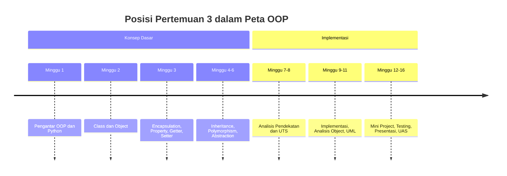
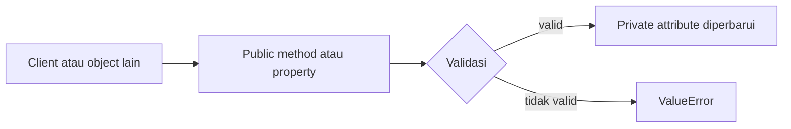
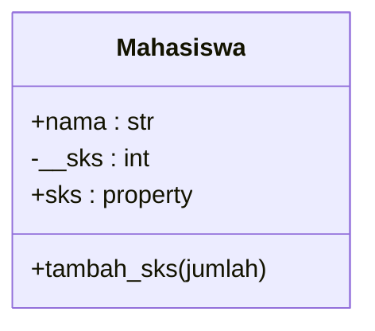

# Pertemuan 3 — Encapsulation pada Python

| | |
|:--|:--|
| **Mata Kuliah** | USA-WP2360214 — Pemrograman Berorientasi Objek |
| **Pertemuan** | 3 dari 16 |
| **Tanggal** | Rabu, 30 September 2026 |
| **CPMK** | CPMK114 |
| **Materi** | Encapsulation, access control, private attribute, property, getter, setter |
| **Model Pembelajaran** | Case Based Learning / Problem Based Learning / Pair Programming |
| **Stack** | Python 3 |

> **Catatan penting:** Pertemuan 3 membahas encapsulation sebagai strategi untuk mengendalikan perubahan data object. Anda akan menggunakan private attribute, property, getter, dan setter untuk menerapkan validasi pada data mahasiswa dan anggota perpustakaan.

---

## Daftar Isi

- [Pertemuan 3 — Encapsulation pada Python](#pertemuan-3--encapsulation-pada-python)
  - [Daftar Isi](#daftar-isi)
  - [1. Keterkaitan Pertemuan dengan RPS OBE](#1-keterkaitan-pertemuan-dengan-rps-obe)
  - [2. Capaian Pembelajaran Pertemuan](#2-capaian-pembelajaran-pertemuan)
  - [3. Pemantik Kasus: Data Object yang Perlu Dikendalikan](#3-pemantik-kasus-data-object-yang-perlu-dikendalikan)
  - [4. Konsep Encapsulation](#4-konsep-encapsulation)
  - [5. Access Control pada Python](#5-access-control-pada-python)
  - [6. Private Attribute dan Name Mangling](#6-private-attribute-dan-name-mangling)
  - [7. Property sebagai Getter](#7-property-sebagai-getter)
  - [8. Setter dan Validasi Data](#8-setter-dan-validasi-data)
  - [9. Interaksi Method dan Property](#9-interaksi-method-dan-property)
  - [10. Case Based Learning: Data Mahasiswa](#10-case-based-learning-data-mahasiswa)
  - [11. Case Based Learning: Akun Anggota Perpustakaan](#11-case-based-learning-akun-anggota-perpustakaan)
  - [12. Aktivitas Kelompok](#12-aktivitas-kelompok)
  - [13. Latihan Individu](#13-latihan-individu)
  - [14. Pemanfaatan AI sebagai Coding Assistant](#14-pemanfaatan-ai-sebagai-coding-assistant)
  - [15. Kuis Formatif](#15-kuis-formatif)
    - [16. Asesmen dan Penugasan](#16-asesmen-dan-penugasan)
    - [17. Persiapan menuju Pertemuan 4](#17-persiapan-menuju-pertemuan-4)
    - [18. Referensi dan Kode Praktikum](#18-referensi-dan-kode-praktikum)

---

## 1. Keterkaitan Pertemuan dengan RPS OBE

Pertemuan 3 mendukung **CPMK114** dan `SUB-CPMK11402` pada RPS:

> Mahasiswa mampu menerapkan encapsulation dan access modifier.

Indikator pembelajaran minggu ini adalah mahasiswa mampu menerapkan private/public/protected secara tepat serta menggunakan getter dan setter. Python tidak memiliki keyword access modifier seperti Java, sehingga pembahasan menggunakan konvensi underscore, name mangling, property, dan validasi setter.



---

## 2. Capaian Pembelajaran Pertemuan

Setelah mengikuti pertemuan ini, mahasiswa mampu:

| No. | Kemampuan | Indikator |
| :-: | --------- | --------- |
| 1 | Menjelaskan encapsulation | Menguraikan tujuan pengendalian akses data pada object |
| 2 | Menggunakan private attribute | Menulis attribute dengan awalan `__` dan menjelaskan name mangling |
| 3 | Membuat property getter | Membaca private attribute melalui property |
| 4 | Membuat setter tervalidasi | Menolak nilai yang tidak sesuai aturan object |
| 5 | Menghubungkan method dan property | Memperbarui state melalui method atau setter tanpa merusak invariant |
| 6 | Menerapkan encapsulation pada studi kasus | Membuat class Python yang mengendalikan data mahasiswa atau anggota |

---

## 3. Pemantik Kasus: Data Object yang Perlu Dikendalikan

Sistem akademik menyimpan jumlah SKS mahasiswa. Nilai tersebut tidak boleh negatif dan harus berupa bilangan bulat. Jika siapa pun dapat mengubah attribute secara langsung, object dapat berada pada keadaan yang tidak valid.

Analisis kasus berikut:

- Apa risiko jika `sks` dapat diubah menjadi `-5`?
- Mengapa data tidak cukup hanya disimpan sebagai attribute biasa?
- Bagaimana property dapat menghubungkan sintaks attribute dengan proses validasi?
- Apa perbedaan membaca data melalui getter dan mengubah data melalui setter?
- Kapan method lebih tepat digunakan daripada setter?

---

## 4. Konsep Encapsulation

Encapsulation menggabungkan data dan perilaku dalam class, lalu mengatur cara data tersebut dibaca atau diubah. Tujuannya adalah menjaga aturan object tetap dipenuhi.



Contoh sederhana:

```python
class Mahasiswa:
    def __init__(self, nama):
        self.nama = nama
        self.__sks = 0
```

Attribute `__sks` tidak dimaksudkan untuk diakses langsung oleh kode luar class. Aksesnya dikendalikan melalui property atau method.

---

## 5. Access Control pada Python

Python menggunakan konvensi penamaan untuk menyatakan tingkat akses:

| Bentuk | Makna penggunaan |
|:-------|:-----------------|
| `nama` | Public secara konvensi; dapat diakses dari luar class |
| `_nama` | Internal/protected secara konvensi; sebaiknya tidak diakses langsung dari luar |
| `__nama` | Private melalui name mangling; akses langsung dibatasi oleh Python |

```python
class Profil:
    def __init__(self):
        self.nama = "Jhon Doe"
        self._kode_internal = "P-001"
        self.__nomor_rahasia = "12345"
```

Istilah protected pada Python merupakan konvensi, bukan pembatasan compiler. Untuk data yang memerlukan aturan perubahan, gunakan property atau method validasi.

---

## 6. Private Attribute dan Name Mangling

Attribute dengan awalan dua underscore mengalami name mangling. Python mengubah nama internalnya sehingga akses langsung dengan nama asli tidak tersedia seperti attribute public.

```python
class Mahasiswa:
    def __init__(self, nama, sks):
        self.nama = nama
        self.__sks = sks

    def tampilkan_sks(self):
        return self.__sks

mahasiswa = Mahasiswa("Jhon Doe", 3)
print(mahasiswa.tampilkan_sks())
```

Name mangling bukan pengamanan absolut. Tujuan utamanya adalah mencegah akses tidak sengaja dan mengurangi konflik nama pada inheritance. Aturan bisnis tetap harus diterapkan melalui interface class.

---

## 7. Property sebagai Getter

Decorator `@property` memungkinkan method dibaca seperti attribute:

```python
class Mahasiswa:
    def __init__(self, nama, sks):
        self.nama = nama
        self.__sks = sks

    @property
    def sks(self):
        return self.__sks

mahasiswa = Mahasiswa("Jhon Doe", 3)
print(mahasiswa.sks)
```

`mahasiswa.sks` menjalankan method getter `sks()` tanpa tanda kurung. Dengan cara ini, representasi data dari luar tetap sederhana, sementara penyimpanan internal dapat diubah tanpa mengubah cara pemanggilan.

---

## 8. Setter dan Validasi Data

Setter digunakan ketika nilai baru perlu diperiksa sebelum disimpan:

```python
class Mahasiswa:
    def __init__(self, nama, sks):
        self.nama = nama
        self.__sks = 0
        self.sks = sks

    @property
    def sks(self):
        return self.__sks

    @sks.setter
    def sks(self, nilai):
        if not isinstance(nilai, int) or nilai < 0:
            raise ValueError("SKS harus bilangan bulat tidak negatif")
        self.__sks = nilai
```

Constructor menggunakan `self.sks = sks`, sehingga validasi setter juga berlaku saat object pertama kali dibuat.

Validasi yang baik menjelaskan alasan penolakan data dan tidak membiarkan object menyimpan state yang tidak sesuai.

---

## 9. Interaksi Method dan Property

Method dapat menggunakan property untuk mengubah data secara aman:

```python
class Mahasiswa:
    def __init__(self, nama, sks=0):
        self.nama = nama
        self.__sks = 0
        self.sks = sks

    @property
    def sks(self):
        return self.__sks

    @sks.setter
    def sks(self, nilai):
        if nilai < 0:
            raise ValueError("SKS tidak boleh negatif")
        self.__sks = nilai

    def tambah_sks(self, jumlah):
        if jumlah <= 0:
            raise ValueError("Jumlah SKS harus positif")
        self.sks += jumlah
```

Method `tambah_sks()` tidak mengubah `__sks` secara langsung. Method menggunakan setter melalui `self.sks`, sehingga aturan validasi tetap diterapkan.

---

## 10. Case Based Learning: Data Mahasiswa

Implementasi tersedia pada [`../code/pertemuan-03/mahasiswa_terlindungi.py`](../code/pertemuan-03/mahasiswa_terlindungi.py).



Uji program:

```bash
python3 ../code/pertemuan-03/mahasiswa_terlindungi.py
```

Perhatikan bahwa `sks` dibaca melalui property, sedangkan nilai internal disimpan pada `__sks`. Ketika nilai negatif diberikan, setter menghasilkan `ValueError`.

---

## 11. Case Based Learning: Akun Anggota Perpustakaan

Data nomor kontak anggota perlu memiliki format yang dapat diperiksa sebelum disimpan. Implementasi tersedia pada [`../code/pertemuan-03/akun_perpustakaan.py`](../code/pertemuan-03/akun_perpustakaan.py).

```python
anggota = Anggota("Jhon Doe", "081234567890")
print(anggota.ringkasan())
```

Diskusi:

1. Mengapa nomor kontak disimpan melalui setter?
2. Apa response program jika nomor kontak tidak memenuhi aturan?
3. Data apa yang sebaiknya tidak diubah langsung dari luar class?

---

## 12. Aktivitas Kelompok

Bentuk kelompok 3–4 orang:

1. Identifikasi tiga data pada Sistem Informasi yang membutuhkan validasi.
2. Tentukan attribute public dan private untuk setiap data.
3. Rancang getter dan setter yang diperlukan.
4. Buat diagram class dengan Mermaid.
5. Uji minimal satu nilai valid dan satu nilai tidak valid.

---

## 13. Latihan Individu

Gunakan scaffold berikut:

- [`../code/pertemuan-03/latihan_terbimbing_3.py`](../code/pertemuan-03/latihan_terbimbing_3.py) — class `RekeningMahasiswa` dengan property saldo.
- [`../code/pertemuan-03/latihan_mandiri_3.py`](../code/pertemuan-03/latihan_mandiri_3.py) — class `ProfilMahasiswa` dengan property email dan semester.

Latihan mandiri harus memenuhi ketentuan:

1. `email` disimpan pada private attribute dan harus memuat karakter `@`.
2. `semester` disimpan pada private attribute dan harus berupa integer positif.
3. Getter dapat membaca kedua nilai.
4. Setter menolak nilai yang tidak sesuai aturan dengan `ValueError`.
5. `tampilkan_info()` menampilkan data object.

---

## 14. Pemanfaatan AI sebagai Coding Assistant

**AI assistant (GitHub Copilot, ChatGPT, Claude, Gemini) boleh dipakai — dengan cara yang benar:**

**✅ Gunakan AI untuk:**

- Menjelaskan perbedaan public, internal, dan private attribute pada Python.
- Membantu membaca `ValueError` setelah Anda menguji setter.
- Mereview penggunaan `@property` dan `@<nama>.setter`.
- Membuat skenario pengujian untuk nilai valid dan tidak valid.
- Memeriksa apakah validasi sesuai dengan aturan data pada studi kasus.

**❌ Jangan gunakan AI untuk:**

- Menuliskan seluruh latihan `ProfilMahasiswa` tanpa memahami validasinya.
- Menyalin getter dan setter tanpa menguji nilai valid dan tidak valid.
- Menghapus validasi hanya agar program dapat dijalankan.
- Memasukkan data pribadi atau kredensial ke dalam prompt.

**Etika di kelas:**

1. Anda wajib dapat menjelaskan private attribute, property, getter, setter, dan aturan validasi yang diserahkan.
2. Jika memakai AI, cantumkan pada komentar kode atau refleksi. Contoh yang sesuai dengan materi Pertemuan 3:

   ```python
   # Bantuan: ChatGPT — penjelasan setter untuk validasi nilai SKS.
   mahasiswa.sks = 3
   ```

3. AI digunakan sebagai asisten, bukan pengganti. Anda tetap bertanggung jawab memahami, menjalankan, dan menguji kode.

---

## 15. Kuis Formatif

Gunakan [Quiz Pertemuan 3](./02-Quiz-Pertemuan-3.md) setelah praktikum.

---

## 16. Asesmen dan Penugasan

| Komponen | Bentuk | Keterangan |
|:---------|:-------|:-----------|
| Praktikum coding | Property dan setter | Menyelesaikan latihan terbimbing |
| Quiz | 5 soal | Mengukur pemahaman encapsulation dan validasi |
| Latihan mandiri | `ProfilMahasiswa` | Diserahkan sesuai arahan dosen |

Checklist:

- [ ] Private attribute digunakan pada data yang perlu dikendalikan.
- [ ] Getter dapat membaca nilai dengan benar.
- [ ] Setter memvalidasi nilai baru.
- [ ] Nilai tidak valid menghasilkan `ValueError`.
- [ ] Program diuji dengan Python 3.

---

## 17. Persiapan menuju Pertemuan 4

Pada Pertemuan 4, mahasiswa akan mempelajari inheritance, superclass, subclass, dan overriding pada Python.

Persiapkan hal berikut:

- Baca ulang encapsulation, private attribute, property, getter, dan setter.
- Jalankan `mahasiswa_terlindungi.py` dan `akun_perpustakaan.py`.
- Selesaikan `latihan_mandiri_3.py` dan uji nilai valid serta tidak valid.
- Siapkan contoh hubungan parent-child class dari domain Sistem Informasi.

---

## 18. Referensi dan Kode Praktikum

Referensi:

- [Python Docs — Property](https://docs.python.org/3/library/functions.html#property)
- [Python Docs — Classes](https://docs.python.org/3/tutorial/classes.html)
- [PEP 8 — Naming Conventions](https://peps.python.org/pep-0008/)

Kode praktikum:

- [`../code/pertemuan-03/mahasiswa_terlindungi.py`](../code/pertemuan-03/mahasiswa_terlindungi.py) — contoh property dan validasi SKS.
- [`../code/pertemuan-03/akun_perpustakaan.py`](../code/pertemuan-03/akun_perpustakaan.py) — contoh property nomor kontak.
- [`../code/pertemuan-03/latihan_terbimbing_3.py`](../code/pertemuan-03/latihan_terbimbing_3.py) — scaffold latihan terbimbing.
- [`../code/pertemuan-03/latihan_mandiri_3.py`](../code/pertemuan-03/latihan_mandiri_3.py) — scaffold latihan mandiri.
- [`../code/pertemuan-03/_kunci-jawaban/latihan_mandiri_3.py`](../code/pertemuan-03/_kunci-jawaban/latihan_mandiri_3.py) — kunci jawaban kode untuk dosen.
