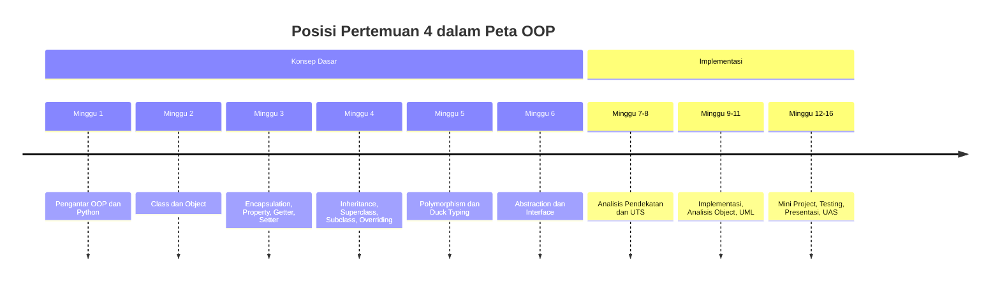
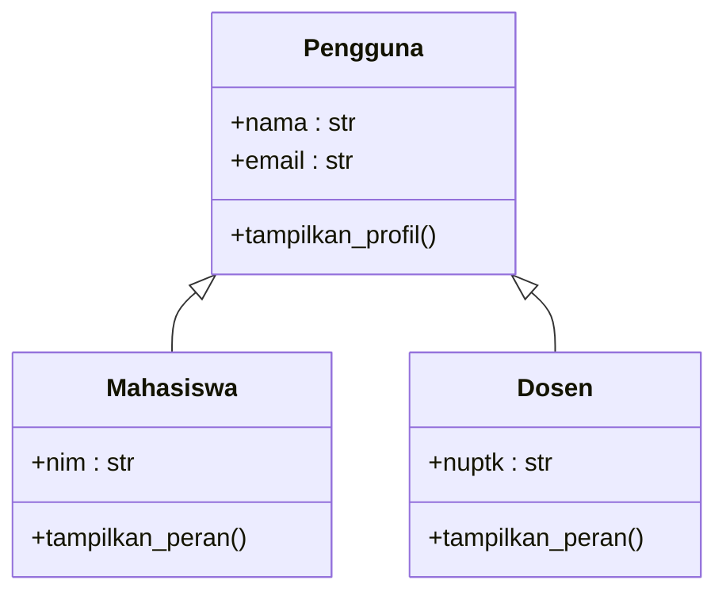

# Pertemuan 4 — Inheritance pada Python

| | |
|:--|:--|
| **Mata Kuliah** | USA-WP2360214 — Pemrograman Berorientasi Objek |
| **Pertemuan** | 4 dari 16 |
| **Tanggal** | Rabu, 7 Oktober 2026 |
| **CPMK** | CPMK114 |
| **Materi** | Inheritance, superclass, subclass, `super()`, overriding, dan hierarki class |
| **Model Pembelajaran** | Case Based Learning / Problem Based Learning / Pair Programming |
| **Stack** | Python 3 |

> **Catatan penting:** Pertemuan 4 membahas inheritance sebagai mekanisme untuk membentuk class baru berdasarkan class yang sudah ada. Anda akan merancang superclass dan subclass, menggunakan `super()` untuk memanfaatkan constructor parent, serta menerapkan overriding pada studi kasus Sistem Informasi.

---

## Daftar Isi

- [Pertemuan 4 — Inheritance pada Python](#pertemuan-4--inheritance-pada-python)
  - [Daftar Isi](#daftar-isi)
  - [1. Keterkaitan Pertemuan dengan RPS OBE](#1-keterkaitan-pertemuan-dengan-rps-obe)
  - [2. Capaian Pembelajaran Pertemuan](#2-capaian-pembelajaran-pertemuan)
  - [3. Pemantik Kasus: Kesamaan dan Perbedaan Class](#3-pemantik-kasus-kesamaan-dan-perbedaan-class)
  - [4. Konsep Inheritance](#4-konsep-inheritance)
  - [5. Superclass dan Subclass](#5-superclass-dan-subclass)
  - [6. Constructor dan `super()`](#6-constructor-dan-super)
  - [7. Overriding Method](#7-overriding-method)
  - [8. Inheritance dan Encapsulation](#8-inheritance-dan-encapsulation)
  - [9. Studi Kasus: Pengguna Sistem Informasi](#9-studi-kasus-pengguna-sistem-informasi)
  - [10. Case Based Learning: Pengguna Akademik](#10-case-based-learning-pengguna-akademik)
  - [11. Aktivitas Kelompok](#11-aktivitas-kelompok)
  - [12. Latihan Individu](#12-latihan-individu)
  - [13. Pemanfaatan AI sebagai Coding Assistant](#13-pemanfaatan-ai-sebagai-coding-assistant)
  - [14. Kuis Formatif](#14-kuis-formatif)
  - [15. Asesmen dan Penugasan](#15-asesmen-dan-penugasan)
  - [16. Persiapan menuju Pertemuan 5](#16-persiapan-menuju-pertemuan-5)
  - [17. Referensi dan Kode Praktikum](#17-referensi-dan-kode-praktikum)

---

## 1. Keterkaitan Pertemuan dengan RPS OBE

Pertemuan 4 mendukung **CPMK114** dan `SUB-CPMK11403` pada RPS:

> Mahasiswa mampu menerapkan inheritance, superclass, subclass, dan overriding pada program Python.

Inheritance digunakan ketika beberapa class memiliki karakteristik umum dan hubungan hierarkis yang jelas. Subclass dapat menggunakan attribute dan method dari superclass, kemudian menambahkan atau menyesuaikan perilaku sesuai kebutuhannya.



---

## 2. Capaian Pembelajaran Pertemuan

Setelah mengikuti pertemuan ini, mahasiswa mampu:

| No. | Kemampuan | Indikator |
| :-: | --------- | --------- |
| 1 | Menjelaskan inheritance | Menguraikan hubungan superclass dan subclass |
| 2 | Membuat superclass dan subclass | Mendefinisikan hierarki class yang sesuai dengan domain |
| 3 | Menggunakan `super()` | Memanggil constructor atau method superclass dari subclass |
| 4 | Menerapkan overriding | Menyesuaikan implementasi method pada subclass |
| 5 | Menghubungkan inheritance dan encapsulation | Mengelola attribute parent melalui interface yang sesuai |
| 6 | Menerapkan inheritance pada studi kasus | Membuat hierarki class untuk domain Sistem Informasi |

---

## 3. Pemantik Kasus: Kesamaan dan Perbedaan Class

Sistem Informasi akademik memiliki beberapa jenis pengguna, misalnya mahasiswa, dosen, dan administrator. Semua pengguna memiliki nama dan email, tetapi setiap jenis pengguna memiliki informasi serta perilaku tambahan yang berbeda.

Analisis kasus berikut:

- Attribute apa yang dimiliki oleh semua pengguna?
- Method apa yang dapat ditempatkan pada superclass `Pengguna`?
- Informasi apa yang khusus dimiliki oleh `Mahasiswa` dan `Dosen`?
- Kapan subclass perlu menambahkan method baru?
- Kapan subclass perlu melakukan overriding terhadap method superclass?
- Apa konsekuensi jika inheritance digunakan tanpa hubungan hierarkis yang jelas?

Pada akhir pertemuan, Anda akan membuat hierarki class yang memanfaatkan kembali kode superclass tanpa menghilangkan perilaku khusus pada subclass.

---

## 4. Konsep Inheritance

Inheritance memungkinkan sebuah class memperoleh attribute dan method dari class lain. Class yang diwarisi disebut superclass, sedangkan class yang mewarisi disebut subclass.



Inheritance sesuai digunakan ketika subclass benar-benar merupakan bentuk khusus dari superclass. Hubungan tersebut sering disebut hubungan **is-a**, misalnya `Mahasiswa` adalah `Pengguna`.

---

## 5. Superclass dan Subclass

Superclass berisi karakteristik umum. Subclass dapat langsung menggunakan karakteristik tersebut dan menambahkan karakteristik khusus.

```python
class Pengguna:
    def __init__(self, nama, email):
        self.nama = nama
        self.email = email

    def tampilkan_profil(self):
        return f"{self.nama} — {self.email}"


class Mahasiswa(Pengguna):
    def __init__(self, nama, email, nim):
        super().__init__(nama, email)
        self.nim = nim


mahasiswa = Mahasiswa("Budi", "budi@example.com", "SI-101")
print(mahasiswa.tampilkan_profil())
print(mahasiswa.nim)
```

`Mahasiswa` memperoleh method `tampilkan_profil()` dari `Pengguna` dan memiliki attribute tambahan `nim`.

---

## 6. Constructor dan `super()`

Ketika subclass memiliki constructor sendiri, constructor superclass tidak dipanggil secara otomatis. Gunakan `super()` untuk menjalankan constructor superclass.

```python
class Dosen(Pengguna):
    def __init__(self, nama, email, nuptk):
        super().__init__(nama, email)
        self.nuptk = nuptk
```

Pemanggilan `super().__init__(nama, email)` memastikan attribute umum tetap diinisialisasi oleh superclass. Cara ini mengurangi duplikasi kode dan mempertahankan tanggung jawab setiap class.

`super()` juga dapat digunakan untuk memanggil method superclass ketika subclass ingin mempertahankan sebagian perilaku parent.

---

## 7. Overriding Method

Overriding terjadi ketika subclass mendefinisikan method dengan nama yang sama seperti method pada superclass. Implementasi subclass akan digunakan ketika method dipanggil melalui object subclass.

```python
class Pengguna:
    def tampilkan_peran(self):
        return "Pengguna sistem"


class Mahasiswa(Pengguna):
    def tampilkan_peran(self):
        return "Mahasiswa"


class Dosen(Pengguna):
    def tampilkan_peran(self):
        return "Dosen"
```

Overriding digunakan ketika perilaku umum pada superclass memerlukan implementasi khusus pada subclass. Method yang dioverride sebaiknya memiliki tujuan dan kontrak penggunaan yang tetap dapat dipahami.

Subclass juga dapat memperluas perilaku superclass:

```python
class Admin(Pengguna):
    def tampilkan_profil(self):
        profil_dasar = super().tampilkan_profil()
        return f"{profil_dasar} — Administrator"
```

---

## 8. Inheritance dan Encapsulation

Inheritance tidak mengubah prinsip encapsulation. Attribute yang dikelola oleh superclass tetap sebaiknya diakses melalui method atau property yang disediakan class tersebut.

```python
class Pengguna:
    def __init__(self, nama):
        self.__nama = nama

    @property
    def nama(self):
        return self.__nama


class Mahasiswa(Pengguna):
    def tampilkan_nama(self):
        return self.nama
```

Subclass menggunakan property `nama`, bukan mengakses attribute private superclass secara langsung. Hal ini menjaga batas tanggung jawab antara superclass dan subclass.

---

## 9. Studi Kasus: Pengguna Sistem Informasi

Sistem Informasi memerlukan tiga jenis pengguna:

- `Mahasiswa` memiliki NIM dan informasi program studi.
- `Dosen` memiliki NUPTK dan bidang keahlian.
- `Admin` memiliki unit kerja dan kewenangan pengelolaan data.

Karakteristik umum ditempatkan pada `Pengguna`, sedangkan informasi khusus ditempatkan pada masing-masing subclass. Dengan demikian, perubahan pada data umum dapat dikelola dari satu class dan perilaku khusus tetap berada pada class yang relevan.

Gunakan pertanyaan berikut untuk mengevaluasi rancangan:

1. Apakah semua subclass memiliki data `nama` dan `email`?
2. Apakah method `tampilkan_peran()` memerlukan overriding?
3. Apakah hubungan setiap subclass dengan `Pengguna` merupakan hubungan **is-a**?
4. Apakah ada attribute yang seharusnya dikelola melalui property?

---

## 10. Case Based Learning: Pengguna Akademik

Implementasi tersedia pada [`../code/pertemuan-04/pengguna_akademik.py`](../code/pertemuan-04/pengguna_akademik.py).

```bash
python3 ../code/pertemuan-04/pengguna_akademik.py
```

Amati hal berikut:

- constructor subclass memanggil `super().__init__()`;
- subclass menambahkan attribute khusus;
- method `tampilkan_peran()` dioverride oleh setiap subclass;
- object dapat diproses melalui method umum yang tersedia pada superclass.

Contoh pemakaian:

```python
pengguna = [
    Mahasiswa("Budi", "budi@example.com", "SI-101", "Sistem Informasi"),
    Dosen("Sari", "sari@example.com", "NUPTK-001", "Pemrograman"),
]

for data in pengguna:
    print(data.ringkasan())
```

---

## 11. Aktivitas Kelompok

Bentuk kelompok 3–4 orang:

1. Pilih satu domain Sistem Informasi, seperti perpustakaan, akademik, atau layanan administrasi.
2. Identifikasi satu superclass dan minimal dua subclass.
3. Tentukan attribute umum dan attribute khusus setiap class.
4. Tentukan method yang diwariskan dan method yang dioverride.
5. Buat diagram class dengan Mermaid.
6. Implementasikan dan uji minimal satu object dari setiap subclass.

---

## 12. Latihan Individu

Gunakan scaffold berikut:

- [`../code/pertemuan-04/latihan_terbimbing_4.py`](../code/pertemuan-04/latihan_terbimbing_4.py) — hierarki `Kendaraan`, `Mobil`, dan `Motor`.
- [`../code/pertemuan-04/latihan_mandiri_4.py`](../code/pertemuan-04/latihan_mandiri_4.py) — hierarki `Akun`, `AkunMahasiswa`, dan `AkunDosen`.

Latihan mandiri harus memenuhi ketentuan:

1. `Akun` menyimpan nama dan email.
2. `AkunMahasiswa` menambahkan NIM dan program studi.
3. `AkunDosen` menambahkan NUPTK dan bidang keahlian.
4. Constructor subclass memanggil constructor superclass menggunakan `super()`.
5. Setiap subclass mengimplementasikan `tampilkan_peran()`.
6. `ringkasan()` menampilkan data umum dan data khusus object.
7. Program diuji dengan minimal satu object dari setiap subclass.

---

## 13. Pemanfaatan AI sebagai Coding Assistant

**AI assistant dapat digunakan dengan pendekatan yang tepat:**

**Gunakan AI untuk:**

- Menjelaskan hubungan superclass dan subclass.
- Membantu membaca error pada pemanggilan `super()`.
- Membandingkan penggunaan inheritance dengan class yang berdiri sendiri.
- Membuat skenario pengujian untuk method yang dioverride.
- Memeriksa apakah rancangan class memiliki hubungan **is-a** yang tepat.

**Jangan gunakan AI untuk:**

- Menuliskan seluruh hierarki class tanpa memahami tanggung jawab setiap class.
- Menyalin implementasi `super()` tanpa menguji constructor subclass.
- Menggunakan inheritance hanya untuk menghindari penulisan ulang kode tanpa hubungan konseptual.
- Memasukkan data pribadi atau kredensial ke dalam prompt.

**Etika di kelas:**

1. Anda wajib dapat menjelaskan fungsi superclass, subclass, `super()`, dan overriding pada kode yang diserahkan.
2. Jika memakai AI, cantumkan penggunaannya pada komentar kode atau refleksi.
   Contoh yang sesuai dengan materi inheritance:

   ```python
   # Bantuan: ChatGPT — penjelasan pemanggilan constructor superclass dengan super().
   class Mahasiswa(Pengguna):
       def __init__(self, nama, email, nim):
           super().__init__(nama, email)
           self.nim = nim
   ```

3. AI digunakan sebagai asisten. Anda tetap bertanggung jawab memahami, menjalankan, dan menguji kode.

---

## 14. Kuis Formatif

Gunakan [Quiz Pertemuan 4](./02-Quiz-Pertemuan-4.md) setelah praktikum.

---

## 15. Asesmen dan Penugasan

| Komponen | Bentuk | Keterangan |
|:---------|:-------|:-----------|
| Praktikum coding | Inheritance | Membuat superclass dan subclass |
| Quiz | 5 soal | Mengukur pemahaman inheritance dan overriding |
| Latihan mandiri | `AkunMahasiswa` dan `AkunDosen` | Diserahkan sesuai arahan dosen |

Checklist:

- [ ] Superclass dan subclass memiliki hubungan hierarkis yang jelas.
- [ ] Constructor subclass menggunakan `super()` jika diperlukan.
- [ ] Attribute umum dikelola oleh superclass.
- [ ] Method khusus diimplementasikan pada subclass.
- [ ] Overriding diuji melalui object subclass.
- [ ] Program diuji dengan Python 3.

---

## 16. Persiapan menuju Pertemuan 5

Pada Pertemuan 5, mahasiswa akan mempelajari polymorphism, overriding, dan duck typing pada Python.

Persiapkan hal berikut:

- Baca ulang konsep superclass, subclass, `super()`, dan overriding.
- Jalankan `pengguna_akademik.py` dan amati output setiap subclass.
- Selesaikan `latihan_mandiri_4.py` dan uji object dari kedua subclass.
- Siapkan contoh beberapa object yang dapat diproses melalui method dengan nama yang sama.

---

## 17. Referensi dan Kode Praktikum

Referensi:

- [Python Docs — Inheritance](https://docs.python.org/3/tutorial/classes.html#inheritance)
- [Python Docs — `super()`](https://docs.python.org/3/library/functions.html#super)
- [Python Docs — Classes](https://docs.python.org/3/tutorial/classes.html)
- [PEP 8 — Naming Conventions](https://peps.python.org/pep-0008/)

Kode praktikum:

- [`../code/pertemuan-04/pengguna_akademik.py`](../code/pertemuan-04/pengguna_akademik.py) — contoh superclass, subclass, `super()`, dan overriding.
- [`../code/pertemuan-04/latihan_terbimbing_4.py`](../code/pertemuan-04/latihan_terbimbing_4.py) — scaffold latihan terbimbing.
- [`../code/pertemuan-04/latihan_mandiri_4.py`](../code/pertemuan-04/latihan_mandiri_4.py) — scaffold latihan mandiri.

