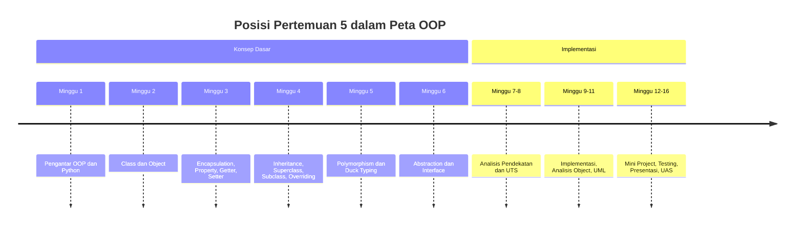
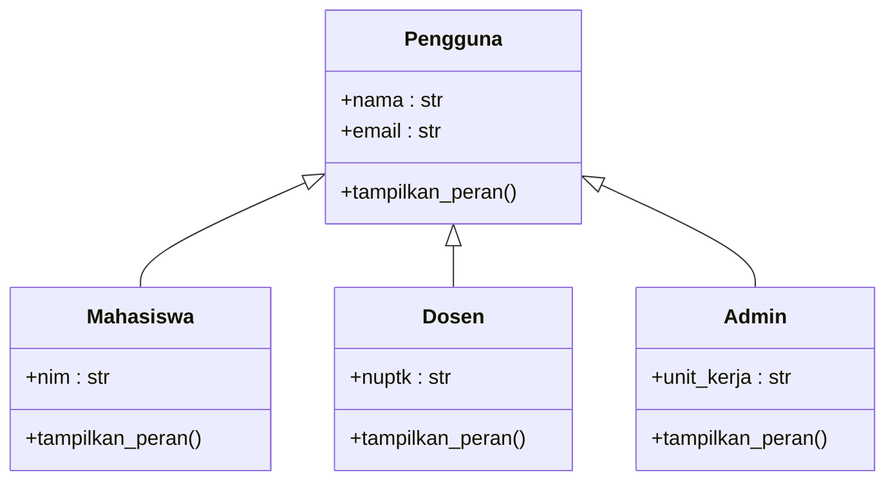
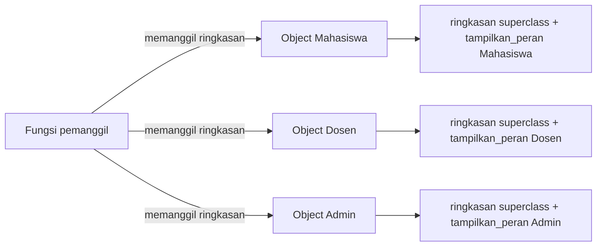

# Pertemuan 5 — Polymorphism dan Duck Typing pada Python

| | |
|:--|:--|
| **Mata Kuliah** | USA-WP2360214 — Pemrograman Berorientasi Objek |
| **Pertemuan** | 5 dari 16 |
| **Tanggal** | Rabu, 14 Oktober 2026 |
| **CPMK** | CPMK114 |
| **Materi** | Polymorphism, overriding, duck typing, dan perancangan method polimorfik |
| **Model Pembelajaran** | Case Based Learning / Problem Based Learning / Pair Programming |
| **Stack** | Python 3 |

> **Catatan penting:** Pertemuan 5 membahas polymorphism sebagai kemampuan object dari class yang berbeda untuk merespons method dengan nama yang sama secara berbeda. Anda akan menganalisis overriding, memahami duck typing, dan merancang fungsi yang dapat memproses banyak jenis object pada studi kasus Sistem Informasi.

---

## Daftar Isi

- [Pertemuan 5 — Polymorphism dan Duck Typing pada Python](#pertemuan-5--polymorphism-dan-duck-typing-pada-python)
  - [Daftar Isi](#daftar-isi)
  - [1. Keterkaitan Pertemuan dengan RPS OBE](#1-keterkaitan-pertemuan-dengan-rps-obe)
  - [2. Capaian Pembelajaran Pertemuan](#2-capaian-pembelajaran-pertemuan)
  - [3. Pemantik Kasus: Satu Method, Banyak Perilaku](#3-pemantik-kasus-satu-method-banyak-perilaku)
  - [4. Konsep Polymorphism](#4-konsep-polymorphism)
  - [5. Overriding sebagai Bentuk Polymorphism](#5-overriding-sebagai-bentuk-polymorphism)
  - [6. Duck Typing](#6-duck-typing)
  - [7. Polymorphism dan Inheritance](#7-polymorphism-dan-inheritance)
  - [8. Merancang Method yang Polimorfik](#8-merancang-method-yang-polimorfik)
  - [9. Studi Kasus: Pengguna Sistem Informasi](#9-studi-kasus-pengguna-sistem-informasi)
  - [10. Case Based Learning: Pengguna Polimorfik](#10-case-based-learning-pengguna-polimorfik)
  - [11. Aktivitas Kelompok](#11-aktivitas-kelompok)
  - [12. Latihan Individu](#12-latihan-individu)
  - [13. Pemanfaatan AI sebagai Coding Assistant](#13-pemanfaatan-ai-sebagai-coding-assistant)
  - [14. Kuis Formatif](#14-kuis-formatif)
  - [15. Asesmen dan Penugasan](#15-asesmen-dan-penugasan)
  - [16. Persiapan menuju Pertemuan 6](#16-persiapan-menuju-pertemuan-6)
  - [17. Referensi dan Kode Praktikum](#17-referensi-dan-kode-praktikum)

---

## 1. Keterkaitan Pertemuan dengan RPS OBE

Pertemuan 5 mendukung **CPMK114** dan `SUB-CPMK11404` pada RPS:

> Mahasiswa mampu menganalisis dan menerapkan polymorphism, overriding, dan duck typing pada program Python.

Polymorphism memungkinkan object dari class yang berbeda diproses melalui antarmuka yang sama. Konsep ini melengkapi inheritance: setelah subclass dibentuk pada Pertemuan 4, Pertemuan 5 membahas bagaimana subclass yang berbeda dapat merespons method yang sama dengan perilaku yang berbeda.



---

## 2. Capaian Pembelajaran Pertemuan

Setelah mengikuti pertemuan ini, mahasiswa mampu:

| No. | Kemampuan | Indikator |
| :-: | --------- | --------- |
| 1 | Menjelaskan polymorphism | Menguraikan kemampuan object merespons method yang sama secara berbeda |
| 2 | Menghubungkan overriding dan polymorphism | Menjelaskan peran overriding dalam perilaku polimorfik |
| 3 | Menjelaskan duck typing | Mengidentifikasi bahwa Python menilai object dari method yang tersedia |
| 4 | Merancang method polimorfik | Membuat fungsi yang memproses banyak jenis object tanpa pemeriksaan tipe |
| 5 | Menerapkan polymorphism pada studi kasus | Memproses daftar object Sistem Informasi melalui method yang sama |

---

## 3. Pemantik Kasus: Satu Method, Banyak Perilaku

Sistem Informasi akademik memiliki mahasiswa, dosen, dan administrator. Ketika sistem menampilkan ringkasan pengguna, setiap jenis pengguna menampilkan informasi yang berbeda meskipun dipanggil dengan method yang sama.

Analisis kasus berikut:

- Method apa yang dapat dipanggil untuk semua jenis pengguna?
- Mengapa hasil pemanggilan method tersebut berbeda untuk setiap jenis pengguna?
- Apakah fungsi pemanggil perlu mengetahui jenis object secara pasti?
- Apa yang terjadi jika sebuah object tidak memiliki method yang dipanggil?
- Bagaimana cara memproses daftar pengguna yang beragam dalam satu perulangan?

Pada akhir pertemuan, Anda akan membuat fungsi yang memproses daftar object beragam tanpa memeriksa tipe object satu per satu.

---

## 4. Konsep Polymorphism

Polymorphism berarti "banyak bentuk". Dalam OOP, polymorphism adalah kemampuan object dari class yang berbeda untuk merespons method dengan nama yang sama, tetapi dengan implementasi yang sesuai dengan class masing-masing.



Perhatikan bahwa `tampilkan_peran()` dideklarasikan pada superclass dan dioverride oleh setiap subclass. Pemanggil method tidak perlu mengetahui class pasti dari object; pemanggil cukup memanggil method dengan nama yang sama.

---

## 5. Overriding sebagai Bentuk Polymorphism

Overriding pada Pertemuan 4 menjadi dasar polymorphism. Ketika subclass mendefinisikan ulang method superclass, object subclass merespons pemanggilan method dengan implementasinya sendiri.

```python
class Pengguna:
    def tampilkan_peran(self):
        return "Pengguna sistem"

class Mahasiswa(Pengguna):
    def tampilkan_peran(self):
        return "Mahasiswa"

class Dosen(Pengguna):
    def tampilkan_peran(self):
        return "Dosen"
```

Pemanggilan berikut menghasilkan output yang berbeda untuk setiap object:

```python
print(Mahasiswa("Budi", "budi@example.com").tampilkan_peran())
print(Dosen("Sari", "sari@example.com").tampilkan_peran())
```

Output:

```text
Mahasiswa
Dosen
```

Method yang sama, yaitu `tampilkan_peran()`, menghasilkan perilaku berbeda sesuai class object. Inilah bentuk polymorphism yang paling umum pada Python.

---

## 6. Duck Typing

Python tidak mewajibkan object memiliki superclass yang sama untuk diproses bersama. Python menilai object dari method dan attribute yang tersedia, bukan dari tipe class-nya. Prinsip ini disebut duck typing: "jika berjalan seperti bebek dan bersuara seperti bebek, maka ia adalah bebek".

```python
class Mahasiswa:
    def ringkasan(self):
        return "Mahasiswa — Budi"

class Dosen:
    def ringkasan(self):
        return "Dosen — Sari"

def tampilkan(data):
    print(data.ringkasan())

tampilkan(Mahasiswa())
tampilkan(Dosen())
```

Fungsi `tampilkan()` tidak memeriksa tipe parameter. Fungsi hanya membutuhkan object yang memiliki method `ringkasan()`. Selama method tersebut tersedia, fungsi dapat memproses object apa pun.

Duck typing membuat kode lebih fleksibel, tetapi konsekuensinya adalah error baru muncul saat method dipanggil, bukan saat program dikompilasi. Pastikan setiap object yang dikirim ke fungsi memiliki method yang diharapkan.

---

## 7. Polymorphism dan Inheritance

Polymorphism sering bekerja bersama inheritance, tetapi keduanya bukan hal yang sama. Inheritance membentuk hubungan antar-class, sedangkan polymorphism menentukan bagaimana object merespons method yang sama.

```python
class Pengguna:
    def __init__(self, nama, email):
        self.nama = nama
        self.email = email

    def tampilkan_peran(self):
        return "Pengguna sistem"

    def ringkasan(self):
        return f"{self.nama} — {self.email} — {self.tampilkan_peran()}"
```

Method `ringkasan()` pada superclass memanggil `self.tampilkan_peran()`. Ketika method dipanggil melalui object subclass, Python menggunakan implementasi `tampilkan_peran()` milik subclass. Superclass tidak perlu mengetahui subclass mana yang akan memanggilnya.



Amati bahwa satu fungsi pemanggil dapat menangani banyak jenis object. Perilaku akhir ditentukan oleh class object, bukan oleh fungsi pemanggil.

---

## 8. Merancang Method yang Polimorfik

Fungsi yang polimorfik menerima object beragam dan memanggil method yang sama tanpa pemeriksaan tipe. Perhatikan contoh berikut:

```python
def tampilkan_semua(daftar_pengguna):
    for data in daftar_pengguna:
        print(data.ringkasan())
```

Fungsi `tampilkan_semua()` tidak memeriksa apakah `data` adalah `Mahasiswa`, `Dosen`, atau `Admin`. Fungsi hanya memanggil `ringkasan()` dan mempercayai setiap object menyediakan method tersebut.

Pertanyaan untuk mengevaluasi rancangan:

1. Apakah setiap class yang dikirim memiliki method yang dipanggil?
2. Apakah method memiliki kontrak yang sama, yaitu menerima parameter yang sama dan mengembalikan hasil yang sejenis?
3. Apakah fungsi pemanggil perlu mengetahui tipe object untuk bekerja?
4. Apakah perilaku setiap object sesuai dengan tanggung jawab class-nya?

Jika salah satu jawaban tidak terpenuhi, rancangan perlu diperiksa kembali sebelum diimplementasikan.

---

## 9. Studi Kasus: Pengguna Sistem Informasi

Sistem Informasi memiliki tiga jenis pengguna: `Mahasiswa`, `Dosen`, dan `Admin`. Ketiga class mewarisi `Pengguna` dan mengimplementasikan `tampilkan_peran()` serta `ringkasan()` sesuai kebutuhan masing-masing.

Sistem perlu menampilkan ringkasan seluruh pengguna dalam satu daftar. Dengan polymorphism, satu fungsi dapat memproses daftar tersebut tanpa memeriksa tipe setiap elemen.

Gunakan pertanyaan berikut untuk mengevaluasi rancangan:

1. Apakah semua subclass memiliki method `ringkasan()`?
2. Apakah method `tampilkan_peran()` dioverride oleh setiap subclass?
3. Apakah fungsi pemanggil dapat bekerja tanpa mengetahui tipe object?
4. Apa yang terjadi jika sebuah object tanpa method `ringkasan()` masuk ke dalam daftar?

---

## 10. Case Based Learning: Pengguna Polimorfik

Implementasi tersedia pada [`../code/pertemuan-05/polimorfisme_pengguna.py`](../code/pertemuan-05/polimorfisme_pengguna.py).

```bash
python3 ../code/pertemuan-05/polimorfisme_pengguna.py
```

Amati hal berikut:

- satu fungsi `tampilkan_semua()` memproses daftar object beragam;
- setiap object merespons `ringkasan()` sesuai class-nya;
- `ringkasan()` pada superclass memanggil `tampilkan_peran()` yang dioverride;
- fungsi pemanggil tidak memeriksa tipe object satu per satu.

Contoh pemakaian:

```python
pengguna = [
    Mahasiswa("Budi", "budi@example.com", "SI-101", "Sistem Informasi"),
    Dosen("Sari", "sari@example.com", "NUPTK-001", "Pemrograman"),
    Admin("Rina", "rina@example.com", "Akademik"),
]

tampilkan_semua(pengguna)
```

---

## 11. Aktivitas Kelompok

Bentuk kelompok 3–4 orang:

1. Gunakan hierarki class dari Pertemuan 4 atau pilih domain Sistem Informasi lain.
2. Tentukan satu method yang dipanggil dengan nama yang sama oleh semua class.
3. Tentukan perilaku berbeda untuk setiap class pada method tersebut.
4. Buat satu fungsi yang memproses daftar object tanpa pemeriksaan tipe.
5. Tambahkan satu class baru yang tidak mewarisi superclass, tetapi memiliki method yang sama, lalu uji apakah fungsi tetap bekerja.
6. Catat hasil pengujian dan jelaskan peran duck typing.

---

## 12. Latihan Individu

Gunakan scaffold berikut:

- [`../code/pertemuan-05/latihan_terbimbing_5.py`](../code/pertemuan-05/latihan_terbimbing_5.py) — hierarki `Hewan`, `Kucing`, dan `Anjing`.
- [`../code/pertemuan-05/latihan_mandiri_5.py`](../code/pertemuan-05/latihan_mandiri_5.py) — hierarki `Pembayaran`, `PembayaranTunai`, dan `PembayaranTransfer`.

Latihan mandiri harus memenuhi ketentuan:

1. `Pembayaran` menyimpan jumlah dan mendeklarasikan `proses()`.
2. `PembayaranTunai` mengimplementasikan `proses()` untuk pembayaran tunai.
3. `PembayaranTransfer` menambahkan nomor referensi dan mengimplementasikan `proses()` untuk transfer.
4. Buat fungsi yang memproses daftar pembayaran tanpa memeriksa tipe.
5. Program diuji dengan minimal satu object dari setiap subclass.

---

## 13. Pemanfaatan AI sebagai Coding Assistant

**AI assistant (GitHub Copilot, ChatGPT, Claude, Gemini) boleh dipakai — dengan cara yang benar:**

**✅ Gunakan AI untuk:**

- Menjelaskan perbedaan polymorphism, overriding, dan duck typing.
- Membantu membaca error ketika method tidak ditemukan pada object.
- Membandingkan pendekatan pemeriksaan tipe dengan pendekatan polimorfik.
- Membuat skenario pengujian untuk fungsi yang memproses object beragam.

**❌ Hindari penggunaan AI untuk:**

- Menuliskan seluruh hierarki class tanpa memahami perilaku setiap class.
- Menyalin implementasi method tanpa menguji hasil pemanggilan.
- Menggunakan pemeriksaan tipe berlebihan yang menghilangkan manfaat polymorphism.
- Memasukkan data pribadi atau kredensial ke dalam prompt.

**Etika di kelas ini:**

1. Anda wajib dapat menjelaskan fungsi polymorphism, overriding, dan duck typing pada kode yang diserahkan.
2. Cantumkan penggunaan bantuan AI pada komentar kode atau refleksi.
   Contoh yang sesuai dengan materi polymorphism:

   ```python
   # Bantuan: GitHub Copilot — penjelasan fungsi yang memproses object beragam tanpa pemeriksaan tipe.
   def tampilkan_semua(daftar_pengguna):
       for data in daftar_pengguna:
           print(data.ringkasan())
   ```

3. AI digunakan sebagai alat bantu pembelajaran. Anda tetap bertanggung jawab memahami, menjelaskan, dan menguji kode yang digunakan dalam tugas. Penggunaan AI tidak menggantikan proses memahami polymorphism, overriding, dan duck typing.

---

## 14. Kuis Formatif

Gunakan [Quiz Pertemuan 5](./02-Quiz-Pertemuan-5.md) setelah praktikum.

---

## 15. Asesmen dan Penugasan

| Komponen | Bentuk | Keterangan |
|:---------|:-------|:-----------|
| Praktikum coding | Polymorphism | Membuat fungsi yang memproses object beragam |
| Quiz | 5 soal | Mengukur pemahaman polymorphism dan duck typing |
| Latihan mandiri | `PembayaranTunai` dan `PembayaranTransfer` | Diserahkan sesuai arahan dosen |

Checklist:

- [ ] Method yang sama menghasilkan perilaku berbeda pada setiap class.
- [ ] Fungsi pemanggil tidak memeriksa tipe object.
- [ ] Duck typing diuji dengan class yang tidak memiliki hubungan inheritance.
- [ ] Setiap object menyediakan method yang dipanggil fungsi.
- [ ] Program diuji dengan Python 3.

---

## 16. Persiapan menuju Pertemuan 6

Pada Pertemuan 6, mahasiswa akan mempelajari abstraction dan interface menggunakan abstract base class (ABC) pada Python.

Persiapkan hal berikut:

- Baca ulang konsep polymorphism, overriding, dan duck typing.
- Jalankan `polimorfisme_pengguna.py` dan amati output setiap object.
- Selesaikan `latihan_mandiri_5.py` dan uji fungsi pemrosesan daftar pembayaran.
- Siapkan contoh method yang harus dimiliki setiap class agar kontrak perilaku dapat ditegakkan.

---

## 17. Referensi dan Kode Praktikum

Referensi:

- [Python Docs — Classes](https://docs.python.org/3/tutorial/classes.html)
- [Real Python — Object-Oriented Programming (OOP) in Python 3](https://realpython.com/python3-object-oriented-programming/)
- [Refactoring Guru — Prinsip OOP & Design Patterns](https://refactoring.guru/design-patterns)
- [PEP 8 — Naming Conventions](https://peps.python.org/pep-0008/)

Kode praktikum:

- [`../code/pertemuan-05/polimorfisme_pengguna.py`](../code/pertemuan-05/polimorfisme_pengguna.py) — contoh polymorphism dan duck typing pada pengguna Sistem Informasi.
- [`../code/pertemuan-05/latihan_terbimbing_5.py`](../code/pertemuan-05/latihan_terbimbing_5.py) — scaffold latihan terbimbing.
- [`../code/pertemuan-05/latihan_mandiri_5.py`](../code/pertemuan-05/latihan_mandiri_5.py) — scaffold latihan mandiri.