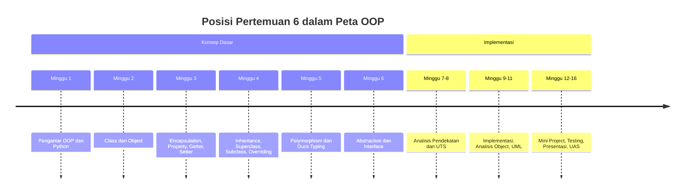
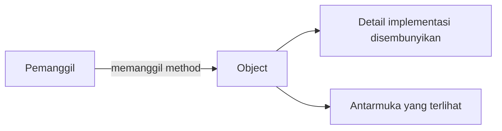
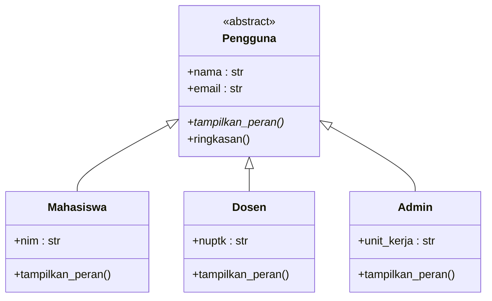

# Pertemuan 6 — Abstraction dan Interface pada Python

| | |
|:--|:--|
| **Mata Kuliah** | USA-WP2360214 — Pemrograman Berorientasi Objek |
| **Pertemuan** | 6 dari 16 |
| **Tanggal** | Rabu, 21 Oktober 2026 |
| **CPMK** | CPMK114 |
| **Materi** | Abstraction, abstract class, abstract base class (ABC), abstract method, dan kontrak perilaku object |
| **Model Pembelajaran** | Case Based Learning / Problem Based Learning / Pair Programming |
| **Stack** | Python 3 |

> **Catatan penting:** Pertemuan 6 membahas abstraction sebagai cara menyembunyikan detail implementasi dan menampilkan antarmuka yang penting. Anda akan menggunakan `abc` dari standard library untuk membuat abstract class, mendefinisikan abstract method sebagai kontrak, dan memastikan setiap subclass mengimplementasikan perilaku yang diwajibkan pada studi kasus Sistem Informasi.

---

## Daftar Isi

- [Pertemuan 6 — Abstraction dan Interface pada Python](#pertemuan-6--abstraction-dan-interface-pada-python)
  - [Daftar Isi](#daftar-isi)
  - [1. Keterkaitan Pertemuan dengan RPS OBE](#1-keterkaitan-pertemuan-dengan-rps-obe)
  - [2. Capaian Pembelajaran Pertemuan](#2-capaian-pembelajaran-pertemuan)
  - [3. Pemantik Kasus: Kontrak Perilaku Object](#3-pemantik-kasus-kontrak-perilaku-object)
  - [4. Konsep Abstraction](#4-konsep-abstraction)
  - [5. Abstract Class dan Abstract Method](#5-abstract-class-dan-abstract-method)
  - [6. Abstract Base Class (ABC)](#6-abstract-base-class-abc)
  - [7. Interface sebagai Kontrak Perilaku](#7-interface-sebagai-kontrak-perilaku)
  - [8. Abstraction dan Polymorphism](#8-abstraction-dan-polymorphism)
  - [9. Studi Kasus: Pengguna Sistem Informasi](#9-studi-kasus-pengguna-sistem-informasi)
  - [10. Case Based Learning: Pengguna Abstrak](#10-case-based-learning-pengguna-abstrak)
  - [11. Aktivitas Kelompok](#11-aktivitas-kelompok)
  - [12. Latihan Individu](#12-latihan-individu)
  - [13. Pemanfaatan AI sebagai Coding Assistant](#13-pemanfaatan-ai-sebagai-coding-assistant)
  - [14. Kuis Formatif](#14-kuis-formatif)
  - [15. Asesmen dan Penugasan](#15-asesmen-dan-penugasan)
  - [16. Persiapan menuju Pertemuan 7](#16-persiapan-menuju-pertemuan-7)
  - [17. Referensi dan Kode Praktikum](#17-referensi-dan-kode-praktikum)

---

## 1. Keterkaitan Pertemuan dengan RPS OBE

Pertemuan 6 mendukung **CPMK114** dan `SUB-CPMK11405` pada RPS:

> Mahasiswa mampu menganalisis dan menerapkan abstraction serta interface pada program Python.

Abstraction melengkapi empat pilar OOP yang telah dipelajari: encapsulation, inheritance, dan polymorphism. Setelah memahami polymorphism pada Pertemuan 5, Pertemuan 6 membahas bagaimana kontrak perilaku dapat ditegakkan melalui abstract class sehingga setiap subclass diwajibkan mengimplementasikan method tertentu.



---

## 2. Capaian Pembelajaran Pertemuan

Setelah mengikuti pertemuan ini, mahasiswa mampu:

| No. | Kemampuan | Indikator |
| :-: | --------- | --------- |
| 1 | Menjelaskan abstraction | Menguraikan penyembunyian detail implementasi dan penampilan antarmuka penting |
| 2 | Membuat abstract class | Mendefinisikan class yang tidak dapat diinstansiasi langsung |
| 3 | Mendefinisikan abstract method | Menetapkan method yang wajib diimplementasikan oleh subclass |
| 4 | Menggunakan `abc` | Menerapkan `ABC` dan `@abstractmethod` dari standard library |
| 5 | Menghubungkan abstraction dan polymorphism | Menjelaskan peran kontrak perilaku dalam pemrosesan object beragam |
| 6 | Menerapkan abstraction pada studi kasus | Membuat hierarki class dengan kontrak perilaku untuk domain Sistem Informasi |

---

## 3. Pemantik Kasus: Kontrak Perilaku Object

Sistem Informasi memiliki beberapa jenis pengguna yang harus menyediakan method `tampilkan_peran()` dan `ringkasan()`. Pada Pertemuan 5, kontrak tersebut hanya berupa kesepakatan tidak tertulis: jika method tidak diimplementasikan, error baru muncul saat dipanggil.

Analisis kasus berikut:

- Bagaimana memastikan setiap subclass wajib mengimplementasikan method tertentu?
- Apa yang terjadi jika sebuah subclass lupa mengimplementasikan method?
- Bagaimana cara mencegah abstract class diinstansiasi langsung?
- Apa perbedaan antara method yang diwajibkan dan method yang bersifat opsional?
- Bagaimana abstraction membantu pemrosesan object beragam?

Pada akhir pertemuan, Anda akan membuat abstract class yang menegakkan kontrak perilaku sehingga setiap subclass diwajibkan mengimplementasikan method yang ditentukan.

---

## 4. Konsep Abstraction

Abstraction adalah prinsip OOP yang menyembunyikan detail implementasi dan hanya menampilkan antarmuka yang penting bagi pengguna object. Pengguna object cukup mengetahui method apa yang dapat dipanggil, tanpa perlu memahami bagaimana method tersebut bekerja di dalamnya.



Contoh dalam kehidupan sehari-hari: pengguna mesin ATM tidak perlu mengetahui cara kerja internal mesin. Pengguna cukup mengetahui antarmuka, yaitu memasukkan kartu, memasukkan PIN, dan memilih transaksi. Detail internal disembunyikan.

Dalam OOP, abstraction dicapai dengan mendefinisikan class yang menampilkan method publik, sedangkan detail implementasi berada di dalam class. Abstract class memperkuat abstraction dengan menetapkan method yang wajib dimiliki setiap subclass.

---

## 5. Abstract Class dan Abstract Method

Abstract class adalah class yang tidak dapat diinstansiasi langsung. Abstract class berfungsi sebagai kerangka yang mendefinisikan method yang wajib diimplementasikan oleh subclass.

Abstract method adalah method yang dideklarasikan tanpa implementasi lengkap. Subclass yang mewarisi abstract class wajib mengimplementasikan seluruh abstract method sebelum dapat diinstansiasi.

```python
from abc import ABC, abstractmethod

class Pengguna(ABC):
    def __init__(self, nama, email):
        self.nama = nama
        self.email = email

    @abstractmethod
    def tampilkan_peran(self):
        pass
```

Class `Pengguna` tidak dapat diinstansiasi langsung karena memiliki abstract method `tampilkan_peran()`. Subclass yang tidak mengimplementasikan method tersebut juga tidak dapat diinstansiasi.

---

## 6. Abstract Base Class (ABC)

Python menyediakan modul `abc` pada standard library. Modul ini berisi `ABC` sebagai class dasar dan `@abstractmethod` sebagai decorator untuk menandai method abstrak.

```python
from abc import ABC, abstractmethod

class Pengguna(ABC):
    def __init__(self, nama, email):
        self.nama = nama
        self.email = email

    @abstractmethod
    def tampilkan_peran(self):
        pass

    def ringkasan(self):
        return f"{self.nama} — {self.email} — {self.tampilkan_peran()}"
```

Perhatikan bahwa abstract class tetap dapat memiliki method biasa seperti `ringkasan()`. Method biasa ini diwarisi dan dapat langsung digunakan oleh subclass. Hanya method yang ditandai `@abstractmethod` yang wajib diimplementasikan.

Jika sebuah subclass tidak mengimplementasikan seluruh abstract method, Python memunculkan `TypeError` saat subclass diinstansiasi:

```python
class Mahasiswa(Pengguna):
    pass

# TypeError: Can't instantiate abstract class Mahasiswa
# with abstract method tampilkan_peran
```

Error ini muncul lebih awal dibandingkan pendekatan duck typing pada Pertemuan 5, yaitu saat object dibuat, bukan saat method dipanggil.

---

## 7. Interface sebagai Kontrak Perilaku

Dalam OOP, interface adalah kontrak yang mendefinisikan method yang harus dimiliki sebuah class. Python tidak memiliki kata kunci `interface` seperti bahasa lain. Peran interface dapat didekati dengan abstract class yang seluruh method-nya abstrak.

```python
from abc import ABC, abstractmethod

class KontrakPengguna(ABC):
    @abstractmethod
    def tampilkan_peran(self):
        pass

    @abstractmethod
    def ringkasan(self):
        pass
```

Class `KontrakPengguna` hanya berisi abstract method. Class ini tidak menyimpan attribute dan tidak menyediakan implementasi. Setiap class yang ingin dianggap sebagai pengguna sistem wajib mengimplementasikan kedua method tersebut.

Kontrak ini membuat pemrosesan object beragam menjadi lebih aman: pemanggil dapat yakin bahwa setiap object yang lolos instansiasi memiliki method yang diwajibkan.

---

## 8. Abstraction dan Polymorphism

Abstraction dan polymorphism saling melengkapi. Abstraction menetapkan kontrak method yang wajib dimiliki, sedangkan polymorphism memungkinkan method yang sama menghasilkan perilaku berbeda pada setiap class.

```python
def tampilkan_semua(daftar_pengguna):
    for data in daftar_pengguna:
        print(data.ringkasan())
```

Fungsi `tampilkan_semua()` tidak perlu memeriksa tipe object. Fungsi cukup memanggil `ringkasan()` karena kontrak abstraction menjamin setiap object yang masuk ke daftar memiliki method tersebut.



Pada kode diagram, `tampilkan_peran()` ditulis dengan tanda `*` di akhir (`tampilkan_peran()*`) untuk menandai abstract method. Saat diagram dirender, method abstract ditampilkan dengan huruf miring (italic). Subclass wajib mengimplementasikan method tersebut sebelum dapat diinstansiasi.

---

## 9. Studi Kasus: Pengguna Sistem Informasi

Sistem Informasi memiliki tiga jenis pengguna: `Mahasiswa`, `Dosen`, dan `Admin`. Ketiga class mewarisi `Pengguna` yang merupakan abstract class.

`Pengguna` mendefinisikan:

- attribute `nama` dan `email` yang diinisialisasi melalui constructor;
- abstract method `tampilkan_peran()` yang wajib diimplementasikan;
- method `ringkasan()` yang memanggil `tampilkan_peran()`.

Setiap subclass mengimplementasikan `tampilkan_peran()` sesuai perannya. Dengan kontrak ini, sistem dapat memproses daftar pengguna beragam tanpa memeriksa tipe object satu per satu.

Gunakan pertanyaan berikut untuk mengevaluasi rancangan:

1. Apakah `Pengguna` perlu diinstansiasi langsung?
2. Apakah setiap subclass mengimplementasikan seluruh abstract method?
3. Apakah method `ringkasan()` dapat ditempatkan pada superclass?
4. Apakah kontrak perilaku mempermudah pemrosesan object beragam?

---

## 10. Case Based Learning: Pengguna Abstrak

Implementasi tersedia pada [`../code/pertemuan-06/abstraksi_pengguna.py`](../code/pertemuan-06/abstraksi_pengguna.py).

```bash
python3 ../code/pertemuan-06/abstraksi_pengguna.py
```

Amati hal berikut:

- `Pengguna` ditandai sebagai abstract class dengan `ABC`;
- `tampilkan_peran()` ditandai `@abstractmethod`;
- setiap subclass mengimplementasikan `tampilkan_peran()`;
- percobaan menginstansiasi `Pengguna` langsung menghasilkan `TypeError`;
- fungsi `tampilkan_semua()` memproses daftar object beragam.

Contoh pemakaian:

```python
pengguna = [
    Mahasiswa("Budi", "budi@example.com", "SI-101", "Sistem Informasi"),
    Dosen("Sari", "sari@example.com", "NUPTK-001", "Pemrograman"),
    Admin("Rina", "rina@example.com", "Akademik"),
]

tampilkan_semua(pengguna)
```

---

## 11. Aktivitas Kelompok

Bentuk kelompok 3–4 orang:

1. Gunakan hierarki class dari Pertemuan 5 atau pilih domain Sistem Informasi lain.
2. Ubah superclass menjadi abstract class dengan minimal dua abstract method.
3. Tentukan method yang bersifat wajib dan method yang bersifat opsional.
4. Implementasikan seluruh abstract method pada setiap subclass.
5. Uji bahwa abstract class tidak dapat diinstansiasi langsung.
6. Uji bahwa subclass yang belum lengkap memunculkan `TypeError`.
7. Catat hasil pengujian dan jelaskan manfaat kontrak perilaku.

---

## 12. Latihan Individu

Gunakan scaffold berikut:

- [`../code/pertemuan-06/latihan_terbimbing_6.py`](../code/pertemuan-06/latihan_terbimbing_6.py) — abstract class `AlatElektronik`, `Televisi`, dan `Kulkas`.
- [`../code/pertemuan-06/latihan_mandiri_6.py`](../code/pertemuan-06/latihan_mandiri_6.py) — abstract class `Transaksi`, `TransaksiTunai`, dan `TransaksiTransfer`.

Latihan mandiri harus memenuhi ketentuan:

1. `Transaksi` adalah abstract class dengan abstract method `proses()`.
2. `TransaksiTunai` mengimplementasikan `proses()` untuk pembayaran tunai.
3. `TransaksiTransfer` menambahkan nomor referensi dan mengimplementasikan `proses()` untuk transfer.
4. Buat fungsi yang memproses daftar transaksi tanpa memeriksa tipe.
5. Program diuji dengan minimal satu object dari setiap subclass.

---

## 13. Pemanfaatan AI sebagai Coding Assistant

**AI assistant dapat digunakan dengan pendekatan yang tepat:**

**Gunakan AI untuk:**

- Menjelaskan perbedaan abstract class, abstract method, dan interface.
- Membantu membaca error `TypeError` pada abstract class.
- Membandingkan pendekatan duck typing dengan kontrak abstraction.
- Membuat skenario pengujian untuk subclass yang belum lengkap.

**Jangan gunakan AI untuk:**

- Menuliskan seluruh hierarki class tanpa memahami kontrak setiap class.
- Menyalin implementasi abstract method tanpa menguji instansiasi subclass.
- Menghapus abstract method hanya untuk menghindari error.
- Memasukkan data pribadi atau kredensial ke dalam prompt.

**Etika di kelas:**

1. Anda wajib dapat menjelaskan fungsi abstract class, abstract method, dan kontrak perilaku pada kode yang diserahkan.
2. Jika memakai AI, cantumkan penggunaannya pada komentar kode atau refleksi.
   Contoh yang sesuai dengan materi abstraction:

   ```python
   # Bantuan: GitHub Copilot — penjelasan abstract method sebagai kontrak perilaku.
   @abstractmethod
   def tampilkan_peran(self):
       pass
   ```

3. AI digunakan sebagai asisten. Anda tetap bertanggung jawab memahami, menjalankan, dan menguji kode.

---

## 14. Kuis Formatif

Gunakan [Quiz Pertemuan 6](./02-Quiz-Pertemuan-6.md) setelah praktikum.

---

## 15. Asesmen dan Penugasan

| Komponen | Bentuk | Keterangan |
|:---------|:-------|:-----------|
| Praktikum coding | Abstraction | Membuat abstract class dan abstract method |
| Quiz | 5 soal | Mengukur pemahaman abstraction dan kontrak perilaku |
| Latihan mandiri | `TransaksiTunai` dan `TransaksiTransfer` | Diserahkan sesuai arahan dosen |

Checklist:

- [ ] Abstract class tidak dapat diinstansiasi langsung.
- [ ] Setiap subclass mengimplementasikan seluruh abstract method.
- [ ] Subclass yang belum lengkap memunculkan `TypeError`.
- [ ] Fungsi pemanggil tidak memeriksa tipe object.
- [ ] Program diuji dengan Python 3.

---

## 16. Persiapan menuju Pertemuan 7

Pada Pertemuan 7, mahasiswa akan membandingkan OOP dengan pemrograman prosedural (procedural programming) melalui analisis kebutuhan.

Persiapkan hal berikut:

- Baca ulang konsep abstraction, abstract class, dan abstract method.
- Jalankan `abstraksi_pengguna.py` dan amati error saat abstract class diinstansiasi.
- Selesaikan `latihan_mandiri_6.py` dan uji instansiasi setiap subclass.
- Siapkan contoh program yang sama ditulis dengan pendekatan OOP dan pendekatan prosedural untuk dibandingkan.

---

## 17. Referensi dan Kode Praktikum

Referensi:

- [Python Docs — ABC (Abstract Base Classes)](https://docs.python.org/3/library/abc.html)
- [Python Docs — Classes](https://docs.python.org/3/tutorial/classes.html)
- [Real Python — Object-Oriented Programming (OOP) in Python 3](https://realpython.com/python3-object-oriented-programming/)
- [Refactoring Guru — Prinsip OOP & Design Patterns](https://refactoring.guru/design-patterns)
- [PEP 8 — Naming Conventions](https://peps.python.org/pep-0008/)

Kode praktikum:

- [`../code/pertemuan-06/abstraksi_pengguna.py`](../code/pertemuan-06/abstraksi_pengguna.py) — contoh abstract class, abstract method, dan kontrak perilaku.
- [`../code/pertemuan-06/latihan_terbimbing_6.py`](../code/pertemuan-06/latihan_terbimbing_6.py) — scaffold latihan terbimbing.
- [`../code/pertemuan-06/latihan_mandiri_6.py`](../code/pertemuan-06/latihan_mandiri_6.py) — scaffold latihan mandiri.