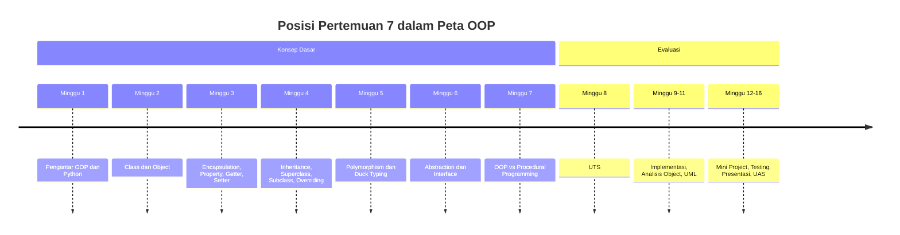
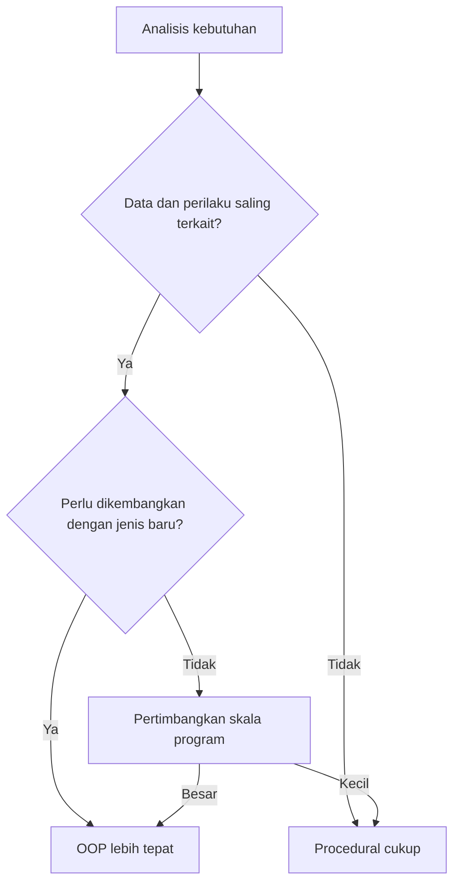

# Pertemuan 7 — OOP vs Procedural Programming

| | |
|:--|:--|
| **Mata Kuliah** | USA-WP2360214 — Pemrograman Berorientasi Objek |
| **Pertemuan** | 7 dari 16 |
| **Tanggal** | Rabu, 28 Oktober 2026 |
| **CPMK** | CPMK114 |
| **Materi** | Perbandingan OOP dan procedural programming, analisis kebutuhan, dan pemilihan pendekatan |
| **Model Pembelajaran** | Case Based Learning / Problem Based Learning / Diskusi |
| **Stack** | Python 3 |

> **Catatan penting:** Pertemuan 7 membahas perbandingan antara pemrograman berorientasi objek (OOP) dan pemrograman prosedural (procedural programming). Anda akan menganalisis kebutuhan program, membandingkan kedua pendekatan pada kasus yang sama, dan menentukan kapan masing-masing pendekatan lebih tepat digunakan pada studi kasus Sistem Informasi.

---

## Daftar Isi

- [Pertemuan 7 — OOP vs Procedural Programming](#pertemuan-7--oop-vs-procedural-programming)
  - [Daftar Isi](#daftar-isi)
  - [1. Keterkaitan Pertemuan dengan RPS OBE](#1-keterkaitan-pertemuan-dengan-rps-obe)
  - [2. Capaian Pembelajaran Pertemuan](#2-capaian-pembelajaran-pertemuan)
  - [3. Pemantik Kasus: Dua Cara Menyelesaikan Masalah](#3-pemantik-kasus-dua-cara-menyelesaikan-masalah)
  - [4. Konsep Procedural Programming](#4-konsep-procedural-programming)
  - [5. Konsep OOP](#5-konsep-oop)
  - [6. Perbandingan Kedua Pendekatan](#6-perbandingan-kedua-pendekatan)
  - [7. Analisis Kebutuhan Program](#7-analisis-kebutuhan-program)
  - [8. Kapan Menggunakan OOP](#8-kapan-menggunakan-oop)
  - [9. Kapan Menggunakan Procedural](#9-kapan-menggunakan-procedural)
  - [10. Studi Kasus: Sistem Informasi Perpustakaan](#10-studi-kasus-sistem-informasi-perpustakaan)
  - [11. Case Based Learning: Perbandingan Implementasi](#11-case-based-learning-perbandingan-implementasi)
  - [12. Aktivitas Kelompok](#12-aktivitas-kelompok)
  - [13. Latihan Individu](#13-latihan-individu)
  - [14. Pemanfaatan AI sebagai Coding Assistant](#14-pemanfaatan-ai-sebagai-coding-assistant)
  - [15. Kuis Formatif](#15-kuis-formatif)
  - [16. Asesmen dan Penugasan](#16-asesmen-dan-penugasan)
  - [17. Persiapan menuju Pertemuan 8](#17-persiapan-menuju-pertemuan-8)
  - [18. Referensi dan Kode Praktikum](#18-referensi-dan-kode-praktikum)

---

## 1. Keterkaitan Pertemuan dengan RPS OBE

Pertemuan 7 mendukung **CPMK114** dan `SUB-CPMK11406` pada RPS:

> Mahasiswa mampu menganalisis kebutuhan program dan membandingkan pendekatan OOP dengan procedural programming.

Pertemuan ini menjadi penutup rangkaian konsep dasar OOP sebelum UTS. Setelah memahami encapsulation, inheritance, polymorphism, dan abstraction pada Pertemuan 3–6, Pertemuan 7 membahas kapan pendekatan OOP lebih tepat dibandingkan pendekatan prosedural.



---

## 2. Capaian Pembelajaran Pertemuan

Setelah mengikuti pertemuan ini, mahasiswa mampu:

| No. | Kemampuan | Indikator |
| :-: | --------- | --------- |
| 1 | Menjelaskan procedural programming | Menguraikan alur program sebagai urutan fungsi dan data terpisah |
| 2 | Menjelaskan OOP | Menguraikan penggabungan data dan perilaku dalam object |
| 3 | Membandingkan kedua pendekatan | Menyebutkan karakteristik, kelebihan, dan keterbatasan masing-masing |
| 4 | Menganalisis kebutuhan program | Menentukan pendekatan yang sesuai berdasarkan karakteristik masalah |
| 5 | Menerapkan perbandingan pada studi kasus | Menulis program yang sama dengan kedua pendekatan dan membandingkannya |

---

## 3. Pemantik Kasus: Dua Cara Menyelesaikan Masalah

Sistem Informasi perpustakaan perlu mengelola data buku, anggota, dan peminjaman. Masalah yang sama dapat diselesaikan dengan dua pendekatan berbeda: procedural programming dan OOP.

Analisis kasus berikut:

- Bagaimana data buku dan anggota disimpan pada pendekatan prosedural?
- Bagaimana data dan perilaku digabungkan pada pendekatan OOP?
- Pendekatan mana yang lebih mudah dikembangkan ketika jenis pengguna bertambah?
- Pendekatan mana yang lebih sederhana untuk program kecil?
- Apa konsekuensi jangka panjang dari setiap pilihan?

Pada akhir pertemuan, Anda akan menulis program yang sama dengan kedua pendekatan dan menganalisis perbedaannya.

---

## 4. Konsep Procedural Programming

Procedural programming adalah pendekatan yang menyusun program sebagai urutan instruksi yang dijalankan langkah demi langkah. Program dipecah menjadi fungsi-fungsi, sedangkan data disimpan secara terpisah dalam variabel atau struktur data.

```python
# Pendekatan prosedural: data dan fungsi terpisah
buku = {"judul": "Pemrograman Python", "tersedia": True}

def pinjam_buku(buku):
    if buku["tersedia"]:
        buku["tersedia"] = False
        return True
    return False

def tampilkan_status(buku):
    status = "Tersedia" if buku["tersedia"] else "Dipinjam"
    print(f"{buku['judul']} [{status}]")

pinjam_buku(buku)
tampilkan_status(buku)
```

Pada pendekatan ini, data disimpan dalam dictionary dan fungsi menerima data sebagai parameter. Fungsi dan data tidak terikat dalam satu kesatuan.

---

## 5. Konsep OOP

OOP menggabungkan data dan perilaku dalam satu kesatuan yang disebut object. Class mendefinisikan attribute dan method, sedangkan object adalah instance dari class tersebut.

```python
# Pendekatan OOP: data dan perilaku digabung dalam class
class Buku:
    def __init__(self, judul):
        self.judul = judul
        self.tersedia = True

    def pinjam(self):
        if self.tersedia:
            self.tersedia = False
            return True
        return False

    def tampilkan_status(self):
        status = "Tersedia" if self.tersedia else "Dipinjam"
        print(f"{self.judul} [{status}]")

buku = Buku("Pemrograman Python")
buku.pinjam()
buku.tampilkan_status()
```

Pada pendekatan ini, data (`judul`, `tersedia`) dan perilaku (`pinjam()`, `tampilkan_status()`) berada dalam satu class. Object mengelola datanya sendiri.

---

## 6. Perbandingan Kedua Pendekatan

| Aspek | Procedural Programming | OOP |
|:------|:-----------------------|:----|
| Struktur | Urutan instruksi dan fungsi | Object yang menggabungkan data dan perilaku |
| Data | Terpisah dari fungsi | Menyatu dalam object |
| Fokus | Proses atau langkah kerja | Object dan interaksinya |
| Reusability | Melalui fungsi | Melalui class dan inheritance |
| Perubahan data | Fungsi harus menyesuaikan struktur data | Perubahan dikelola dalam class |
| Kompleksitas | Sederhana untuk program kecil | Lebih terstruktur untuk program besar |
| Kurva belajar | Lebih mudah dipahami pemula | Memerlukan pemahaman konsep tambahan |

Kedua pendekatan dapat digunakan untuk menyelesaikan masalah yang sama. Perbedaannya terletak pada cara mengorganisasi kode dan kemudahan pengembangan jangka panjang.

---

## 7. Analisis Kebutuhan Program

Pemilihan pendekatan sebaiknya didasarkan pada analisis kebutuhan, bukan kebiasaan. Gunakan pertanyaan berikut:

1. Apakah program memiliki banyak data yang saling terkait?
2. Apakah data memiliki perilaku yang melekat, seperti validasi atau aturan?
3. Apakah program akan dikembangkan dengan menambah jenis data baru?
4. Apakah beberapa jenis data memiliki karakteristik yang sama?
5. Apakah program berukuran kecil dan sekali pakai?
6. Apakah tim lebih memahami salah satu pendekatan?



Jawaban atas pertanyaan tersebut membantu menentukan pendekatan yang sesuai. Tidak ada pendekatan yang selalu lebih baik; keduanya memiliki konteks penggunaan masing-masing.

---

## 8. Kapan Menggunakan OOP

OOP lebih tepat digunakan ketika:

- data dan perilaku saling terkait erat, misalnya validasi yang melekat pada data;
- program memerlukan beberapa jenis object dengan karakteristik yang sama, sehingga inheritance membantu;
- program diperkirakan berkembang dengan menambah jenis data atau perilaku baru;
- encapsulation diperlukan untuk melindungi data dari perubahan yang tidak terkontrol;
- tim perlu membagi pekerjaan berdasarkan class atau modul.

Contoh: Sistem Informasi perpustakaan dengan `Buku`, `Anggota`, dan `Peminjaman` yang saling berinteraksi dan akan terus dikembangkan.

---

## 9. Kapan Menggunakan Procedural

Procedural programming lebih tepat digunakan ketika:

- program berukuran kecil dan alurnya sederhana;
- data tidak memiliki perilaku yang kompleks;
- program bersifat sekali pakai, misalnya skrip untuk mengolah data;
- kebutuhan utama adalah urutan langkah yang jelas, bukan pengelolaan state object;
- tim lebih mudah memahami dan memelihara kode berbasis fungsi.

Contoh: skrip sederhana untuk menghitung total nilai mahasiswa dari daftar data tanpa interaksi antar-object.

---

## 10. Studi Kasus: Sistem Informasi Perpustakaan

Sistem Informasi perpustakaan memiliki data buku, anggota, dan peminjaman. Pada pendekatan prosedural, data disimpan dalam dictionary dan fungsi mengelola data tersebut. Pada pendekatan OOP, setiap entitas menjadi class dengan data dan perilaku sendiri.

Gunakan pertanyaan berikut untuk mengevaluasi rancangan:

1. Apakah data buku dan anggota memiliki perilaku yang melekat?
2. Apakah sistem akan bertambah jenis pengguna atau jenis koleksi?
3. Apakah validasi data lebih mudah dikelola dalam class?
4. Pendekatan mana yang lebih mudah diuji dan dikembangkan?

---

## 11. Case Based Learning: Perbandingan Implementasi

Implementasi tersedia pada:

- [`../code/pertemuan-07/perpustakaan_prosedural.py`](../code/pertemuan-07/perpustakaan_prosedural.py) — pendekatan prosedural.
- [`../code/pertemuan-07/perpustakaan_oop.py`](../code/pertemuan-07/perpustakaan_oop.py) — pendekatan OOP.

```bash
python3 ../code/pertemuan-07/perpustakaan_prosedural.py
python3 ../code/pertemuan-07/perpustakaan_oop.py
```

Amati hal berikut:

- cara data disimpan pada kedua pendekatan;
- cara fungsi atau method mengelola data;
- cara menambah jenis pengguna baru pada kedua pendekatan;
- perbedaan struktur kode dan kemudahan pengembangan.

---

## 12. Aktivitas Kelompok

Bentuk kelompok 3–4 orang:

1. Pilih satu domain Sistem Informasi, seperti perpustakaan, akademik, atau layanan administrasi.
2. Tuliskan kebutuhan program secara singkat: data apa saja, perilaku apa saja, dan kemungkinan pengembangan.
3. Rancang solusi dengan pendekatan prosedural dan pendekatan OOP.
4. Bandingkan kedua rancangan berdasarkan struktur, pengembangan, dan pengujian.
5. Tentukan pendekatan yang lebih tepat dan berikan alasan teknis.
6. Sajikan hasil analisis dalam bentuk tabel atau diagram.

---

## 13. Latihan Individu

Gunakan scaffold berikut:

- [`../code/pertemuan-07/latihan_terbimbing_7.py`](../code/pertemuan-07/latihan_terbimbing_7.py) — perbandingan sederhana pengelolaan nilai mahasiswa.
- [`../code/pertemuan-07/latihan_mandiri_7.py`](../code/pertemuan-07/latihan_mandiri_7.py) — analisis dan implementasi pengelolaan data buku.

Latihan mandiri harus memenuhi ketentuan:

1. Tuliskan fungsi prosedural untuk menambah, menampilkan, dan menghapus buku dari daftar.
2. Tuliskan class `Buku` dan `KoleksiBuku` untuk kebutuhan yang sama.
3. Bandingkan kedua implementasi berdasarkan struktur data dan pengelolaan perilaku.
4. Tuliskan analisis singkat: pendekatan mana yang lebih tepat untuk sistem perpustakaan yang berkembang, beserta alasan teknis.

---

## 14. Pemanfaatan AI sebagai Coding Assistant

**AI assistant (GitHub Copilot, ChatGPT, Claude, Gemini) boleh dipakai — dengan cara yang benar:**

**✅ Gunakan AI untuk:**

- Menjelaskan perbedaan procedural programming dan OOP.
- Membantu menulis ulang program prosedural menjadi OOP.
- Membandingkan struktur kode kedua pendekatan.
- Membantu menyusun analisis kebutuhan program.

**❌ Hindari penggunaan AI untuk:**

- Menuliskan seluruh analisis tanpa memahami alasan teknis setiap pilihan.
- Menyalin implementasi tanpa menguji kedua pendekatan.
- Menganggap OOP selalu lebih baik tanpa analisis kebutuhan.
- Memasukkan data pribadi atau kredensial ke dalam prompt.

**Etika di kelas ini:**

1. Anda wajib dapat menjelaskan perbedaan kedua pendekatan dan alasan pemilihan pada tugas yang diserahkan.
2. Cantumkan penggunaan bantuan AI pada komentar kode atau refleksi.
   Contoh yang sesuai dengan materi perbandingan:

   ```python
   # Bantuan: GitHub Copilot — penjelasan perbedaan penyimpanan data prosedural dan OOP.
   ```

3. AI digunakan sebagai alat bantu pembelajaran. Anda tetap bertanggung jawab memahami, menjelaskan, dan menguji kode yang digunakan dalam tugas. Penggunaan AI tidak menggantikan proses menganalisis kebutuhan dan memilih pendekatan pemrograman.

---

## 15. Kuis Formatif

Gunakan [Quiz Pertemuan 7](./02-Quiz-Pertemuan-7.md) setelah praktikum.

---

## 16. Asesmen dan Penugasan

| Komponen | Bentuk | Keterangan |
|:---------|:-------|:-----------|
| Praktikum coding | Perbandingan implementasi | Menulis program yang sama dengan kedua pendekatan |
| Quiz | 5 soal | Mengukur pemahaman perbedaan kedua pendekatan |
| Tugas analisis | Analisis kebutuhan | Diserahkan sesuai arahan dosen |

Checklist:

- [ ] Program prosedural dan OOP ditulis untuk kebutuhan yang sama.
- [ ] Perbandingan mencakup struktur, pengembangan, dan pengujian.
- [ ] Analisis menyebutkan alasan teknis pemilihan pendekatan.
- [ ] Program diuji dengan Python 3.

---

## 17. Persiapan menuju Pertemuan 8

Pada Pertemuan 8, mahasiswa akan mengikuti **UTS** yang mencakup teori dan coding/problem solving OOP.

Persiapkan hal berikut:

- Baca ulang seluruh materi Pertemuan 1–7: class, object, encapsulation, inheritance, polymorphism, abstraction, dan perbandingan pendekatan.
- Jalankan kembali seluruh contoh kode dari `code/pertemuan-01/` hingga `code/pertemuan-07/`.
- Selesaikan seluruh latihan mandiri dan pahami kunci jawaban.
- Latih menulis class, menggunakan `super()`, property, abstract method, dan fungsi polimorfik tanpa melihat catatan.

---

## 18. Referensi dan Kode Praktikum

Referensi:

- [Python Docs — Classes](https://docs.python.org/3/tutorial/classes.html)
- [Real Python — Object-Oriented Programming (OOP) in Python 3](https://realpython.com/python3-object-oriented-programming/)
- [Refactoring Guru — Prinsip OOP & Design Patterns](https://refactoring.guru/design-patterns)
- [PEP 8 — Naming Conventions](https://peps.python.org/pep-0008/)

Kode praktikum:

- [`../code/pertemuan-07/perpustakaan_prosedural.py`](../code/pertemuan-07/perpustakaan_prosedural.py) — contoh pendekatan prosedural.
- [`../code/pertemuan-07/perpustakaan_oop.py`](../code/pertemuan-07/perpustakaan_oop.py) — contoh pendekatan OOP.
- [`../code/pertemuan-07/latihan_terbimbing_7.py`](../code/pertemuan-07/latihan_terbimbing_7.py) — scaffold latihan terbimbing.
- [`../code/pertemuan-07/latihan_mandiri_7.py`](../code/pertemuan-07/latihan_mandiri_7.py) — scaffold latihan mandiri.