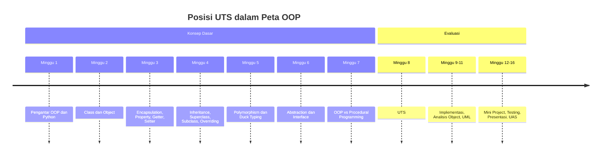
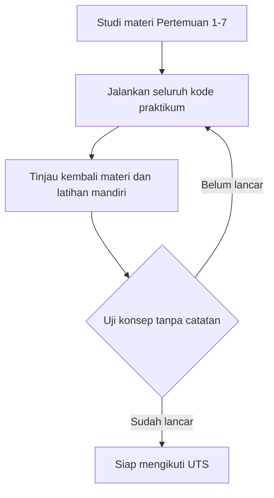

# Pertemuan 8 — UTS: Konsep OOP, Analisis Desain, dan Coding

| | |
|:--|:--|
| **Mata Kuliah** | USA-WP2360214 — Pemrograman Berorientasi Objek |
| **Pertemuan** | 8 dari 16 |
| **Tanggal** | Rabu, 4 November 2026 |
| **CPMK** | CPMK114 |
| **Materi** | Ujian Tengah Semester — konsep OOP, analisis desain, dan coding/problem solving |
| **Model Pembelajaran** | Evaluasi tertulis dan praktik |
| **Stack** | Python 3 |

> **Catatan penting:** Pertemuan 8 adalah **Ujian Tengah Semester (UTS)** yang mencakup materi Pertemuan 1–7. UTS mengukur pemahaman konsep OOP, kemampuan menganalisis desain, dan kemampuan menyelesaikan masalah melalui kode Python. Bobot UTS adalah 20% dari nilai akhir mata kuliah.

---

## Daftar Isi

- [Pertemuan 8 — UTS: Konsep OOP, Analisis Desain, dan Coding](#pertemuan-8--uts-konsep-oop-analisis-desain-dan-coding)
  - [Daftar Isi](#daftar-isi)
  - [1. Keterkaitan Pertemuan dengan RPS OBE](#1-keterkaitan-pertemuan-dengan-rps-obe)
  - [2. Capaian Pembelajaran Pertemuan](#2-capaian-pembelajaran-pertemuan)
  - [3. Pemantik: Evaluasi Rangkaian Konsep OOP](#3-pemantik-evaluasi-rangkaian-konsep-oop)
  - [4. Cakupan Materi UTS](#4-cakupan-materi-uts)
  - [5. Format dan Mekanisme UTS](#5-format-dan-mekanisme-uts)
  - [6. Kisi-Kisi Bagian Teori](#6-kisi-kisi-bagian-teori)
  - [7. Kisi-Kisi Bagian Coding dan Problem Solving](#7-kisi-kisi-bagian-coding-dan-problem-solving)
  - [8. Strategi Pengerjaan Soal Teori](#8-strategi-pengerjaan-soal-teori)
  - [9. Strategi Pengerjaan Soal Coding](#9-strategi-pengerjaan-soal-coding)
  - [10. Studi Kasus: Domain Sistem Informasi](#10-studi-kasus-domain-sistem-informasi)
    - [11. Latihan Terbimbing: Persiapan UTS](#11-latihan-terbimbing-persiapan-uts)
  - [12. Aktivitas Kelompok](#12-aktivitas-kelompok)
  - [13. Latihan Individu](#13-latihan-individu)
  - [14. Pemanfaatan AI sebagai Coding Assistant](#14-pemanfaatan-ai-sebagai-coding-assistant)
  - [15. Asesmen dan Penugasan](#15-asesmen-dan-penugasan)
  - [16. Persiapan menuju Pertemuan 9](#16-persiapan-menuju-pertemuan-9)
  - [17. Referensi dan Kode Praktikum](#17-referensi-dan-kode-praktikum)

---

## 1. Keterkaitan Pertemuan dengan RPS OBE

UTS mendukung **CPMK114** dan mencakup `SUB-CPMK11401–11403` pada RPS:

> Evaluasi capaian konsep dan analisis OOP.

RPS menetapkan UTS sebagai evaluasi berupa konsep OOP, analisis desain, dan coding/problem solving. UTS mengukur tiga kemampuan sekaligus: memahami konsep dasar OOP, menganalisis rancangan program, dan menulis kode Python yang bekerja sesuai kebutuhan.



---

## 2. Capaian Pembelajaran Pertemuan

Setelah mengikuti UTS, mahasiswa mampu:

| No. | Kemampuan | Indikator |
| :-: | --------- | --------- |
| 1 | Menjelaskan konsep dasar OOP | Menguraikan arti class, object, attribute, method, constructor, dan `self` |
| 2 | Menerapkan pilar OOP | Menjelaskan encapsulation, inheritance, polymorphism, dan abstraction beserta penggunaannya |
| 3 | Menganalisis desain program | Menilai struktur class, hubungan antar-class, dan pemilihan pendekatan pada program contoh |
| 4 | Menyelesaikan masalah dengan kode | Menulis class, method, dan konsep OOP yang dibutuhkan agar program berjalan benar |
| 5 | Membandingkan pendekatan | Menentukan penggunaan OOP atau procedural programming berdasarkan analisis kebutuhan |

---

## 3. Pemantik: Evaluasi Rangkaian Konsep OOP

Pada Pertemuan 1–7 Anda telah mempelajari konsep dasar OOP secara berurutan: class dan object, encapsulation, inheritance, polymorphism, abstraction, sampai perbandingan pendekatan. UTS menggabungkan seluruh konsep tersebut dalam satu evaluasi.

Jawablah pertanyaan berikut sebelum hari UTS:

1. Apa perbedaan class dan object, dan bagaimana hubungannya pada kode Python?
2. Kapan attribute privat dan `@property` digunakan?
3. Apa yang dilakukan `super()` dan kapan overriding diperlukan?
4. Bagaimana polymorphism bekerja melalui overriding dan duck typing?
5. Apa fungsi abstract class dan abstract method?
6. Kapan sebuah program lebih tepat ditulis dengan pendekatan prosedural?

Ketidakmampuan menjawab salah satu pertanyaan menunjukkan bagian materi yang perlu ditinjau ulang sebelum UTS.

---

## 4. Cakupan Materi UTS

Seluruh materi Pertemuan 1–7 masuk dalam cakupan UTS:

| Pertemuan | Topik | Konsep yang Diuji |
| :-------: | ----- | ----------------- |
| 1 | Pengantar OOP dan Python | paradigma OOP, class, object, attribute, method, constructor, `self` |
| 2 | Class dan Object | pembuatan object, interaksi antar-object, class attribute dan instance attribute |
| 3 | Encapsulation | access control, attribute privat, property, getter, setter, validasi data |
| 4 | Inheritance | superclass, subclass, `super()`, overriding, hierarki class |
| 5 | Polymorphism | overriding, duck typing, pemrosesan object beragam tipe |
| 6 | Abstraction dan Interface | abstract class, `ABC`, abstract method, kontrak perilaku |
| 7 | OOP vs Procedural | analisis kebutuhan, perbandingan pendekatan, pemilihan pendekatan |

---

## 5. Format dan Mekanisme UTS

| Aspek | Ketentuan |
| ----- | --------- |
| Waktu | Sesuai jadwal kelas — Rabu, 4 November 2026, 15:30–18:00 |
| Bentuk soal | Teori (uraian) dan coding/problem solving |
| Cakupan | Pertemuan 1–7, dengan penekanan pada penerapan konsep |
| Bobot | 20% dari nilai akhir mata kuliah |
| Perangkat | Python 3 pada komputer masing-masing, sesuai arahan dosen |
| Sumber bantuan | Tanpa catatan dan tanpa bantuan AI, kecuali ada arahan dosen |



Amati alur di atas — seluruh penyiapan dilakukan sebelum hari UTS, bukan saat ujian berlangsung.

---

## 6. Kisi-Kisi Bagian Teori

Bagian teori mengukur pemahaman konsep dan kemampuan menjelaskan. Topik yang mungkin muncul:

1. **Konsep dasar** — pengertian class, object, attribute, method, constructor, dan peran `self`.
2. **Encapsulation** — alasan menyembunyikan data, penggunaan attribute privat dan `@property`.
3. **Inheritance** — hubungan superclass dan subclass, penggunaan `super()`, keuntungan overriding.
4. **Polymorphism** — perbedaan polymorphism berbasis overriding dan duck typing.
5. **Abstraction** — peran abstract class dan abstract method sebagai kontrak perilaku.
6. **Perbandingan pendekatan** — kapan OOP lebih tepat dibandingkan pendekatan prosedural.

Contoh bentuk soal teori tersedia pada [Soal UTS](./02-Quiz-Pertemuan-8.md).

---

## 7. Kisi-Kisi Bagian Coding dan Problem Solving

Bagian coding mengukur kemampuan menerapkan konsep pada program yang berjalan. Kemampuan yang diuji:

| No. | Kemampuan | Contoh tugas soal |
| :-: | --------- | ----------------- |
| 1 | Membuat class dan object | mendefinisikan class dengan constructor dan method |
| 2 | Menerapkan encapsulation | menyembunyikan attribute dan menambahkan property dengan validasi |
| 3 | Membangun hierarki class | membuat superclass dan subclass serta menggunakan `super()` |
| 4 | Menerapkan polymorphism | menulis method yang sama pada beberapa class berbeda |
| 5 | Menganalisis kode | menemukan kesalahan pada program OOP dan memperbaikinya |
| 6 | Memilih pendekatan | menulis solusi prosedural atau OOP sesuai kebutuhan kasus |

---

## 8. Strategi Pengerjaan Soal Teori

1. Baca seluruh soal terlebih dahulu untuk mengetahui urutan kesulitan.
2. Jawab konsep dengan definisi singkat, lalu berikan satu contoh penerapannya pada kode Python.
3. Gunakan istilah teknis secara tepat: `class`, `object`, `attribute`, `method`, `constructor`, `self`, `encapsulation`, `inheritance`, `polymorphism`, `abstraction`.
4. Pada soal perbandingan, sebutkan karakteristik kedua pendekatan dan alasan teknis pemilihannya.
5. Periksa kembali jawaban yang menggunakan istilah yang sama tetapi konteksnya berbeda.

---

## 9. Strategi Pengerjaan Soal Coding

Ikuti urutan berikut untuk setiap soal coding:

1. **Baca kebutuhan** — tentukan data apa yang perlu disimpan dan perilaku apa yang perlu dimiliki.
2. **Tentukan class** — tentukan nama class, attribute, dan method sebelum menulis kode.
3. **Tulis constructor** — siapkan `__init__()` beserta attribute yang diperlukan.
4. **Tambahkan konsep OOP** — terapkan encapsulation, inheritance, polymorphism, atau abstraction sesuai tuntutan soal.
5. **Uji jalankan** — jalankan program dan pastikan hasil sesuai yang diminta.
6. **Periksa kembali** — pastikan penamaan mengikuti konvensi: class `PascalCase`, function dan variable `snake_case`.

```bash
python3 <nama_file_soal>.py
```

---

## 10. Studi Kasus: Domain Sistem Informasi

Soal UTS diambil dari domain Sistem Informasi yang telah digunakan sepanjang perkuliahan, antara lain perpustakaan dan akademik. Contoh skenario:

> Sistem Informasi perpustakaan menyimpan data buku dan anggota. Setiap buku memiliki judul dan status ketersediaan. Anggota dapat meminjam buku yang tersedia. Sistem perlu mendukung penambahan jenis koleksi baru tanpa mengubah fungsi yang sudah ada.

Dari skenario tersebut, soal dapat meminta Anda membuat class `Buku` dan `Anggota`, menerapkan validasi status peminjaman melalui encapsulation, atau menambahkan jenis koleksi baru melalui inheritance.

---

## 11. Latihan Terbimbing: Persiapan UTS

Latihan terbimbing untuk persiapan UTS menggunakan scaffold berikut:

- [`../code/pertemuan-08/latihan_persiapan_uts.py`](../code/pertemuan-08/latihan_persiapan_uts.py) — scaffold latihan gabungan konsep OOP.

```bash
python3 ../code/pertemuan-08/latihan_persiapan_uts.py
```

Scaffold ini sengaja belum lengkap. Anda perlu melengkapi setiap bagian bertanda `LATIHAN` sebelum dijalankan. Kerjakan latihan secara mandiri dan uji program setelah setiap bagian selesai.

Amati hal berikut saat mengerjakan:

- bagaimana attribute disimpan dalam constructor;
- bagaimana validasi diterapkan melalui property;
- bagaimana subclass memanfaatkan superclass;
- bagaimana method dengan nama sama bekerja pada object yang berbeda.

---

## 12. Aktivitas Kelompok

Bentuk kelompok 3–4 orang untuk sesi tinjauan sebelum UTS:

1. Bagi topik tinjauan: konsep dasar, encapsulation, inheritance, polymorphism, abstraction, dan perbandingan pendekatan.
2. Setiap anggota menjelaskan satu konsep kepada kelompok dengan contoh kode singkat.
3. Diskusikan kesalahan umum yang pernah terjadi pada praktikum Pertemuan 1–7.
4. Kerjakan satu soal teori dan satu soal coding secara bersama, lalu bandingkan hasilnya.
5. Catat bagian materi yang masih belum dipahami dan tinjau ulang bersama.

---

## 13. Latihan Individu

Gunakan scaffold berikut:

- [`../code/pertemuan-08/latihan_persiapan_uts.py`](../code/pertemuan-08/latihan_persiapan_uts.py) — latihan gabungan konsep OOP.

Latihan persiapan harus memenuhi ketentuan:

1. Lengkapi class `Buku` dengan constructor, attribute, dan method peminjaman.
2. Lengkapi class `Anggota` dengan validasi nama melalui property.
3. Lengkapi subclass `BukuDigital` yang mewarisi `Buku` dan menggunakan `super()`.
4. Tuliskan fungsi polimorfik `tampilkan_info()` yang menerima object berbeda.
5. Jalankan program dan pastikan seluruh keluaran sesuai dengan yang diminta.

---

## 14. Pemanfaatan AI sebagai Coding Assistant

**AI assistant (GitHub Copilot, ChatGPT, Claude, Gemini) boleh dipakai — dengan cara yang benar:**

**✅ Gunakan AI untuk:**

- Menjelaskan konsep OOP yang belum dipahami selama persiapan.
- Membantu membaca pesan error pada latihan persiapan.
- Memberi alternatif implementasi untuk dibandingkan.
- Membantu menyusun daftar tinjauan materi Pertemuan 1–7.

**❌ Hindari penggunaan AI untuk:**

- Mengerjakan soal UTS saat ujian berlangsung.
- Menyalin jawaban tanpa memahami alasan teknis setiap baris kode.
- Menganggap hasil AI selalu benar tanpa menguji program.
- Memasukkan data pribadi atau kredensial ke dalam prompt.

**Etika di kelas ini:**

1. Anda wajib dapat menjelaskan setiap konsep dan kode yang diserahkan pada UTS.
2. Cantumkan penggunaan bantuan AI pada komentar kode atau refleksi selama persiapan.
   Contoh yang sesuai dengan materi UTS:

   ```python
   # Bantuan: GitHub Copilot — penjelasan perbedaan class attribute dan instance attribute.
   ```

3. AI digunakan sebagai alat bantu pembelajaran. Anda tetap bertanggung jawab memahami, menjelaskan, dan menguji kode yang digunakan selama persiapan. Penggunaan AI tidak diperbolehkan saat UTS, kecuali ada arahan dosen.

---

## 15. Asesmen dan Penugasan

| Komponen | Bentuk | Keterangan |
|:---------|:-------|:-----------|
| UTS teori | Uraian | Mengukur pemahaman konsep dan analisis desain |
| UTS coding | Problem solving | Mengukur kemampuan menulis dan memperbaiki kode Python |
| Bobot | 20% | Bagian dari nilai akhir mata kuliah |

Checklist:

- [ ] Seluruh materi Pertemuan 1–7 telah ditinjau.
- [ ] Seluruh contoh kode dari `code/pertemuan-01/` hingga `code/pertemuan-07/` telah dijalankan.
- [ ] Latihan persiapan UTS telah diselesaikan dan diuji.
- [ ] Program dapat ditulis tanpa melihat catatan.

---

## 16. Persiapan menuju Pertemuan 9

Pada Pertemuan 9, mahasiswa akan mempelajari **implementasi OOP dengan Python** untuk membangun aplikasi sederhana berbasis object.

Persiapkan hal berikut:

- Tinjau kembali konsep class, object, dan interaksi antar-object dari Pertemuan 1–2.
- Jalankan kembali contoh kode perpustakaan dari `code/pertemuan-07/`.
- Siapkan satu ide aplikasi sederhana berbasis object, misalnya pengelolaan data buku atau data mahasiswa.
- Baca kembali bagian analisis kebutuhan pada Pertemuan 7 sebagai dasar perancangan aplikasi.

---

## 17. Referensi dan Kode Praktikum

Referensi:

- [Python Docs — Classes](https://docs.python.org/3/tutorial/classes.html)
- [Real Python — Object-Oriented Programming (OOP) in Python 3](https://realpython.com/python3-object-oriented-programming/)
- [Python Docs — ABC (Abstract Base Classes)](https://docs.python.org/3/library/abc.html)
- [PEP 8 — Naming Conventions](https://peps.python.org/pep-0008/)

Kode praktikum:

- [`../code/pertemuan-08/latihan_persiapan_uts.py`](../code/pertemuan-08/latihan_persiapan_uts.py) — scaffold latihan persiapan UTS.