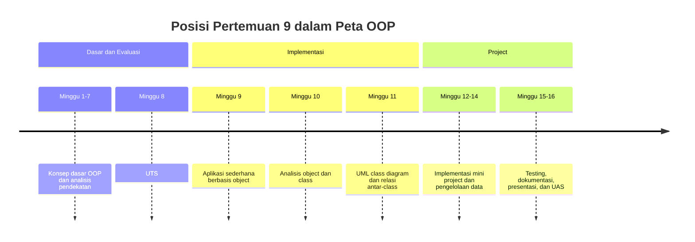
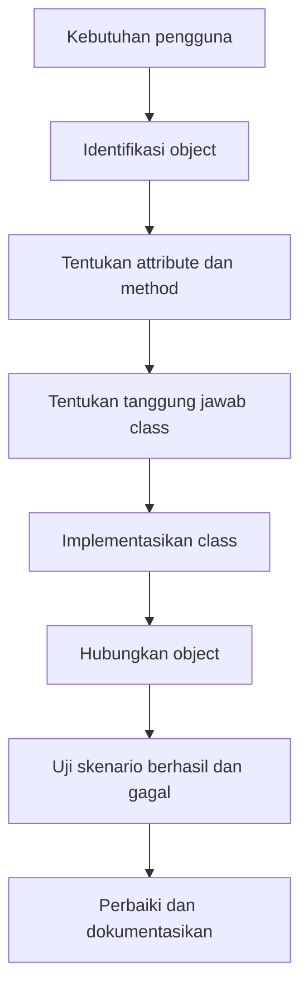
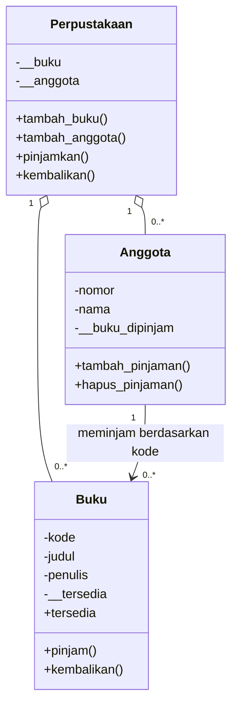

# Pertemuan 9 — Implementasi OOP dengan Python

| | |
|:--|:--|
| **Mata Kuliah** | USA-WP2360214 — Pemrograman Berorientasi Objek |
| **Pertemuan** | 9 dari 16 |
| **Tanggal** | Rabu, 11 November 2026 |
| **CPMK** | CPMK115 |
| **Materi** | Implementasi OOP dengan Python untuk membangun aplikasi sederhana berbasis object |
| **Model Pembelajaran** | Case Based Learning / Problem Based Learning / Praktikum |
| **Stack** | Python 3 |

> **Catatan penting:** Pertemuan 9 menghubungkan konsep OOP yang telah dipelajari pada Pertemuan 1–8 dengan implementasi aplikasi sederhana. Anda akan menerjemahkan kebutuhan menjadi class, mengatur tanggung jawab setiap object, dan menguji interaksi antar-object pada aplikasi perpustakaan.

---

## Daftar Isi

- [Pertemuan 9 — Implementasi OOP dengan Python](#pertemuan-9--implementasi-oop-dengan-python)
  - [Daftar Isi](#daftar-isi)
  - [1. Keterkaitan Pertemuan dengan RPS OBE](#1-keterkaitan-pertemuan-dengan-rps-obe)
  - [2. Capaian Pembelajaran Pertemuan](#2-capaian-pembelajaran-pertemuan)
  - [3. Pemantik Kasus: Dari Konsep ke Aplikasi](#3-pemantik-kasus-dari-konsep-ke-aplikasi)
  - [4. Alur Implementasi Aplikasi OOP](#4-alur-implementasi-aplikasi-oop)
  - [5. Merancang Model `Buku`](#5-merancang-model-buku)
  - [6. Merancang Model `Anggota`](#6-merancang-model-anggota)
  - [7. Merancang Class Pengelola](#7-merancang-class-pengelola)
  - [8. Interaksi Antar-Object](#8-interaksi-antar-object)
  - [9. Validasi dan Penanganan Kondisi](#9-validasi-dan-penanganan-kondisi)
  - [10. Studi Kasus: Aplikasi Perpustakaan Sederhana](#10-studi-kasus-aplikasi-perpustakaan-sederhana)
  - [11. Latihan Terbimbing: Implementasi Aplikasi](#11-latihan-terbimbing-implementasi-aplikasi)
  - [12. Aktivitas Kelompok](#12-aktivitas-kelompok)
  - [13. Latihan Individu](#13-latihan-individu)
  - [14. Pemanfaatan AI sebagai Coding Assistant](#14-pemanfaatan-ai-sebagai-coding-assistant)
  - [15. Kuis Formatif](#15-kuis-formatif)
  - [16. Asesmen dan Penugasan](#16-asesmen-dan-penugasan)
  - [17. Persiapan menuju Pertemuan 10](#17-persiapan-menuju-pertemuan-10)
  - [18. Referensi dan Kode Praktikum](#18-referensi-dan-kode-praktikum)

---

## 1. Keterkaitan Pertemuan dengan RPS OBE

Pertemuan 9 mendukung **CPMK115** dan `SUB-CPMK11501` pada RPS:

> Mahasiswa mampu mengimplementasikan solusi sederhana berbasis OOP dari kebutuhan Sistem Informasi.

Pada Pertemuan 1–7, konsep OOP dipelajari dan dibandingkan dengan pendekatan prosedural. Pertemuan 8 mengevaluasi konsep tersebut melalui UTS. Pertemuan 9 mulai menerapkan konsep itu sebagai aplikasi yang memiliki beberapa object dan aturan bisnis.



---

## 2. Capaian Pembelajaran Pertemuan

Setelah mengikuti pertemuan ini, mahasiswa mampu:

| No. | Kemampuan | Indikator |
| :-: | --------- | --------- |
| 1 | Menerjemahkan kebutuhan menjadi object | Mengidentifikasi data dan perilaku dari kasus Sistem Informasi |
| 2 | Membuat model class | Mendefinisikan constructor, attribute, method, dan representasi object |
| 3 | Mengatur tanggung jawab class | Memisahkan data buku, data anggota, dan aturan peminjaman |
| 4 | Menerapkan interaksi antar-object | Membuat object pengelola yang menggunakan object lain melalui method |
| 5 | Menguji aplikasi sederhana | Menjalankan skenario berhasil dan skenario dengan kondisi tidak valid |

---

## 3. Pemantik Kasus: Dari Konsep ke Aplikasi

Pada pertemuan sebelumnya, class `Buku` sudah dapat menyimpan data dan mengubah status ketersediaan. Namun, aplikasi perpustakaan membutuhkan lebih dari satu object:

- banyak buku harus disimpan dalam satu koleksi;
- anggota harus dapat terdaftar;
- peminjaman harus menghubungkan anggota dengan buku;
- buku yang sedang dipinjam tidak boleh dipinjam kembali;
- aplikasi perlu menampilkan keadaan terbaru setelah setiap operasi.

Pertanyaan pemantik:

1. Class apa saja yang diperlukan untuk kasus tersebut?
2. Attribute dan method apa yang menjadi tanggung jawab setiap class?
3. Class mana yang mengatur interaksi antara anggota dan buku?
4. Bagaimana program melaporkan operasi yang tidak dapat dilakukan?
5. Bagaimana rancangan dapat dikembangkan untuk kasus akademik atau administrasi?

Aplikasi yang baik tidak hanya memiliki beberapa class. Setiap class perlu memiliki tanggung jawab yang jelas sehingga perubahan pada satu kebutuhan tidak merusak seluruh program.

---

## 4. Alur Implementasi Aplikasi OOP

Implementasi aplikasi dimulai dari kebutuhan, bukan langsung dari penulisan class. Gunakan alur berikut:



Gunakan pertanyaan berikut pada setiap tahap:

| Tahap | Pertanyaan kerja |
| ----- | ---------------- |
| Kebutuhan | Masalah apa yang harus diselesaikan pengguna? |
| Object | Entitas apa yang memiliki data dan perilaku? |
| Class | Attribute dan method apa yang dimiliki entitas? |
| Tanggung jawab | Operasi apa yang hanya boleh dikelola oleh class tersebut? |
| Interaksi | Object mana yang perlu bekerja sama? |
| Pengujian | Apa hasil yang diharapkan untuk setiap skenario? |

Kesalahan yang sering terjadi adalah membuat satu class yang mengerjakan seluruh hal. Pada aplikasi kecil pun, pemisahan tanggung jawab membantu kode lebih mudah dibaca dan diuji.

---

## 5. Merancang Model `Buku`

`Buku` menyimpan identitas buku dan status peminjaman. Aturan perubahan status dikelola melalui method, bukan dengan mengubah attribute dari luar secara bebas.

```python
class Buku:
    """Merepresentasikan satu buku dalam perpustakaan."""

    def __init__(self, kode, judul, penulis):
        self.kode = kode
        self.judul = judul
        self.penulis = penulis
        self.__tersedia = True

    @property
    def tersedia(self):
        return self.__tersedia

    def pinjam(self):
        if not self.__tersedia:
            return False
        self.__tersedia = False
        return True

    def kembalikan(self):
        self.__tersedia = True
```

Attribute `__tersedia` dibuat privat agar perubahan status mengikuti aturan pada method `pinjam()` dan `kembalikan()`. Property `tersedia` menyediakan akses baca tanpa memberikan akses langsung untuk mengubah status.

Representasi object dapat dibuat melalui `__str__()`:

```python
    def __str__(self):
        status = "Tersedia" if self.tersedia else "Dipinjam"
        return f"{self.kode} — {self.judul} oleh {self.penulis} [{status}]"
```

Method `__str__()` membuat object mudah dibaca ketika dicetak. Method ini tidak mengubah data; tanggung jawabnya hanya menyediakan representasi teks.

---

## 6. Merancang Model `Anggota`

`Anggota` menyimpan identitas anggota dan daftar kode buku yang sedang dipinjam. Pada aplikasi yang lebih besar, daftar peminjaman dapat dipisahkan menjadi class tersendiri. Untuk aplikasi sederhana, daftar tersebut cukup dikelola oleh `Anggota`.

```python
class Anggota:
    """Merepresentasikan anggota perpustakaan."""

    def __init__(self, nomor, nama):
        self.nomor = nomor
        self.nama = nama
        self.__buku_dipinjam = []

    @property
    def buku_dipinjam(self):
        return list(self.__buku_dipinjam)

    def tambah_pinjaman(self, kode_buku):
        self.__buku_dipinjam.append(kode_buku)

    def hapus_pinjaman(self, kode_buku):
        if kode_buku in self.__buku_dipinjam:
            self.__buku_dipinjam.remove(kode_buku)
```

Property `buku_dipinjam` mengembalikan salinan list. Dengan begitu, kode dari luar tidak mengubah list internal tanpa melalui method. Ini adalah penerapan encapsulation pada koleksi data.

---

## 7. Merancang Class Pengelola

Class `Perpustakaan` bertanggung jawab mengelola kumpulan buku dan anggota serta menjalankan aturan peminjaman. Class ini tidak mengambil alih seluruh perilaku `Buku` atau `Anggota`; ia mengoordinasikan object-object tersebut.

```python
class Perpustakaan:
    """Mengelola koleksi buku, anggota, dan proses peminjaman."""

    def __init__(self):
        self.__buku = {}
        self.__anggota = {}

    def tambah_buku(self, buku):
        self.__buku[buku.kode] = buku

    def daftar_buku(self):
        return list(self.__buku.values())

    def daftar_anggota(self):
        return list(self.__anggota.values())
```

Dictionary digunakan agar buku dan anggota dapat ditemukan berdasarkan kode atau nomor. Method `daftar_buku()` mengembalikan list hasil, bukan dictionary internal, sehingga struktur internal tetap terlindungi.

Pemisahan tanggung jawabnya adalah:

| Class | Tanggung jawab utama |
| ----- | -------------------- |
| `Buku` | Menyimpan identitas dan status ketersediaan buku |
| `Anggota` | Menyimpan identitas dan daftar pinjaman anggota |
| `Perpustakaan` | Mengelola koleksi dan mengoordinasikan proses peminjaman |

---

## 8. Interaksi Antar-Object

Peminjaman membutuhkan tiga object: `Perpustakaan`, `Anggota`, dan `Buku`. Method pada class pengelola mencari object yang sesuai, meminta `Buku` mengubah statusnya, lalu memperbarui data `Anggota`.

```python
    def tambah_anggota(self, anggota):
        self.__anggota[anggota.nomor] = anggota

    def pinjamkan(self, nomor_anggota, kode_buku):
        anggota = self.__anggota.get(nomor_anggota)
        buku = self.__buku.get(kode_buku)

        if anggota is None or buku is None:
            return False
        if not buku.pinjam():
            return False

        anggota.tambah_pinjaman(kode_buku)
        return True

    def kembalikan(self, nomor_anggota, kode_buku):
        anggota = self.__anggota.get(nomor_anggota)
        buku = self.__buku.get(kode_buku)

        if anggota is None or buku is None:
            return False
        if kode_buku not in anggota.buku_dipinjam:
            return False

        buku.kembalikan()
        anggota.hapus_pinjaman(kode_buku)
        return True
```

Perhatikan urutan tanggung jawab:

1. `Perpustakaan` mencari object berdasarkan identifier.
2. `Buku` memutuskan apakah peminjaman dapat dilakukan.
3. `Anggota` memperbarui daftar pinjamannya.
4. `Perpustakaan` mengembalikan hasil operasi kepada program utama.

Pemanggil tidak perlu mengubah `__tersedia` atau `__buku_dipinjam` secara langsung. Aturan tetap berada pada method yang sesuai.

---

## 9. Validasi dan Penanganan Kondisi

Aplikasi harus menangani kondisi yang mungkin terjadi, bukan hanya skenario ideal. Gunakan hasil boolean atau pesan yang jelas untuk membedakan operasi berhasil dan gagal.

| Kondisi | Hasil yang diharapkan |
| ------- | --------------------- |
| Kode buku belum terdaftar | Peminjaman ditolak |
| Nomor anggota belum terdaftar | Peminjaman ditolak |
| Buku sedang dipinjam | Peminjaman kedua ditolak |
| Pengembalian dilakukan oleh anggota yang tidak meminjam | Pengembalian ditolak |
| Buku tersedia dan anggota valid | Peminjaman berhasil |

Untuk aplikasi sederhana, method dapat mengembalikan `True` atau `False`. Program utama bertugas mengubah hasil tersebut menjadi pesan yang dapat dipahami pengguna:

```python
berhasil = perpustakaan.pinjamkan("A001", "B001")
if berhasil:
    print("Peminjaman berhasil.")
else:
    print("Peminjaman tidak dapat dilakukan.")
```

Pemilihan antara nilai boolean, pesan, dan exception bergantung pada skala aplikasi. Pada tahap ini, nilai boolean cukup untuk memisahkan aturan bisnis dari tampilan output.

---

## 10. Studi Kasus: Aplikasi Perpustakaan Sederhana

Kebutuhan aplikasi:

1. Sistem menyimpan buku berdasarkan kode, judul, dan penulis.
2. Sistem menyimpan anggota berdasarkan nomor dan nama.
3. Anggota dapat meminjam buku yang tersedia.
4. Anggota dapat mengembalikan buku yang sedang dipinjamnya.
5. Sistem dapat menampilkan daftar buku dan statusnya.
6. Sistem menolak kode buku atau nomor anggota yang belum terdaftar.

Rancangan awal:



Diagram tersebut menunjukkan bahwa `Perpustakaan` memiliki kumpulan `Buku` dan `Anggota`. Hubungan ini akan dibahas lebih formal menggunakan UML pada Pertemuan 11.

---

## 11. Latihan Terbimbing: Implementasi Aplikasi

Latihan terbimbing menggunakan contoh aplikasi pada [`../code/pertemuan-09/perpustakaan.py`](../code/pertemuan-09/perpustakaan.py) untuk mengamati implementasi lengkap yang dapat dijalankan.

```bash
python3 ../code/pertemuan-09/perpustakaan.py
```

Kemudian kerjakan scaffold pada [`../code/pertemuan-09/latihan_aplikasi_perpustakaan.py`](../code/pertemuan-09/latihan_aplikasi_perpustakaan.py).

```bash
python3 ../code/pertemuan-09/latihan_aplikasi_perpustakaan.py
```

Saat mengamati program, perhatikan:

- bagaimana object dibuat dari setiap class;
- bagaimana object disimpan dalam dictionary pengelola;
- bagaimana method pengelola memanggil method object lain;
- bagaimana kondisi gagal dikembalikan kepada program utama;
- bagaimana perubahan status terlihat setelah peminjaman dan pengembalian.

---

## 12. Aktivitas Kelompok

Bentuk kelompok 3–4 orang:

1. Pilih domain Sistem Informasi: perpustakaan, akademik, klinik, atau layanan administrasi.
2. Tuliskan minimal tiga kebutuhan pengguna dari domain tersebut.
3. Identifikasi minimal tiga object dan pisahkan data serta perilakunya.
4. Tentukan satu class pengelola yang mengoordinasikan interaksi object.
5. Buat diagram sederhana hubungan antar-class.
6. Presentasikan satu skenario berhasil dan satu skenario gagal.

Gunakan tabel berikut sebagai format analisis:

| Object | Attribute | Method | Tanggung jawab |
| ------ | --------- | ------ | -------------- |
|        |           |        |                |

---

## 13. Latihan Individu

Lengkapi scaffold aplikasi perpustakaan dengan ketentuan berikut:

1. Lengkapi constructor dan method pada class `Buku`.
2. Lengkapi constructor dan method pada class `Anggota`.
3. Lengkapi class `Perpustakaan` untuk menyimpan buku dan anggota.
4. Implementasikan operasi tambah, pinjam, dan kembali.
5. Tambahkan validasi untuk object yang belum terdaftar.
6. Uji minimal lima skenario, termasuk peminjaman kedua pada buku yang sama.
7. Tulis tiga contoh output yang menunjukkan perubahan status object.

Jalankan program setelah setiap bagian selesai. Catat input, hasil yang diharapkan, dan hasil aktual agar proses pemeriksaan dapat ditelusuri.

---

## 14. Pemanfaatan AI sebagai Coding Assistant

**AI assistant (GitHub Copilot, ChatGPT, Claude, Gemini) boleh dipakai — dengan cara yang benar:**

**✅ Gunakan AI untuk:**

- Menjelaskan pembagian tanggung jawab antar-class.
- Membantu membaca error `AttributeError`, `KeyError`, atau `TypeError`.
- Mengusulkan skenario pengujian tambahan.
- Membandingkan dua rancangan class berdasarkan kebutuhan.

**❌ Hindari penggunaan AI untuk:**

- Menyerahkan implementasi tanpa memahami tanggung jawab setiap class.
- Menyalin rancangan tanpa menjalankan dan menguji program.
- Menganggap pembagian class dari AI selalu sesuai dengan kebutuhan.
- Memasukkan data pribadi, kredensial, atau data pengguna nyata ke dalam prompt.

**Etika di kelas ini:**

1. Anda wajib dapat menjelaskan alasan teknis di balik setiap class, method, dan skenario pengujian yang diserahkan.
2. Cantumkan penggunaan bantuan AI pada komentar kode atau refleksi latihan.
    Contoh yang sesuai dengan materi implementasi aplikasi:

    ```python
    # Bantuan: GitHub Copilot — usulan skenario pengujian peminjaman buku.
    ```

3. AI digunakan sebagai alat bantu pembelajaran. Anda tetap bertanggung jawab memahami, menjelaskan, dan menguji kode yang digunakan dalam tugas. Penggunaan AI tidak menggantikan proses memahami pembagian tanggung jawab antar-class.

---

## 15. Kuis Formatif

Kerjakan [Quiz Pertemuan 9](./02-Quiz-Pertemuan-9.md) setelah menyelesaikan pembahasan dan praktik. Kuis mengukur pemahaman tentang penerjemahan kebutuhan menjadi class, pembagian tanggung jawab, interaksi object, dan validasi operasi.

---

## 16. Asesmen dan Penugasan

| Komponen | Bentuk | Keterangan |
| --------- | ------ | ---------- |
| Praktikum | Implementasi Python | Membuat aplikasi sederhana berbasis object |
| Analisis | Tabel dan diagram | Menjelaskan object, tanggung jawab, dan relasi |
| Pengujian | Skenario manual | Menguji operasi berhasil dan kondisi tidak valid |
| Kuis formatif | Uraian dan analisis kode | Mengukur pemahaman konsep Pertemuan 9 |

Checklist:

- [ ] Kebutuhan kasus telah ditulis.
- [ ] Setiap object memiliki tanggung jawab yang jelas.
- [ ] Class dapat dibuat dan digunakan dari program utama.
- [ ] Interaksi antar-object sudah diuji.
- [ ] Kondisi berhasil dan gagal menghasilkan keluaran yang dapat dipahami.
- [ ] Kode mengikuti penamaan `PascalCase` untuk class dan `snake_case` untuk function atau variable.

---

## 17. Persiapan menuju Pertemuan 10

Pada Pertemuan 10, mahasiswa akan menganalisis object dan class dari kasus Sistem Informasi secara lebih sistematis sebagai dasar perancangan UML.

Persiapkan hal berikut:

- bawa hasil identifikasi object dari aktivitas kelompok;
- tinjau kembali perbedaan attribute, method, dan tanggung jawab class;
- pilih satu kasus Sistem Informasi yang akan dikembangkan menjadi mini project;
- catat kandidat class, hubungan antar-class, dan aturan bisnis utama;
- baca kembali materi analisis kebutuhan pada Pertemuan 7.

---

## 18. Referensi dan Kode Praktikum

Referensi:

- [Python Docs — Classes](https://docs.python.org/3/tutorial/classes.html)
- [Python Docs — Errors and Exceptions](https://docs.python.org/3/tutorial/errors.html)
- [Real Python — Object-Oriented Programming (OOP) in Python 3](https://realpython.com/python3-object-oriented-programming/)
- [PEP 8 — Naming Conventions](https://peps.python.org/pep-0008/)

Kode praktikum:

- [`../code/pertemuan-09/perpustakaan.py`](../code/pertemuan-09/perpustakaan.py) — contoh aplikasi perpustakaan sederhana.
- [`../code/pertemuan-09/latihan_aplikasi_perpustakaan.py`](../code/pertemuan-09/latihan_aplikasi_perpustakaan.py) — scaffold latihan implementasi aplikasi.
