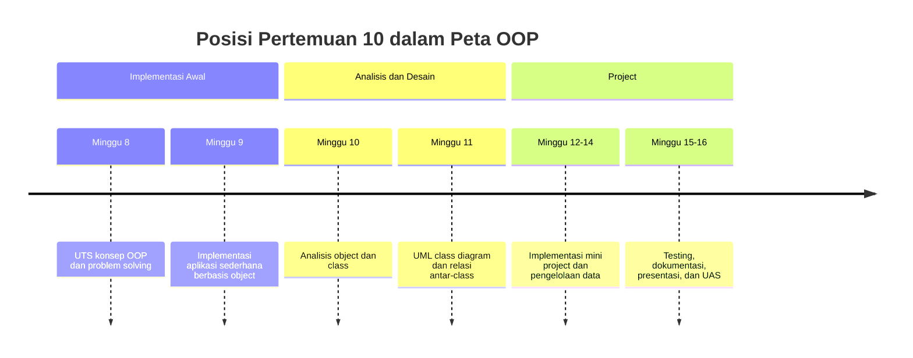
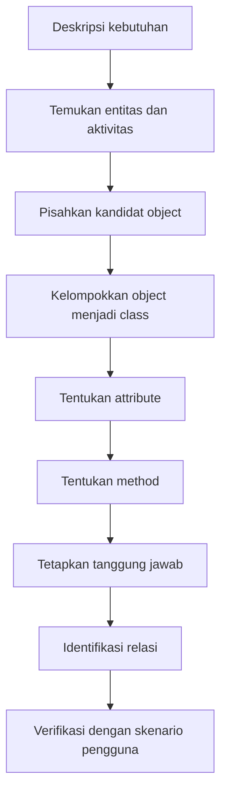
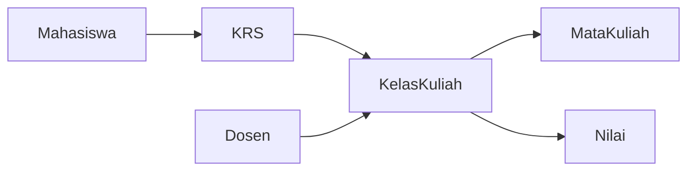

# Pertemuan 10 — Analisis Object dan Class dari Kasus Sistem Informasi

| | |
|:--|:--|
| **Mata Kuliah** | USA-WP2360214 — Pemrograman Berorientasi Objek |
| **Pertemuan** | 10 dari 16 |
| **Tanggal** | Rabu, 18 November 2026 |
| **CPMK** | CPMK115 |
| **Materi** | Analisis object, class, attribute, method, tanggung jawab, dan relasi dari kasus Sistem Informasi |
| **Model Pembelajaran** | Case Based Learning / Problem Based Learning / Analisis Kelompok |
| **Stack** | Python 3 |

> **Catatan penting:** Pertemuan 10 membahas analisis sebelum pembuatan UML dan implementasi mini project. Anda akan mengubah deskripsi kebutuhan menjadi kandidat object, class, attribute, method, dan tanggung jawab yang dapat dipertanggungjawabkan secara teknis.

---

## Daftar Isi

- [Pertemuan 10 — Analisis Object dan Class dari Kasus Sistem Informasi](#pertemuan-10--analisis-object-dan-class-dari-kasus-sistem-informasi)
  - [Daftar Isi](#daftar-isi)
  - [1. Keterkaitan Pertemuan dengan RPS OBE](#1-keterkaitan-pertemuan-dengan-rps-obe)
  - [2. Capaian Pembelajaran Pertemuan](#2-capaian-pembelajaran-pertemuan)
  - [3. Pemantik Kasus: Sebelum Membuat Class](#3-pemantik-kasus-sebelum-membuat-class)
  - [4. Alur Analisis Object dan Class](#4-alur-analisis-object-dan-class)
  - [5. Membaca Kebutuhan sebagai Sumber Kandidat Object](#5-membaca-kebutuhan-sebagai-sumber-kandidat-object)
  - [6. Menentukan Batas Class](#6-menentukan-batas-class)
  - [7. Menentukan Attribute](#7-menentukan-attribute)
  - [8. Menentukan Method](#8-menentukan-method)
  - [9. Menetapkan Tanggung Jawab Class](#9-menetapkan-tanggung-jawab-class)
  - [10. Menentukan Relasi Antar-Class](#10-menentukan-relasi-antar-class)
  - [11. Studi Kasus: Sistem Informasi Akademik](#11-studi-kasus-sistem-informasi-akademik)
    - [12. Latihan Terbimbing: Analisis Kebutuhan](#12-latihan-terbimbing-analisis-kebutuhan)
  - [13. Aktivitas Kelompok](#13-aktivitas-kelompok)
  - [14. Latihan Individu](#14-latihan-individu)
  - [15. Pemanfaatan AI sebagai Coding Assistant](#15-pemanfaatan-ai-sebagai-coding-assistant)
  - [16. Kuis Formatif](#16-kuis-formatif)
  - [17. Asesmen dan Penugasan](#17-asesmen-dan-penugasan)
  - [18. Persiapan menuju Pertemuan 11](#18-persiapan-menuju-pertemuan-11)
  - [19. Referensi dan Kode Praktikum](#19-referensi-dan-kode-praktikum)

---

## 1. Keterkaitan Pertemuan dengan RPS OBE

Pertemuan 10 mendukung **CPMK115** dan `SUB-CPMK11502` pada RPS:

> Mahasiswa mampu menganalisis object, class, attribute, method, dan tanggung jawab dari kasus Sistem Informasi.

Pertemuan 9 berfokus pada implementasi aplikasi sederhana. Pada Pertemuan 10, mahasiswa menganalisis kebutuhan dan rancangan class sebagai dasar agar implementasi mini project memiliki landasan kebutuhan yang jelas. Hasil analisis pada pertemuan ini digunakan untuk menyusun UML class diagram pada Pertemuan 11.



---

## 2. Capaian Pembelajaran Pertemuan

Setelah mengikuti pertemuan ini, mahasiswa mampu:

| No. | Kemampuan | Indikator |
| :-: | --------- | --------- |
| 1 | Membaca kebutuhan Sistem Informasi | Menemukan kata benda, kata kerja, data, dan aturan bisnis dari deskripsi kasus |
| 2 | Menentukan kandidat object dan class | Membedakan entitas utama, atribut, dan konsep yang tidak perlu menjadi class |
| 3 | Menetapkan attribute dan method | Menghubungkan data serta perilaku dengan class yang tepat |
| 4 | Menentukan tanggung jawab class | Menjelaskan operasi yang dikelola oleh setiap class |
| 5 | Menyiapkan rancangan UML | Menyusun tabel analisis dan kandidat relasi antar-class |

---

## 3. Pemantik Kasus: Sebelum Membuat Class

Tim mahasiswa langsung membuat banyak class ketika menerima kebutuhan berikut:

> Sistem akademik menyimpan data mahasiswa, dosen, mata kuliah, dan kelas kuliah. Mahasiswa dapat melakukan pengisian KRS pada periode tertentu. Dosen mengelola nilai mahasiswa pada kelas yang diampu. Sistem perlu menolak pengisian KRS jika mata kuliah penuh atau jadwalnya bertabrakan.

Sebagian class yang dibuat tim adalah `Sistem`, `Data`, `Proses`, `KRS`, `Login`, `Tabel`, dan `Cetak`. Setelah program mulai dikembangkan, tanggung jawab beberapa class saling tumpang tindih.

Pertanyaan pemantik:

1. Entitas apa yang benar-benar ada dalam domain akademik?
2. Data apa yang dimiliki setiap entitas?
3. Perilaku apa yang melekat pada entitas tersebut?
4. Apakah setiap kata benda harus menjadi class?
5. Class mana yang bertanggung jawab memeriksa aturan pengisian KRS?

Analisis class bukan sekadar mengubah semua kata benda menjadi class. Class harus mewakili konsep yang penting bagi kebutuhan dan memiliki data atau perilaku yang jelas.

---

## 4. Alur Analisis Object dan Class

Gunakan alur berikut sebelum menulis kode:



Setiap hasil analisis perlu diuji dengan pertanyaan berikut:

| Tahap | Pertanyaan verifikasi |
| ----- | --------------------- |
| Kandidat object | Apakah konsep ini penting bagi kebutuhan pengguna? |
| Class | Apakah beberapa object sejenis dapat dibuat dari rancangan ini? |
| Attribute | Apakah data ini dimiliki atau menggambarkan object? |
| Method | Apakah perilaku ini menjadi tanggung jawab object? |
| Tanggung jawab | Apakah class memiliki satu fokus yang dapat dijelaskan? |
| Relasi | Mengapa dua class perlu saling mengetahui atau bekerja sama? |
| Skenario | Apakah rancangan dapat menjalankan alur kebutuhan utama? |

---

## 5. Membaca Kebutuhan sebagai Sumber Kandidat Object

Gunakan kata benda sebagai sumber kandidat awal, bukan sebagai keputusan final. Gunakan kata kerja dan aturan bisnis untuk menemukan perilaku.

Contoh kebutuhan:

> Mahasiswa memilih mata kuliah yang tersedia pada periode pengisian KRS. Sistem memeriksa prasyarat dan batas jumlah peserta sebelum menyimpan KRS.

Hasil pembacaan awal:

| Unsur kebutuhan | Kandidat |
| -------------- | --------- |
| Kata benda | `Mahasiswa`, `MataKuliah`, `KRS`, `Periode` |
| Kata kerja | memilih, memeriksa, menyimpan |
| Aturan | mata kuliah tersedia, prasyarat terpenuhi, kapasitas belum penuh |
| Data penting | kode mahasiswa, kode mata kuliah, periode, kapasitas |

Tidak semua kandidat harus menjadi class. Kata `periode` dapat menjadi attribute jika hanya menyimpan nilai sederhana. Sebaliknya, `KRS` layak menjadi class apabila memiliki aturan, daftar mata kuliah, dan perilaku tambah atau hapus.

---

## 6. Menentukan Batas Class

Class dipilih berdasarkan konsep domain dan tanggung jawabnya. Gunakan tiga pertanyaan berikut:

1. Apakah konsep memiliki identitas yang perlu dibedakan dari object lain?
2. Apakah konsep memiliki data yang tetap bersama?
3. Apakah konsep memiliki perilaku atau aturan yang perlu dikelola?

Perbandingan kandidat:

| Kandidat | Keputusan | Alasan |
| -------- | --------- | ------ |
| `Mahasiswa` | Class | Memiliki identitas, data profil, dan perilaku terkait KRS |
| `MataKuliah` | Class | Memiliki kode, kapasitas, prasyarat, dan daftar peserta |
| `periode_aktif` | Attribute | Nilai sederhana yang menjadi bagian dari aturan sistem |
| `validasi` | Method atau layanan | Merupakan perilaku, bukan entitas utama |
| `Database` | Bergantung konteks | Dapat menjadi komponen teknis, bukan class domain utama |

Hindari dua kondisi berikut:

- **God class:** satu class mengelola seluruh data, tampilan, validasi, dan penyimpanan.
- **Class kosong:** class dibuat hanya karena ada kata benda, tetapi tidak memiliki data atau perilaku yang bermakna.

---

## 7. Menentukan Attribute

Attribute adalah data yang menjelaskan keadaan object. Attribute sebaiknya diberi nama sesuai domain dan memiliki pemilik yang jelas.

Contoh analisis `Mahasiswa`:

| Attribute | Jenis data | Alasan |
| --------- | ---------- | ------ |
| `nim` | `str` | Identitas unik mahasiswa |
| `nama` | `str` | Nama yang ditampilkan pada informasi mahasiswa |
| `program_studi` | `str` | Menjelaskan program studi mahasiswa |
| `daftar_krs` | `list` | Menyimpan mata kuliah yang dipilih |

Contoh kode model hasil analisis:

```python
class Mahasiswa:
    """Menyimpan data akademik dasar seorang mahasiswa."""

    def __init__(self, nim, nama, program_studi):
        self.nim = nim
        self.nama = nama
        self.program_studi = program_studi
        self.__daftar_krs = []

    @property
    def daftar_krs(self):
        return list(self.__daftar_krs)
```

Attribute `daftar_krs` dibuat privat karena perubahan daftar harus mengikuti aturan pada method, misalnya pemeriksaan duplikasi atau batas jumlah mata kuliah.

---

## 8. Menentukan Method

Method adalah perilaku yang dapat dilakukan object atau operasi yang menjadi tanggung jawab class. Method sebaiknya diturunkan dari kata kerja pada kebutuhan.

| Kebutuhan | Class pemilik | Method kandidat |
| --------- | ------------- | --------------- |
| Mahasiswa memilih mata kuliah | `Mahasiswa` atau layanan akademik | `tambah_krs()` |
| Mahasiswa membatalkan pilihan | `Mahasiswa` | `hapus_krs()` |
| Sistem memeriksa kapasitas | `MataKuliah` | `masih_tersedia()` |
| Sistem memeriksa prasyarat | `Mahasiswa` atau layanan akademik | `memenuhi_prasyarat()` |
| Sistem menyimpan pengisian | `KRS` atau layanan akademik | `simpan()` |

Method tidak harus selalu diletakkan pada class pertama yang disebut dalam kalimat. Letakkan method pada class yang memiliki data paling dekat dengan aturan tersebut.

```python
class MataKuliah:
    """Menyimpan data mata kuliah dan kapasitas pesertanya."""

    def __init__(self, kode, nama, kapasitas):
        self.kode = kode
        self.nama = nama
        self.kapasitas = kapasitas
        self.__jumlah_peserta = 0

    def masih_tersedia(self):
        return self.__jumlah_peserta < self.kapasitas

    def tambah_peserta(self):
        if not self.masih_tersedia():
            return False
        self.__jumlah_peserta += 1
        return True
```

`MataKuliah` mengetahui kapasitas dan jumlah peserta, sehingga pemeriksaan ketersediaan menjadi tanggung jawab yang masuk akal untuk class tersebut.

---

## 9. Menetapkan Tanggung Jawab Class

Tanggung jawab menjelaskan hal yang harus diketahui atau dilakukan oleh sebuah class. Gunakan kalimat singkat dengan pola “class ini bertanggung jawab untuk ...”.

Contoh:

| Class | Tanggung jawab |
| ----- | -------------- |
| `Mahasiswa` | Menyimpan identitas dan pilihan KRS mahasiswa |
| `MataKuliah` | Menyimpan informasi mata kuliah dan memeriksa kapasitas |
| `KRS` | Menghubungkan mahasiswa dengan mata kuliah pada periode tertentu |
| `LayananAkademik` | Mengoordinasikan proses pengisian KRS dan validasi aturan |

Gunakan prinsip berikut:

- data berada pada class yang memilikinya;
- perilaku berada pada class yang memiliki informasi untuk menjalankannya;
- aturan lintas beberapa object dikelola oleh class layanan atau pengelola;
- class tidak mengambil alih tugas tampilan atau penyimpanan jika itu bukan tanggung jawab domainnya.

Jika satu class memiliki terlalu banyak tanggung jawab, pecah berdasarkan alasan perubahan. Class `Mahasiswa` berubah ketika aturan data mahasiswa berubah, sedangkan `LayananAkademik` berubah ketika alur pengisian KRS berubah.

---

## 10. Menentukan Relasi Antar-Class

Relasi muncul ketika satu class membutuhkan object class lain. Pada tahap ini, tuliskan alasan relasi dalam kalimat, bukan hanya menggambar garis.

| Relasi | Arti dalam kasus akademik |
| ------ | ------------------------- |
| `Mahasiswa` memiliki `KRS` | Satu mahasiswa dapat memiliki data KRS pada periode tertentu |
| `KRS` memuat `MataKuliah` | Satu KRS dapat berisi beberapa mata kuliah |
| `LayananAkademik` menggunakan `Mahasiswa` | Layanan memeriksa identitas dan status mahasiswa |
| `LayananAkademik` menggunakan `MataKuliah` | Layanan memeriksa kapasitas dan prasyarat |

Kandidat relasi awal dapat ditulis sebagai matriks:

| Dari / Ke | Mahasiswa | MataKuliah | KRS | LayananAkademik |
| --------- | :-------: | :--------: | :-: | :-------------: |
| Mahasiswa | — | memilih | memiliki | — |
| MataKuliah | — | — | dimuat oleh | — |
| KRS | terkait | memuat | — | dikelola |
| LayananAkademik | memeriksa | memeriksa | memproses | — |

Relasi perlu diverifikasi melalui skenario. Jika tidak ada alur kebutuhan yang memerlukan dua class saling bekerja sama, relasi tersebut mungkin belum diperlukan.

---

## 11. Studi Kasus: Sistem Informasi Akademik

Gunakan kebutuhan berikut sebagai kasus analisis:

> Sistem Informasi akademik mengelola mahasiswa, dosen, mata kuliah, dan kelas kuliah. Dosen mengajar kelas kuliah. Mahasiswa dapat mendaftar pada kelas jika kapasitas masih tersedia dan prasyarat terpenuhi. Sistem menyimpan nilai mahasiswa untuk setiap kelas yang diikuti.

Kandidat hasil analisis:



Tabel analisis awal:

| Class | Attribute utama | Method kandidat | Tanggung jawab |
| ----- | --------------- | --------------- | -------------- |
| `Mahasiswa` | `nim`, `nama`, `program_studi` | `ambil_kelas()` | Menyimpan identitas mahasiswa |
| `Dosen` | `nuptk`, `nama` | `kelola_nilai()` | Menyimpan identitas pengajar |
| `MataKuliah` | `kode`, `nama`, `sks` | `cek_prasyarat()` | Menyimpan definisi mata kuliah |
| `KelasKuliah` | `kode_kelas`, `kapasitas` | `daftar_peserta()` | Mengelola kelas dan kapasitas |
| `Nilai` | `angka`, `huruf` | `hitung_huruf()` | Menyimpan hasil penilaian |
| `KRS` | `periode`, `daftar_kelas` | `tambah_kelas()` | Menyimpan pilihan kelas mahasiswa |

Tabel tersebut adalah rancangan awal, bukan hasil final. Periksa kembali apakah `Nilai` perlu menjadi class tersendiri atau cukup menjadi data pada relasi mahasiswa dan kelas. Keputusan harus didasarkan pada kebutuhan, aturan, dan kemungkinan pengembangan.

---

## 12. Latihan Terbimbing: Analisis Kebutuhan

Latihan terbimbing menggunakan contoh analisis pada [`../code/pertemuan-10/analisis_akademik.py`](../code/pertemuan-10/analisis_akademik.py) untuk melihat bagaimana kandidat class diterjemahkan menjadi object Python sederhana.

```bash
python3 ../code/pertemuan-10/analisis_akademik.py
```

Kemudian lengkapi scaffold pada [`../code/pertemuan-10/latihan_analisis_sistem.py`](../code/pertemuan-10/latihan_analisis_sistem.py).

```bash
python3 ../code/pertemuan-10/latihan_analisis_sistem.py
```

Amati hal berikut:

- perbedaan data class dan data object;
- hubungan attribute dengan kebutuhan domain;
- method yang merepresentasikan perilaku;
- tanggung jawab yang tidak boleh tumpang tindih;
- relasi yang terlihat dari interaksi antar-object.

---

## 13. Aktivitas Kelompok

Bentuk kelompok 3–4 orang:

1. Pilih satu kasus Sistem Informasi: akademik, perpustakaan, klinik, atau layanan administrasi.
2. Tulis deskripsi kebutuhan dalam lima sampai tujuh kalimat.
3. Tandai kandidat object, aturan bisnis, dan aktivitas utama.
4. Susun tabel class, attribute, method, dan tanggung jawab.
5. Tulis minimal tiga relasi antar-class beserta alasan keberadaannya.
6. Uji rancangan menggunakan satu skenario berhasil dan satu skenario gagal.
7. Siapkan hasil analisis sebagai bahan pembuatan UML pada pertemuan berikutnya.

---

## 14. Latihan Individu

Lengkapi scaffold analisis sistem dengan ketentuan berikut:

1. Lengkapi class `Mahasiswa`, `MataKuliah`, dan `KelasKuliah`.
2. Simpan attribute yang sesuai dengan kebutuhan pada constructor.
3. Tambahkan method yang mewakili perilaku utama setiap class.
4. Buat fungsi `tampilkan_analisis()` untuk menampilkan ringkasan object.
5. Uji object dengan satu skenario pendaftaran berhasil dan satu skenario kapasitas penuh.
6. Tulis tabel analisis yang menjelaskan class, attribute, method, dan tanggung jawab.

Jalankan program setelah setiap bagian selesai. Periksa apakah setiap method berada pada class yang memiliki data yang dibutuhkan untuk menjalankan method tersebut.

---

## 15. Pemanfaatan AI sebagai Coding Assistant

**AI assistant (GitHub Copilot, ChatGPT, Claude, Gemini) boleh dipakai — dengan cara yang benar:**

**✅ Gunakan AI untuk:**

- Mengusulkan kandidat object dari deskripsi kebutuhan.
- Membandingkan dua alternatif pembagian tanggung jawab class.
- Membantu menyusun skenario berhasil dan gagal.
- Membantu membaca error pada latihan analisis.

**❌ Hindari penggunaan AI untuk:**

- Menentukan seluruh rancangan tanpa memeriksa kebutuhan domain.
- Mengubah semua kata benda menjadi class tanpa alasan teknis.
- Menyalin tabel analisis tanpa memahami tanggung jawab setiap class.
- Memasukkan data pribadi, kredensial, atau data pengguna nyata ke dalam prompt.

**Etika di kelas ini:**

1. Anda wajib dapat menjelaskan alasan pemilihan setiap class, attribute, method, dan relasi.
2. Cantumkan penggunaan bantuan AI pada komentar kode atau refleksi latihan.
   Contoh yang sesuai dengan materi analisis:

   ```python
   # Bantuan: GitHub Copilot — alternatif kandidat class dari kebutuhan sistem akademik.
   ```

3. AI digunakan sebagai alat bantu pembelajaran. Anda tetap bertanggung jawab memahami, menjelaskan, dan menguji kode yang digunakan dalam tugas. Penggunaan AI tidak menggantikan proses menganalisis object, class, dan relasi antar-class.

---

## 16. Kuis Formatif

Kerjakan [Quiz Pertemuan 10](./02-Quiz-Pertemuan-10.md) setelah menyelesaikan pembahasan dan latihan. Kuis mengukur kemampuan mengidentifikasi kandidat class, menentukan tanggung jawab, dan menganalisis attribute serta method.

---

## 17. Asesmen dan Penugasan

| Komponen | Bentuk | Keterangan |
| --------- | ------ | ---------- |
| Analisis kebutuhan | Tabel analisis | Mengidentifikasi class, attribute, method, dan tanggung jawab |
| Relasi antar-class | Deskripsi dan diagram awal | Menjelaskan alasan hubungan antar-class |
| Praktikum | Implementasi Python | Membuat object dari hasil analisis |
| Kuis formatif | Uraian dan analisis kode | Mengukur pemahaman konsep Pertemuan 10 |

Checklist:

- [ ] Kebutuhan telah ditulis dalam bentuk skenario.
- [ ] Kandidat object telah dipilih berdasarkan kebutuhan.
- [ ] Setiap class memiliki attribute dan method yang relevan.
- [ ] Tanggung jawab class tidak tumpang tindih.
- [ ] Relasi antar-class memiliki alasan teknis.
- [ ] Hasil analisis siap diterjemahkan menjadi UML.

---

## 18. Persiapan menuju Pertemuan 11

Pada Pertemuan 11, mahasiswa akan mempelajari UML class diagram dan relasi antar-class berdasarkan hasil analisis Pertemuan 10.

Persiapkan hal berikut:

- bawa tabel analisis class, attribute, method, dan tanggung jawab;
- pilih minimal tiga class dari kasus Sistem Informasi yang akan dikembangkan;
- tandai relasi association, aggregation, composition, atau inheritance yang mungkin digunakan;
- siapkan satu skenario utama untuk diuji pada diagram;
- tinjau kembali konsep visibility, attribute, method, dan hubungan antar-object.

---

## 19. Referensi dan Kode Praktikum

Referensi:

- [Python Docs — Classes](https://docs.python.org/3/tutorial/classes.html)
- [Python Docs — Modules](https://docs.python.org/3/tutorial/modules.html)
- [Real Python — Object-Oriented Programming (OOP) in Python 3](https://realpython.com/python3-object-oriented-programming/)
- [Visual Paradigm — UML Class Diagram Tutorial](https://www.visual-paradigm.com/guide/uml-unified-modeling-language/what-is-class-diagram/)
- [PEP 8 — Naming Conventions](https://peps.python.org/pep-0008/)

Kode praktikum:

- [`../code/pertemuan-10/analisis_akademik.py`](../code/pertemuan-10/analisis_akademik.py) — contoh analisis class dari kasus akademik.
- [`../code/pertemuan-10/latihan_analisis_sistem.py`](../code/pertemuan-10/latihan_analisis_sistem.py) — scaffold latihan analisis object dan class.
