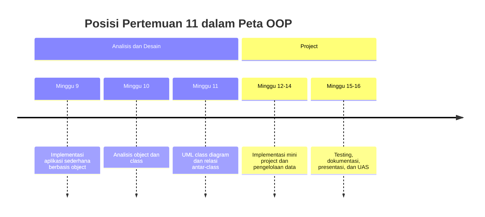
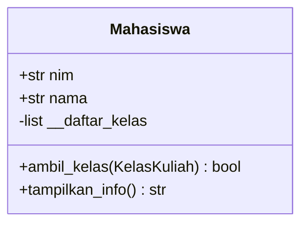
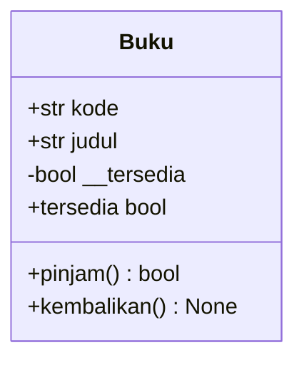
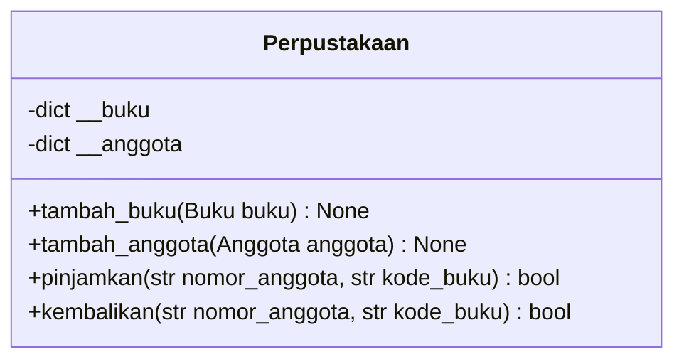
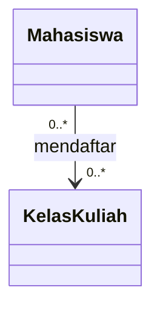
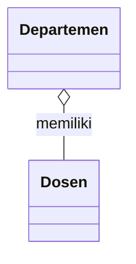
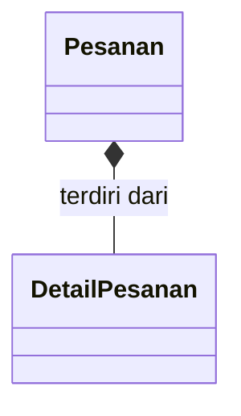
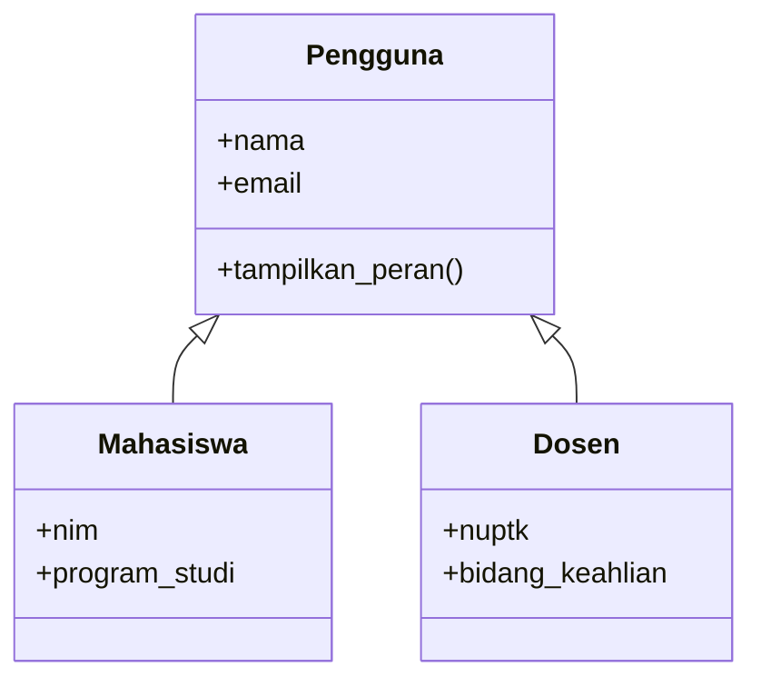
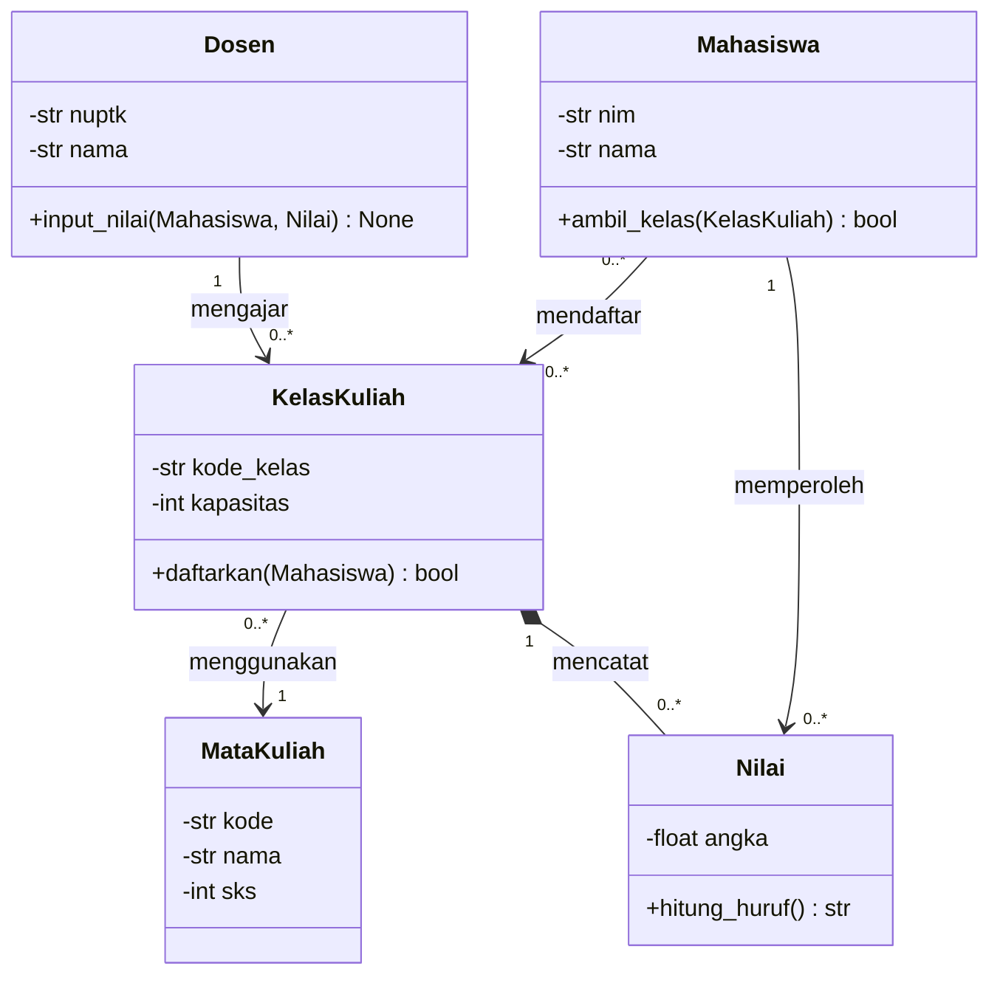
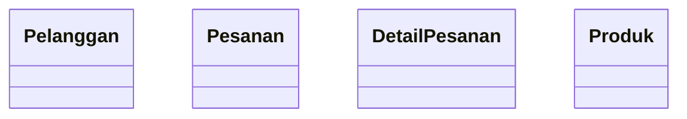

# Pertemuan 11 — UML Class Diagram dan Relasi Antar-Class

| | |
|:--|:--|
| **Mata Kuliah** | USA-WP2360214 — Pemrograman Berorientasi Objek |
| **Pertemuan** | 11 dari 16 |
| **Tanggal** | Rabu, 25 November 2026 |
| **CPMK** | CPMK115 |
| **Materi** | UML class diagram, visibility, multiplicity, association, aggregation, composition, dan inheritance |
| **Model Pembelajaran** | Case Based Learning / Problem Based Learning / Perancangan Kelompok |
| **Stack** | Python 3 dan Mermaid |

> **Catatan penting:** Pertemuan 11 menggunakan hasil analisis Pertemuan 10 untuk menyusun UML class diagram. Anda akan memvisualisasikan class, attribute, method, visibility, multiplicity, dan relasi sebagai dasar implementasi mini project.

---

## Daftar Isi

- [Pertemuan 11 — UML Class Diagram dan Relasi Antar-Class](#pertemuan-11--uml-class-diagram-dan-relasi-antar-class)
  - [Daftar Isi](#daftar-isi)
  - [1. Keterkaitan Pertemuan dengan RPS OBE](#1-keterkaitan-pertemuan-dengan-rps-obe)
  - [2. Capaian Pembelajaran Pertemuan](#2-capaian-pembelajaran-pertemuan)
  - [3. Pemantik Kasus: Dari Tabel Analisis ke Diagram](#3-pemantik-kasus-dari-tabel-analisis-ke-diagram)
  - [4. Struktur UML Class Diagram](#4-struktur-uml-class-diagram)
  - [5. Nama Class dan Tanggung Jawab](#5-nama-class-dan-tanggung-jawab)
  - [6. Attribute dan Visibility](#6-attribute-dan-visibility)
  - [7. Method dan Parameter](#7-method-dan-parameter)
  - [8. Association dan Multiplicity](#8-association-dan-multiplicity)
  - [9. Aggregation](#9-aggregation)
  - [10. Composition](#10-composition)
  - [11. Inheritance pada UML](#11-inheritance-pada-uml)
  - [12. Studi Kasus: Sistem Informasi Akademik](#12-studi-kasus-sistem-informasi-akademik)
    - [13. Latihan Terbimbing: Membuat Class Diagram](#13-latihan-terbimbing-membuat-class-diagram)
  - [14. Aktivitas Kelompok](#14-aktivitas-kelompok)
  - [15. Latihan Individu](#15-latihan-individu)
    - [Latihan Membuat UML Class Diagram](#latihan-membuat-uml-class-diagram)
  - [16. Pemanfaatan AI sebagai Coding Assistant](#16-pemanfaatan-ai-sebagai-coding-assistant)
  - [17. Kuis Formatif](#17-kuis-formatif)
  - [18. Asesmen dan Penugasan](#18-asesmen-dan-penugasan)
  - [19. Persiapan menuju Pertemuan 12](#19-persiapan-menuju-pertemuan-12)
  - [20. Referensi dan Kode Praktikum](#20-referensi-dan-kode-praktikum)

---

## 1. Keterkaitan Pertemuan dengan RPS OBE

Pertemuan 11 mendukung **CPMK115** dan `SUB-CPMK11503` pada RPS:

> Mahasiswa mampu menyusun UML class diagram dan menentukan relasi antar-class sebagai dasar implementasi aplikasi OOP.

Pertemuan 10 menghasilkan tabel analisis class, attribute, method, tanggung jawab, dan kandidat relasi. Pada Pertemuan 11, hasil tersebut diterjemahkan menjadi UML class diagram yang dapat ditinjau sebelum implementasi mini project.



---

## 2. Capaian Pembelajaran Pertemuan

Setelah mengikuti pertemuan ini, mahasiswa mampu:

| No. | Kemampuan | Indikator |
| :-: | --------- | --------- |
| 1 | Menjelaskan struktur UML class diagram | Mengidentifikasi nama class, attribute, method, dan visibility |
| 2 | Menentukan visibility | Memilih `+`, `-`, `#`, atau `~` sesuai kebutuhan akses |
| 3 | Menentukan multiplicity | Menuliskan jumlah object yang terlibat dalam sebuah relasi |
| 4 | Membedakan relasi antar-class | Menjelaskan association, aggregation, composition, dan inheritance |
| 5 | Menyusun diagram | Mengubah tabel analisis menjadi diagram yang dapat ditinjau dan diimplementasikan |

---

## 3. Pemantik Kasus: Dari Tabel Analisis ke Diagram

Pada Pertemuan 10, sebuah kelompok menghasilkan tabel berikut:

| Class | Attribute | Method | Tanggung jawab |
| ----- | --------- | ------ | -------------- |
| `Mahasiswa` | `nim`, `nama` | `ambil_kelas()` | Mengelola identitas mahasiswa |
| `KelasKuliah` | `kode`, `kapasitas` | `daftarkan()` | Mengelola peserta kelas |
| `MataKuliah` | `kode`, `nama`, `sks` | `cek_prasyarat()` | Menyimpan definisi mata kuliah |

Tabel tersebut belum menjelaskan secara visual hal-hal berikut:

1. Apakah satu `MataKuliah` dapat memiliki banyak `KelasKuliah`?
2. Apakah `KelasKuliah` tetap ada jika `MataKuliah` dihapus?
3. Berapa banyak mahasiswa yang dapat mengikuti satu `KelasKuliah`?
4. Attribute mana yang hanya boleh diakses melalui method?
5. Apakah `Mahasiswa` merupakan jenis khusus dari class lain?

UML class diagram membantu kelompok menyatakan keputusan tersebut sebelum kode diperbanyak.

---

## 4. Struktur UML Class Diagram

UML class diagram biasanya memiliki tiga bagian:



| Bagian | Isi |
| ------ | --- |
| Nama class | Nama domain dengan format `PascalCase` |
| Attribute | Nama data dan jenis data jika sudah diketahui |
| Method | Nama method, parameter, dan hasil jika sudah diketahui |

Diagram adalah model rancangan. Detail implementasi seperti struktur dictionary, validasi rinci, dan query database dapat ditambahkan saat tahap coding jika memang diperlukan.

### Mermaid dan Aplikasi Visual

Mermaid adalah sintaks diagram berbasis teks yang dapat dirender oleh editor Markdown, GitHub, dan Mermaid Live Editor. Pada materi ini, blok `mermaid` dengan deklarasi `classDiagram` digunakan untuk menuliskan class, attribute, method, dan relasi secara terstruktur.

Mermaid membantu mahasiswa menyimpan diagram sebagai teks sehingga perubahan class dan relasi dapat ditinjau melalui perubahan kode. Mermaid bukan satu-satunya alat untuk membuat UML. Mahasiswa dapat menggunakan aplikasi visual seperti diagrams.net (draw.io), Visual Paradigm, atau aplikasi UML lain yang mendukung class diagram.

Apa pun alat yang digunakan, hasil diagram harus tetap memuat:

- nama class yang sesuai dengan domain;
- attribute dan method yang berasal dari hasil analisis;
- visibility yang konsisten;
- multiplicity pada relasi yang memerlukannya;
- jenis relasi dan arah navigasi yang dapat dijelaskan.

Jika menggunakan aplikasi visual, simpan file sumber diagram dan ekspor hasilnya ke PNG atau PDF sesuai arahan dosen. Jika menggunakan Mermaid, simpan kode Markdown atau file sumber yang memuat diagram agar rancangan dapat diperiksa dan diperbarui.

---

## 5. Nama Class dan Tanggung Jawab

Nama class harus menunjukkan konsep domain, bukan aktivitas teknis yang terlalu umum. Gunakan hasil analisis Pertemuan 10 sebagai sumber utama.

| Kurang tepat | Lebih tepat | Alasan |
| ------------ | ----------- | ------ |
| `Data` | `Mahasiswa` | Menunjukkan entitas yang dimodelkan |
| `Proses` | `PengisianKRS` | Menunjukkan proses domain tertentu |
| `Tabel` | `MataKuliah` | Menunjukkan makna data |
| `ManagerSemua` | `LayananAkademik` | Menjelaskan cakupan tanggung jawab |

Setiap class pada diagram harus dapat dijelaskan dengan satu kalimat tanggung jawab. Jika nama class terlalu umum, batas tanggung jawab biasanya belum jelas.

---

## 6. Attribute dan Visibility

Visibility menunjukkan tingkat akses anggota class pada UML:

| Simbol | Nama | Makna umum |
| ------ | ---- | ---------- |
| `+` | public | Dapat digunakan oleh object lain |
| `-` | private | Dikelola hanya oleh class pemilik |
| `#` | protected | Dapat digunakan oleh class dan subclass terkait |
| `~` | package | Dapat digunakan dalam package atau modul yang sama |

Contoh:



Dalam Python, attribute dengan awalan `__` menggunakan name mangling. UML `-tersedia` menggambarkan niat bahwa status tidak diubah langsung dari luar class. Method `pinjam()` dan `kembalikan()` menjadi jalur perubahan status.

---

## 7. Method dan Parameter

Method pada diagram perlu mencerminkan perilaku hasil analisis. Tuliskan parameter yang penting untuk memahami interaksi antar-class.



Gunakan notasi berikut secara konsisten:

- `method(parameter) return_type` untuk method;
- `attribute : type` atau `type attribute` untuk attribute;
- `+` atau `-` untuk visibility;
- nama class sebagai jenis parameter ketika method menerima object lain.

Notasi tidak perlu dibuat sangat rinci jika informasi tipe belum tersedia. Ketepatan tanggung jawab lebih penting daripada memenuhi diagram dengan detail yang belum diputuskan.

---

## 8. Association dan Multiplicity

**Association** menunjukkan hubungan umum antara dua class. Hubungan ini dapat berupa penggunaan, komunikasi, atau kepemilikan referensi.

Multiplicity menyatakan jumlah object pada setiap sisi hubungan:

| Notasi | Makna |
| ------ | ----- |
| `1` | Tepat satu |
| `0..1` | Nol atau satu |
| `0..*` | Nol atau banyak |
| `1..*` | Satu atau banyak |
| `m..n` | Minimal `m`, maksimal `n` |

Contoh association:



Satu mahasiswa dapat mendaftar beberapa kelas dan satu kelas dapat memiliki beberapa mahasiswa. Arah panah menunjukkan arah navigasi yang diperlukan pada rancangan, bukan urutan waktu.

---

## 9. Aggregation

**Aggregation** menunjukkan hubungan keseluruhan dan bagian yang masih dapat berdiri sendiri. Simbol UML-nya adalah diamond kosong.



Pada contoh tersebut, `Dosen` masih dapat ada ketika `Departemen` dihapus atau diganti. Aggregation sesuai ketika object bagian memiliki siklus hidup yang tidak sepenuhnya bergantung pada object keseluruhan.

Pertanyaan verifikasi:

1. Apakah object bagian dapat dipindahkan ke keseluruhan lain?
2. Apakah object bagian masih bermakna tanpa object keseluruhan?
3. Apakah object bagian dibuat di luar class keseluruhan?

Jika jawabannya sebagian besar ya, aggregation dapat menjadi kandidat relasi.

---

## 10. Composition

**Composition** menunjukkan hubungan keseluruhan dan bagian dengan ketergantungan siklus hidup yang kuat. Simbol UML-nya adalah diamond penuh.



Pada contoh tersebut, `DetailPesanan` dibuat sebagai bagian dari `Pesanan` dan tidak memiliki makna lengkap tanpa pesanan yang menaunginya. Composition harus digunakan dengan alasan domain yang jelas, bukan hanya karena satu class menyimpan list object lain.

Perbandingan:

| Relasi | Siklus hidup bagian | Simbol |
| ------ | ------------------- | ------ |
| Association | Tidak ditentukan | Garis biasa |
| Aggregation | Bagian dapat berdiri sendiri | Diamond kosong |
| Composition | Bagian bergantung pada keseluruhan | Diamond penuh |

---

## 11. Inheritance pada UML

Inheritance menunjukkan hubungan generalisasi: subclass adalah bentuk khusus dari superclass. Simbolnya adalah garis dengan panah segitiga kosong menuju superclass.



Gunakan inheritance hanya jika hubungan **is-a** benar-benar berlaku. Jika class hanya menggunakan object lain, gunakan association, bukan inheritance.

---

## 12. Studi Kasus: Sistem Informasi Akademik

Gunakan hasil analisis Pertemuan 10 untuk menyusun diagram berikut:



Tinjau diagram dengan pertanyaan berikut:

- Apakah setiap class memiliki tanggung jawab yang jelas?
- Apakah multiplicity sesuai dengan kebutuhan?
- Apakah `Nilai` tepat menjadi bagian dari `KelasKuliah`, atau perlu relasi lain dengan `Mahasiswa`?
- Apakah semua method dapat diterjemahkan menjadi operasi Python?
- Apakah ada relasi yang dibuat tanpa kebutuhan yang dapat diuji?

Diagram perlu direvisi jika tidak dapat menjelaskan skenario pendaftaran kelas atau input nilai.

---

## 13. Latihan Terbimbing: Membuat Class Diagram

Latihan terbimbing menggunakan contoh pada [`../code/pertemuan-11/diagram_akademik.py`](../code/pertemuan-11/diagram_akademik.py) untuk melihat representasi rancangan class dan relasi dalam Python.

```bash
python3 ../code/pertemuan-11/diagram_akademik.py
```

Kemudian lengkapi scaffold pada [`../code/pertemuan-11/latihan_diagram_sistem.py`](../code/pertemuan-11/latihan_diagram_sistem.py).

```bash
python3 ../code/pertemuan-11/latihan_diagram_sistem.py
```

Fokus pengamatan:

- kesesuaian nama class dengan domain;
- kesesuaian attribute dan method dengan diagram;
- penggunaan object sebagai parameter method;
- relasi yang terlihat dari attribute dan collection;
- kesesuaian diagram dengan skenario pengguna.

---

## 14. Aktivitas Kelompok

Bentuk kelompok 3–4 orang:

1. Gunakan hasil analisis Pertemuan 10.
2. Pilih minimal empat class untuk mini project.
3. Tambahkan attribute, method, visibility, dan tipe data yang sudah diketahui.
4. Tentukan association dan multiplicity untuk setiap relasi.
5. Pilih aggregation, composition, atau inheritance hanya jika terdapat alasan teknis.
6. Buat diagram dengan Mermaid.
7. Uji diagram menggunakan satu skenario utama dan satu skenario alternatif.
8. Catat keputusan yang masih perlu dikonfirmasi sebelum implementasi.

---

## 15. Latihan Individu

Lengkapi scaffold diagram sistem dengan ketentuan berikut:

### Latihan Membuat UML Class Diagram

Buat UML class diagram berdasarkan kasus berikut:

> Pelanggan dapat memiliki beberapa pesanan. Setiap pesanan memiliki minimal satu `DetailPesanan`. Setiap detail mengacu pada satu `Produk`, sedangkan satu produk dapat muncul pada banyak detail pesanan.

Lengkapi kerangka Mermaid berikut:



Periksa diagram dengan pertanyaan berikut:

1. Apakah `Pesanan` dan `DetailPesanan` tepat menggunakan composition?
2. Apakah setiap multiplicity sesuai dengan deskripsi kasus?
3. Apakah method pada `Pesanan` dan `DetailPesanan` mendukung kebutuhan?
4. Apakah association `DetailPesanan` dan `Produk` perlu diberi arah navigasi?

Simpan diagram bersama tabel analisis class, attribute, method, dan relasi. Diagram harus dapat dijelaskan menggunakan skenario pembuatan pesanan.

1. Lengkapi class `Produk`, `Pelanggan`, `Pesanan`, dan `DetailPesanan`.
2. Tentukan attribute private dan method public yang sesuai.
3. Implementasikan relasi `Pesanan` dengan `DetailPesanan` sebagai composition pada kode.
4. Implementasikan association antara `Pelanggan` dan `Pesanan`.
5. Buat fungsi `tampilkan_rancangan()` yang menampilkan data object.
6. Tulis diagram Mermaid yang sesuai dengan kode.
7. Uji satu pesanan dengan minimal dua detail produk.

Bandingkan kode dan diagram. Setiap class, attribute, method, dan relasi yang ditampilkan harus memiliki alasan dari kebutuhan kasus.

---

## 16. Pemanfaatan AI sebagai Coding Assistant

**AI assistant (GitHub Copilot, ChatGPT, Claude, Gemini) boleh dipakai — dengan cara yang benar:**

**✅ Gunakan AI untuk:**

- Menjelaskan perbedaan association, aggregation, composition, dan inheritance.
- Membantu memeriksa kesesuaian multiplicity dengan skenario kebutuhan.
- Mereview apakah nama class, attribute, dan method sesuai dengan domain.
- Mengusulkan skenario untuk memvalidasi diagram sebelum coding.

**❌ Hindari penggunaan AI untuk:**

- Membuat diagram tanpa memahami alasan setiap relasi.
- Memilih composition atau inheritance hanya karena terlihat lebih lengkap.
- Menyalin diagram tanpa membandingkannya dengan tabel analisis Pertemuan 10.
- Memasukkan data pribadi, kredensial, atau data pengguna nyata ke dalam prompt.

**Etika di kelas ini:**

1. Anda wajib dapat menjelaskan setiap class, attribute, method, visibility, multiplicity, dan relasi pada diagram yang diserahkan.
2. Cantumkan penggunaan bantuan AI pada komentar kode atau refleksi latihan. Contoh yang sesuai dengan materi UML:

   ```python
   # Bantuan: GitHub Copilot — pemeriksaan multiplicity pada relasi Pesanan dan DetailPesanan.
   ```

3. AI digunakan sebagai alat bantu pembelajaran. Anda tetap bertanggung jawab memahami, menjelaskan, dan menguji kode yang digunakan dalam tugas. Penggunaan AI tidak menggantikan proses merancang UML dan menentukan alasan teknis setiap relasi.

---

## 17. Kuis Formatif

Kerjakan [Quiz Pertemuan 11](./02-Quiz-Pertemuan-11.md) setelah menyelesaikan pembahasan dan latihan. Kuis mengukur pemahaman struktur UML class diagram, visibility, multiplicity, dan jenis relasi antar-class.

---

## 18. Asesmen dan Penugasan

| Komponen | Bentuk | Keterangan |
| --------- | ------ | ---------- |
| Class diagram | Diagram UML | Memvisualisasikan class, attribute, method, dan relasi |
| Analisis relasi | Tabel dan uraian | Menjelaskan alasan association, aggregation, composition, atau inheritance |
| Praktikum | Implementasi Python | Menyesuaikan object dan class dengan rancangan |
| Kuis formatif | Uraian dan analisis diagram | Mengukur pemahaman konsep Pertemuan 11 |

Checklist:

- [ ] Nama class sesuai dengan domain.
- [ ] Attribute dan method berasal dari hasil analisis kebutuhan.
- [ ] Visibility ditentukan dengan alasan yang jelas.
- [ ] Multiplicity sesuai dengan skenario pengguna.
- [ ] Jenis relasi dapat dijelaskan secara teknis.
- [ ] Diagram dan kode tidak memiliki class atau relasi yang tidak diperlukan.

---

## 19. Persiapan menuju Pertemuan 12

Pada Pertemuan 12, mahasiswa akan mulai mengimplementasikan mini project berdasarkan hasil analisis dan UML class diagram.

Persiapkan hal berikut:

- finalisasi diagram class berdasarkan masukan kelompok;
- tetapkan minimal tiga class inti dan tanggung jawabnya;
- siapkan struktur folder dan nama modul Python;
- pilih satu skenario utama yang akan menjadi dasar implementasi;
- tinjau kembali constructor, encapsulation, interaksi object, dan relasi antar-class.

---

## 20. Referensi dan Kode Praktikum

Referensi:

- [Mermaid — Class Diagrams](https://mermaid.js.org/syntax/classDiagram.html)
- [Mermaid Live Editor](https://mermaid.live/)
- [diagrams.net (draw.io)](https://app.diagrams.net/)
- [Visual Paradigm — UML Class Diagram Tutorial](https://www.visual-paradigm.com/guide/uml-unified-modeling-language/what-is-class-diagram/)
- [OMG — UML Specification](https://www.omg.org/spec/UML/)
- [Python Docs — Classes](https://docs.python.org/3/tutorial/classes.html)
- [Real Python — Object-Oriented Programming (OOP) in Python 3](https://realpython.com/python3-object-oriented-programming/)
- [PEP 8 — Naming Conventions](https://peps.python.org/pep-0008/)

Kode praktikum:

- [`../code/pertemuan-11/diagram_akademik.py`](../code/pertemuan-11/diagram_akademik.py) — contoh implementasi class dan relasi akademik.
- [`../code/pertemuan-11/latihan_diagram_sistem.py`](../code/pertemuan-11/latihan_diagram_sistem.py) — scaffold latihan UML dan relasi antar-class.
