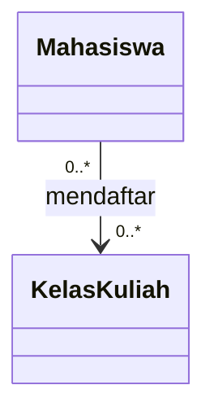

# Quiz Pertemuan 11 — UML Class Diagram dan Relasi Antar-Class

**Mata Kuliah:** USA-WP2360214 — Pemrograman Berorientasi Objek  
**Pertemuan:** 11 | **Tanggal:** 25 November 2026 | **CPMK:** CPMK115

## Petunjuk Pengerjaan

- Waktu: 20 menit
- Jumlah: 5 soal, masing-masing 20 poin
- Dikerjakan secara individu, kecuali ada arahan dosen
- Soal 2–5 berbasis diagram dan analisis kasus

## Soal 1 — Struktur Class Diagram

Sebutkan tiga bagian utama UML class diagram dan jelaskan informasi yang dituliskan pada setiap bagian.

## Soal 2 — Visibility dan Multiplicity

Jelaskan arti simbol `+`, `-`, `1`, dan `0..*` pada UML class diagram. Berikan contoh penggunaannya pada class `Mahasiswa` dan `KelasKuliah`.

## Soal 3 — Jenis Relasi

Jelaskan perbedaan association, aggregation, dan composition. Gunakan contoh `Pelanggan`, `Pesanan`, dan `DetailPesanan` untuk mendukung jawaban.

## Soal 4 — Analisis Diagram

Perhatikan rancangan berikut:

Jelaskan arti kedua multiplicity tersebut dan berikan satu skenario yang sesuai dengan relasi itu.

## Soal 5 — Evaluasi Rancangan

Sebuah tim menggunakan inheritance antara `Pelanggan` dan `Pesanan` karena kedua class tersebut digunakan dalam proses yang sama. Apakah keputusan tersebut tepat? Jelaskan relasi yang lebih sesuai dan alasan teknisnya.
