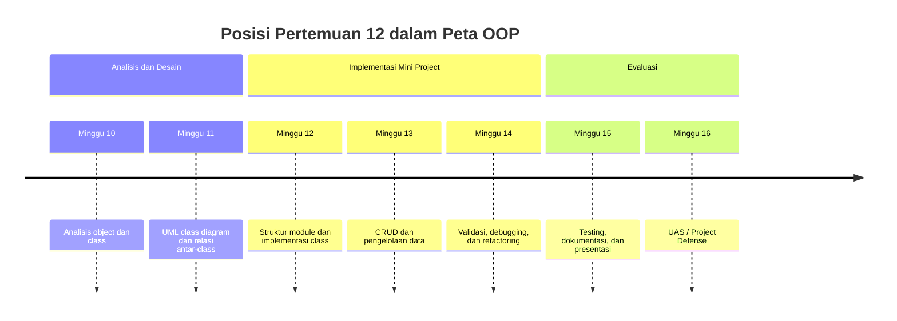
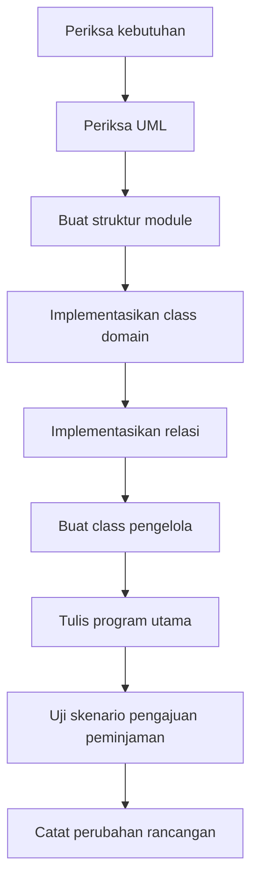
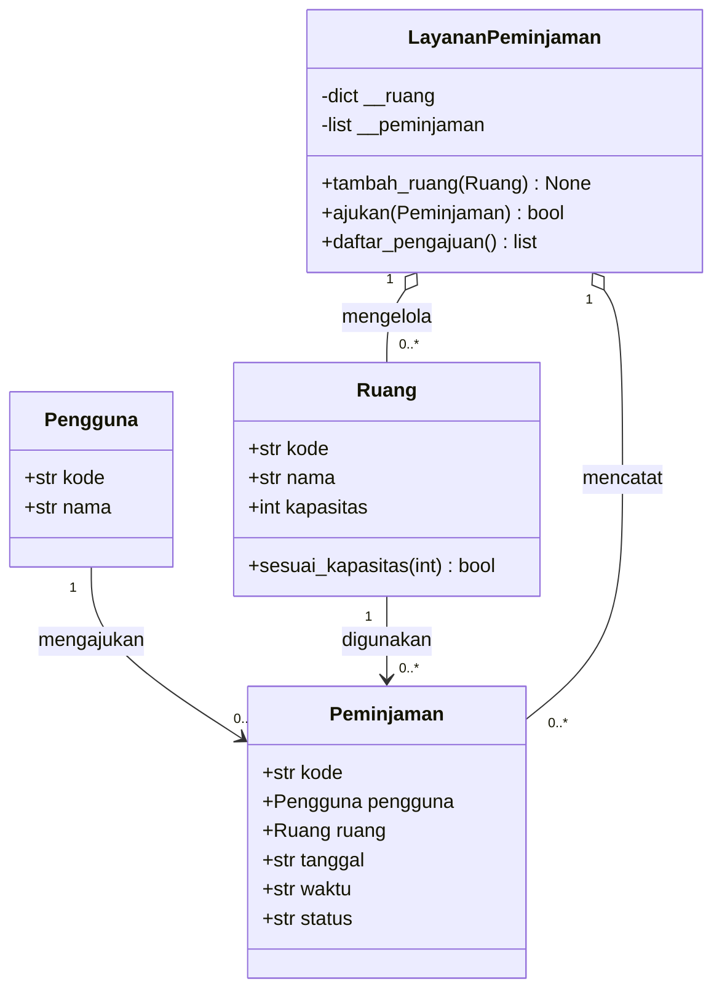

# Pertemuan 12 — Implementasi Mini Project Berbasis OOP

| | |
|:--|:--|
| **Mata Kuliah** | USA-WP2360214 — Pemrograman Berorientasi Objek |
| **Pertemuan** | 12 dari 16 |
| **Tanggal** | Rabu, 2 Desember 2026 |
| **CPMK** | CPMK115 |
| **Materi** | Implementasi mini project berdasarkan analisis kebutuhan dan UML class diagram |
| **Model Pembelajaran** | Project Based Learning / Case Based Learning / Praktikum |
| **Stack** | Python 3 |

> **Catatan penting:** Pertemuan 12 memulai implementasi mini project berdasarkan hasil analisis Pertemuan 10 dan UML class diagram Pertemuan 11. Anda akan mengubah rancangan menjadi struktur folder, module Python, class, object, dan alur program yang dapat dijalankan.

---

## Daftar Isi

- [Pertemuan 12 — Implementasi Mini Project Berbasis OOP](#pertemuan-12--implementasi-mini-project-berbasis-oop)
  - [Daftar Isi](#daftar-isi)
  - [1. Keterkaitan Pertemuan dengan RPS OBE](#1-keterkaitan-pertemuan-dengan-rps-obe)
  - [2. Capaian Pembelajaran Pertemuan](#2-capaian-pembelajaran-pertemuan)
  - [3. Pemantik Kasus: Mengubah UML Menjadi Program](#3-pemantik-kasus-mengubah-uml-menjadi-program)
  - [4. Alur Implementasi Mini Project](#4-alur-implementasi-mini-project)
  - [5. Menyiapkan Struktur Module](#5-menyiapkan-struktur-module)
  - [6. Menerjemahkan Class dari UML](#6-menerjemahkan-class-dari-uml)
  - [7. Menerapkan Relasi Antar-Class](#7-menerapkan-relasi-antar-class)
  - [8. Menyusun Service atau Class Pengelola](#8-menyusun-service-atau-class-pengelola)
  - [9. Program Utama dan Skenario Penggunaan](#9-program-utama-dan-skenario-penggunaan)
  - [10. Validasi Kesesuaian UML dan Kode](#10-validasi-kesesuaian-uml-dan-kode)
  - [11. Studi Kasus: Sistem Peminjaman Ruang](#11-studi-kasus-sistem-peminjaman-ruang)
    - [12. Latihan Terbimbing: Implementasi Mini Project](#12-latihan-terbimbing-implementasi-mini-project)
  - [13. Aktivitas Kelompok](#13-aktivitas-kelompok)
  - [14. Latihan Individu](#14-latihan-individu)
  - [15. Pemanfaatan AI sebagai Coding Assistant](#15-pemanfaatan-ai-sebagai-coding-assistant)
  - [16. Kuis Formatif](#16-kuis-formatif)
  - [17. Asesmen dan Penugasan](#17-asesmen-dan-penugasan)
  - [18. Persiapan menuju Pertemuan 13](#18-persiapan-menuju-pertemuan-13)
  - [19. Referensi dan Kode Praktikum](#19-referensi-dan-kode-praktikum)

---

## 1. Keterkaitan Pertemuan dengan RPS OBE

Pertemuan 12 mendukung **CPMK115** dan `SUB-CPMK11504` pada RPS:

> Mahasiswa mampu mengimplementasikan rancangan UML menjadi aplikasi sederhana berbasis OOP.

Pada Pertemuan 10, mahasiswa menyusun analisis class dan tanggung jawab. Pada Pertemuan 11, mahasiswa menyusun UML class diagram berdasarkan tabel analisis dari Pertemuan 10. Pada Pertemuan 12, tabel analisis dan UML class diagram digunakan sebagai acuan implementasi mini project tahap pertama.



---

## 2. Capaian Pembelajaran Pertemuan

Setelah mengikuti pertemuan ini, mahasiswa mampu:

| No. | Kemampuan | Indikator |
| :-: | --------- | --------- |
| 1 | Menerjemahkan UML menjadi kode | Membuat class dan attribute sesuai diagram |
| 2 | Mengatur struktur module | Memisahkan class berdasarkan tanggung jawab dan kebutuhan project |
| 3 | Menerapkan relasi antar-class | Menghubungkan object melalui attribute, parameter, atau collection |
| 4 | Menyusun program utama | Menjalankan skenario penggunaan dari object yang telah dibuat |
| 5 | Memeriksa kesesuaian rancangan | Membandingkan UML, kode, dan kebutuhan sebelum menambah fitur |

---

## 3. Pemantik Kasus: Mengubah UML Menjadi Program

Kelompok telah memiliki UML class diagram untuk sistem peminjaman ruang. Namun, class dan relasi pada diagram tersebut belum diimplementasikan menjadi program Python yang dapat dijalankan.

Pertanyaan pemantik:

1. Class mana yang harus dibuat terlebih dahulu?
2. Module apa yang diperlukan untuk memisahkan class domain, aturan proses, dan program utama?
3. Bagaimana object `Peminjaman` menyimpan relasi dengan `Pengguna` dan `Ruang`?
4. Di mana pemeriksaan tumpang tindih tanggal dan waktu peminjaman sebaiknya dikelola?
5. Bagaimana program utama menguji alur pengajuan peminjaman?

Implementasi harus menerjemahkan keputusan desain ke dalam kode. Setiap class perlu diperiksa kembali terhadap kebutuhan, attribute, method, dan relasi yang telah disepakati.

---

## 4. Alur Implementasi Mini Project

Gunakan tahapan berikut:



| Tahap | Hasil kerja |
| ----- | ----------- |
| Periksa kebutuhan | Daftar skenario dan aturan bisnis |
| Periksa UML | Class, attribute, method, dan relasi yang disepakati |
| Struktur module | File Python sesuai tanggung jawab |
| Class domain | Model data dan perilaku utama |
| Relasi | Interaksi antar-object |
| Pengelola | Operasi lintas beberapa object |
| Program utama | Skenario yang dapat dijalankan |
| Pengujian | Hasil aktual dan catatan perbaikan |

---

## 5. Menyiapkan Struktur Module

Satu file Python dapat digunakan untuk latihan kecil. Mini project sebaiknya mulai memisahkan module berdasarkan tanggung jawab:

```text
mini_project/
├── main.py
├── model.py
├── layanan.py
└── README.md
```

Contoh pembagian:

| File | Tanggung jawab |
| ---- | -------------- |
| `model.py` | Class domain seperti `Pengguna`, `Ruang`, dan `Peminjaman` |
| `layanan.py` | Aturan lintas object dan proses bisnis |
| `main.py` | Pembuatan object dan skenario penggunaan |
| `README.md` | Cara menjalankan dan ringkasan project |

Struktur module dapat berkembang pada Pertemuan 13–15. Pada Pertemuan 12, tetapkan batas tanggung jawab yang jelas dan pastikan program utama dapat dijalankan.

---

## 6. Menerjemahkan Class dari UML

Class pada UML diterjemahkan menjadi class Python. Attribute menjadi nilai pada constructor, sedangkan method menjadi perilaku class.

```python
class Ruang:
    """Merepresentasikan ruang yang dapat dipinjam."""

    def __init__(self, kode, nama, kapasitas):
        self.kode = kode
        self.nama = nama
        self.kapasitas = kapasitas

    def sesuai_kapasitas(self, jumlah_peserta):
        return jumlah_peserta <= self.kapasitas
```

Periksa hasil penerjemahan:

- nama class mengikuti UML dan menggunakan `PascalCase`;
- attribute yang diperlukan tersedia pada constructor;
- method memiliki nama dan parameter yang sesuai;
- perilaku class tidak dipindahkan ke class yang tidak memiliki data pendukung;
- docstring dan komentar menjelaskan konsep penting.

---

## 7. Menerapkan Relasi Antar-Class

Relasi UML diterapkan melalui referensi object, parameter method, atau collection.

```python
class Peminjaman:
    """Menghubungkan pengguna dengan ruang pada waktu tertentu."""

    def __init__(self, kode, pengguna, ruang, tanggal, waktu):
        self.kode = kode
        self.pengguna = pengguna
        self.ruang = ruang
        self.tanggal = tanggal
        self.waktu = waktu
        self.status = "diajukan"
```

Attribute `pengguna` dan `ruang` menyimpan referensi object lain. Ini merepresentasikan association. Jika sebuah object membuat dan mengelola bagian internalnya sendiri, seperti `Pesanan` dan `DetailPesanan`, relasi tersebut dapat diterapkan sebagai composition melalui list privat.

---

## 8. Menyusun Service atau Class Pengelola

Aturan yang melibatkan beberapa object dapat dikelola oleh class layanan. Class layanan tidak menggantikan class domain; tugasnya mengoordinasikan proses.

```python
class LayananPeminjaman:
    """Mengelola koleksi ruang dan proses peminjaman."""

    def __init__(self):
        self.__ruang = {}
        self.__peminjaman = []

    def tambah_ruang(self, ruang):
        self.__ruang[ruang.kode] = ruang

    def ajukan(self, peminjaman):
        if peminjaman.ruang.kode not in self.__ruang:
            return False
        self.__peminjaman.append(peminjaman)
        return True
```

Class pengelola digunakan ketika operasi membutuhkan beberapa object sekaligus. Aturan khusus satu object tetap dikelola oleh class pemilik data, misalnya `Ruang.sesuai_kapasitas()`.

---

## 9. Program Utama dan Skenario Penggunaan

Program utama membuat object, menjalankan skenario, dan menampilkan keluaran untuk diperiksa:

```python
pengguna = Pengguna("U001", "Nadia")
ruang = Ruang("R001", "Lab 1", 30)
peminjaman = Peminjaman("P001", pengguna, ruang, "2026-12-03", "09:00")

layanan = LayananPeminjaman()
layanan.tambah_ruang(ruang)
print(layanan.ajukan(peminjaman))
```

Skenario penggunaan harus menjelaskan:

1. object apa yang dibuat;
2. method apa yang dipanggil;
3. state apa yang berubah;
4. hasil apa yang diharapkan;
5. kondisi apa yang menyebabkan operasi ditolak.

---

## 10. Validasi Kesesuaian UML dan Kode

Gunakan tabel pemeriksaan berikut sebelum menambah fitur:

| Elemen UML | Pemeriksaan pada kode |
| ---------- | --------------------- |
| Class | Class Python tersedia dan memiliki tanggung jawab yang sama |
| Attribute | Attribute disimpan pada object yang tepat |
| Method | Method memiliki parameter dan perilaku yang sesuai |
| Association | Referensi object atau parameter tersedia |
| Composition | Bagian dibuat dan dikelola oleh object keseluruhan |
| Multiplicity | Collection dan validasi mendukung jumlah object yang dirancang |
| Inheritance | Subclass benar-benar merupakan jenis khusus superclass |

Jika kode tidak sesuai diagram, pilih salah satu keputusan berikut:

- perbaiki kode agar sesuai kebutuhan;
- revisi diagram jika hasil analisis berubah;
- catat alasan perubahan pada dokumentasi project.

Jangan mengubah diagram tanpa memeriksa dampaknya terhadap kode dan skenario penggunaan.

---

## 11. Studi Kasus: Sistem Peminjaman Ruang

Kebutuhan mini project:

1. Sistem menyimpan pengguna dan ruang.
2. Pengguna dapat mengajukan peminjaman ruang.
3. Sistem menolak ruang yang belum terdaftar.
4. Sistem memeriksa kapasitas ruang.
5. Sistem menyimpan status peminjaman.
6. Sistem menampilkan daftar pengajuan.

Rancangan class awal:



Diagram rancangan Sistem Peminjaman Ruang menjadi acuan implementasi. Association digunakan untuk hubungan object domain, sedangkan aggregation digunakan pada class layanan yang mengelola collection object.

---

## 12. Latihan Terbimbing: Implementasi Mini Project

Latihan terbimbing menggunakan contoh pada [`../code/pertemuan-12/peminjaman_ruang.py`](../code/pertemuan-12/peminjaman_ruang.py).

```bash
python3 ../code/pertemuan-12/peminjaman_ruang.py
```

Kemudian lengkapi scaffold pada [`../code/pertemuan-12/latihan_mini_project.py`](../code/pertemuan-12/latihan_mini_project.py).

```bash
python3 ../code/pertemuan-12/latihan_mini_project.py
```

Periksa hal berikut:

- kesesuaian class Python dengan UML;
- cara object disimpan pada class layanan;
- cara method menerima object lain sebagai parameter;
- hasil operasi ketika ruang tersedia dan ketika ruang belum terdaftar;
- perubahan status `Peminjaman` setelah pengajuan berhasil.

---

## 13. Aktivitas Kelompok

Bentuk kelompok 3–4 orang:

1. Pilih satu UML class diagram hasil Pertemuan 11.
2. Tentukan module yang diperlukan untuk implementasi awal.
3. Implementasikan minimal tiga class domain.
4. Implementasikan satu class layanan atau pengelola.
5. Buat `main.py` atau program utama untuk menjalankan satu skenario utama.
6. Uji satu kondisi berhasil dan satu kondisi ditolak.
7. Catat perbedaan antara UML dan implementasi jika ada.

---

## 14. Latihan Individu

Lengkapi scaffold mini project dengan ketentuan berikut:

1. Lengkapi class `Pengguna`, `Ruang`, dan `Peminjaman`.
2. Lengkapi class `LayananPeminjaman` untuk menyimpan ruang dan pengajuan.
3. Implementasikan validasi ruang yang belum terdaftar.
4. Implementasikan pemeriksaan kapasitas ruang.
5. Buat method `daftar_pengajuan()` untuk membaca data pengajuan.
6. Jalankan satu skenario berhasil dan dua skenario ditolak.
7. Bandingkan implementasi dengan UML pada materi.

Dokumentasikan input, hasil yang diharapkan, dan hasil aktual. Perubahan terhadap rancangan harus dicatat dalam refleksi project.

---

## 15. Pemanfaatan AI sebagai Coding Assistant

**AI assistant (GitHub Copilot, ChatGPT, Claude, Gemini) boleh dipakai — dengan cara yang benar:**

**✅ Gunakan AI untuk:**

- Membantu menerjemahkan satu class UML menjadi class Python.
- Menjelaskan pembagian module berdasarkan tanggung jawab class.
- Mengusulkan skenario pengujian untuk operasi berhasil dan ditolak.
- Mereview kesesuaian attribute, method, dan relasi pada UML dengan kode.

**❌ Hindari penggunaan AI untuk:**

- Membuat seluruh mini project tanpa memahami rancangan UML.
- Menyalin kode tanpa membandingkan hasilnya dengan kebutuhan.
- Mengubah relasi atau tanggung jawab class tanpa alasan teknis.
- Memasukkan data pribadi, kredensial, atau data pengguna nyata ke dalam prompt.

**Etika di kelas ini:**

1. Anda wajib dapat menjelaskan hubungan antara UML, module, class, object, dan skenario program yang diserahkan.
2. Cantumkan penggunaan bantuan AI pada komentar kode atau refleksi latihan. Contoh yang sesuai dengan materi implementasi mini project:

   ```python
   # Bantuan: GitHub Copilot — penjelasan pemisahan class domain dan class layanan.
   ```

3. AI digunakan sebagai alat bantu pembelajaran. Anda tetap bertanggung jawab memahami, menjelaskan, dan menguji kode yang digunakan dalam tugas. Penggunaan AI tidak menggantikan proses menerjemahkan UML dan memvalidasi implementasi.

---

## 16. Kuis Formatif

Kerjakan [Quiz Pertemuan 12](./02-Quiz-Pertemuan-12.md) setelah menyelesaikan pembahasan dan praktikum. Kuis mengukur kemampuan menerjemahkan UML menjadi struktur module, class, object, relasi, dan skenario program.

---

## 17. Asesmen dan Penugasan

| Komponen | Bentuk | Keterangan |
| --------- | ------ | ---------- |
| Implementasi mini project | Program Python | Menerjemahkan UML menjadi class dan object |
| Struktur module | Source code | Memisahkan tanggung jawab file dan class |
| Skenario penggunaan | Demonstrasi | Menjalankan operasi berhasil dan ditolak |
| Kuis formatif | Uraian dan analisis kode | Mengukur pemahaman implementasi OOP |

Checklist:

- [ ] Struktur module telah ditentukan.
- [ ] Class dan attribute sesuai dengan UML.
- [ ] Relasi antar-class sudah diimplementasikan.
- [ ] Class layanan mengelola operasi lintas object.
- [ ] Program utama menjalankan skenario yang dapat diuji.
- [ ] Perbedaan UML dan kode telah dicatat jika ada.

---

## 18. Persiapan menuju Pertemuan 13

Pada Pertemuan 13, mahasiswa akan menambahkan operasi CRUD dan pengelolaan data pada mini project.

Persiapkan hal berikut:

- pastikan class domain dan class layanan dapat dijalankan;
- siapkan collection untuk operasi Create, Read, Update, dan Delete;
- tinjau kembali penggunaan dictionary dan list pada Python;
- siapkan skenario perubahan dan penghapusan data;
- baca kembali materi validasi dan encapsulation dari Pertemuan 3.

---

## 19. Referensi dan Kode Praktikum

Referensi:

- [Python Docs — Modules](https://docs.python.org/3/tutorial/modules.html)
- [Python Docs — Classes](https://docs.python.org/3/tutorial/classes.html)
- [Mermaid — Class Diagrams](https://mermaid.js.org/syntax/classDiagram.html)
- [Visual Paradigm — UML Class Diagram Tutorial](https://www.visual-paradigm.com/guide/uml-unified-modeling-language/what-is-class-diagram/)
- [PEP 8 — Naming Conventions](https://peps.python.org/pep-0008/)

Kode praktikum:

- [`../code/pertemuan-12/peminjaman_ruang.py`](../code/pertemuan-12/peminjaman_ruang.py) — contoh implementasi mini project.
- [`../code/pertemuan-12/latihan_mini_project.py`](../code/pertemuan-12/latihan_mini_project.py) — scaffold latihan implementasi.
