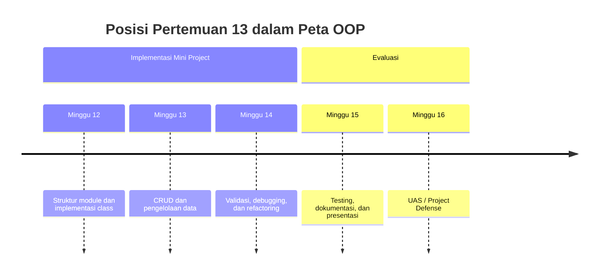
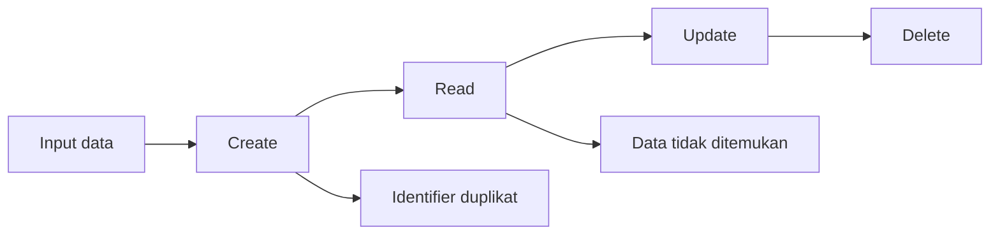
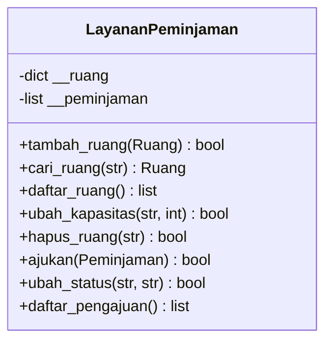

# Pertemuan 13 — CRUD dan Pengelolaan Data dengan Object

| | |
|:--|:--|
| **Mata Kuliah** | USA-WP2360214 — Pemrograman Berorientasi Objek |
| **Pertemuan** | 13 dari 16 |
| **Tanggal** | Rabu, 9 Desember 2026 |
| **CPMK** | CPMK115 |
| **Materi** | Operasi Create, Read, Update, Delete dan pengelolaan collection pada mini project OOP |
| **Model Pembelajaran** | Project Based Learning / Case Based Learning / Praktikum |
| **Stack** | Python 3 |

> **Catatan penting:** Pertemuan 13 mengembangkan mini project Pertemuan 12 dengan operasi CRUD. Anda akan mengelola collection object, mencari object berdasarkan identifier, memperbarui state, menghapus data secara terkontrol, dan menguji hasil setiap operasi.

---

## Daftar Isi

- [Pertemuan 13 — CRUD dan Pengelolaan Data dengan Object](#pertemuan-13--crud-dan-pengelolaan-data-dengan-object)
  - [Daftar Isi](#daftar-isi)
  - [1. Keterkaitan Pertemuan dengan RPS OBE](#1-keterkaitan-pertemuan-dengan-rps-obe)
  - [2. Capaian Pembelajaran Pertemuan](#2-capaian-pembelajaran-pertemuan)
  - [3. Pemantik Kasus: Data yang Perlu Dikelola](#3-pemantik-kasus-data-yang-perlu-dikelola)
  - [4. Konsep CRUD pada Aplikasi OOP](#4-konsep-crud-pada-aplikasi-oop)
  - [5. Collection Object dan Identifier](#5-collection-object-dan-identifier)
  - [6. Create: Menambah Object](#6-create-menambah-object)
  - [7. Read: Membaca dan Mencari Object](#7-read-membaca-dan-mencari-object)
  - [8. Update: Mengubah State Object](#8-update-mengubah-state-object)
  - [9. Delete: Menghapus Object](#9-delete-menghapus-object)
  - [10. Validasi Operasi CRUD](#10-validasi-operasi-crud)
  - [11. Studi Kasus: Pengelolaan Peminjaman Ruang](#11-studi-kasus-pengelolaan-peminjaman-ruang)
  - [12. Latihan Terbimbing: Implementasi CRUD](#12-latihan-terbimbing-implementasi-crud)
  - [13. Aktivitas Kelompok](#13-aktivitas-kelompok)
  - [14. Latihan Individu](#14-latihan-individu)
  - [15. Pemanfaatan AI sebagai Coding Assistant](#15-pemanfaatan-ai-sebagai-coding-assistant)
  - [16. Kuis Formatif](#16-kuis-formatif)
  - [17. Asesmen dan Penugasan](#17-asesmen-dan-penugasan)
  - [18. Persiapan menuju Pertemuan 14](#18-persiapan-menuju-pertemuan-14)
  - [19. Referensi dan Kode Praktikum](#19-referensi-dan-kode-praktikum)

---

## 1. Keterkaitan Pertemuan dengan RPS OBE

Pertemuan 13 mendukung **CPMK115** dan `SUB-CPMK11505` pada RPS:

> Mahasiswa mampu menerapkan operasi CRUD pada object dan collection dalam aplikasi OOP.

Pertemuan 12 menghasilkan struktur class dan service untuk mini project. Pada Pertemuan 13, mahasiswa menambahkan pengelolaan data agar object dapat dibuat, dibaca, diubah, dan dihapus melalui operasi yang memiliki aturan jelas.



---

## 2. Capaian Pembelajaran Pertemuan

Setelah mengikuti pertemuan ini, mahasiswa mampu:

| No. | Kemampuan | Indikator |
| :-: | --------- | --------- |
| 1 | Menjelaskan CRUD | Membedakan Create, Read, Update, dan Delete pada aplikasi OOP |
| 2 | Mengelola collection object | Menyimpan dan mengambil object berdasarkan identifier |
| 3 | Menerapkan Create dan Read | Menambah object dan menampilkan data yang tersimpan |
| 4 | Menerapkan Update dan Delete | Mengubah atau menghapus object dengan validasi |
| 5 | Menguji operasi CRUD | Menjalankan skenario berhasil, data tidak ditemukan, dan identifier duplikat |

---

## 3. Pemantik Kasus: Data yang Perlu Dikelola

Pada Pertemuan 12, sistem sudah dapat menerima pengajuan peminjaman ruang. Namun, mini project belum memiliki operasi untuk mengelola data secara lengkap.

Pertanyaan pemantik:

1. Bagaimana sistem menambahkan ruang baru?
2. Bagaimana sistem mencari pengajuan berdasarkan kode?
3. Bagaimana status pengajuan diubah menjadi `disetujui` atau `ditolak`?
4. Bagaimana sistem menghapus ruang yang tidak lagi digunakan?
5. Bagaimana sistem melaporkan identifier yang tidak ditemukan atau sudah digunakan?

CRUD harus diterapkan melalui class atau service yang memiliki collection data. Program utama hanya memanggil operasi dan menampilkan hasilnya.

---

## 4. Konsep CRUD pada Aplikasi OOP

CRUD adalah empat operasi utama pengelolaan data:

| Operasi | Makna | Contoh pada mini project |
| ------- | ----- | ------------------------ |
| Create | Membuat dan menyimpan data baru | Menambah `Ruang` |
| Read | Membaca atau mencari data | Mencari `Ruang` berdasarkan kode |
| Update | Mengubah data yang sudah ada | Mengubah kapasitas atau status |
| Delete | Menghapus data | Menghapus `Ruang` berdasarkan kode |



Tidak setiap operasi harus mengubah data. `Read` hanya membaca collection, sedangkan `Create`, `Update`, dan `Delete` mengubah state pengelola data.

---

## 5. Collection Object dan Identifier

Collection object dapat disimpan dalam list atau dictionary. Dictionary sesuai ketika setiap object memiliki identifier unik.

```python
class LayananPeminjaman:
    """Mengelola ruang berdasarkan kode unik."""

    def __init__(self):
        self.__ruang = {}

    def tambah_ruang(self, ruang):
        if ruang.kode in self.__ruang:
            return False
        self.__ruang[ruang.kode] = ruang
        return True
```

Identifier digunakan untuk:

- memastikan object dapat ditemukan kembali;
- mencegah data duplikat;
- menentukan object yang akan diubah;
- menentukan object yang akan dihapus.

Pilih identifier yang stabil. Index list tidak disarankan sebagai identifier karena dapat berubah setelah object dihapus.

---

## 6. Create: Menambah Object

Operasi Create membuat object baru atau menerima object yang sudah dibuat, kemudian menyimpannya pada collection.

```python
    def tambah_ruang(self, ruang):
        if ruang.kode in self.__ruang:
            return False
        self.__ruang[ruang.kode] = ruang
        return True
```

Validasi identifier duplikat dilakukan sebelum object disimpan. Hasil boolean memberi informasi kepada program utama apakah operasi berhasil.

Skenario pengujian:

| Input | Hasil yang diharapkan |
| ----- | --------------------- |
| Ruang dengan kode baru | Object tersimpan, hasil `True` |
| Ruang dengan kode yang sudah ada | Object tidak menggantikan data lama, hasil `False` |

---

## 7. Read: Membaca dan Mencari Object

Operasi Read dapat mengembalikan satu object berdasarkan identifier atau salinan collection.

```python
    def cari_ruang(self, kode):
        return self.__ruang.get(kode)

    def daftar_ruang(self):
        return list(self.__ruang.values())
```

Method `cari_ruang()` mengembalikan `None` jika kode tidak ditemukan. Method `daftar_ruang()` mengembalikan list baru agar pemanggil tidak mengubah dictionary internal secara langsung.

Program utama dapat mengubah hasil Read menjadi keluaran:

```python
ruang = layanan.cari_ruang("R001")
if ruang is None:
    print("Ruang tidak ditemukan.")
else:
    print(ruang)
```

---

## 8. Update: Mengubah State Object

Update mengubah object yang sudah ditemukan. Letakkan aturan perubahan pada class yang memiliki data atau pada class layanan jika perubahan melibatkan beberapa object.

```python
    def ubah_kapasitas(self, kode, kapasitas_baru):
        ruang = self.cari_ruang(kode)
        if ruang is None:
            return False
        if kapasitas_baru <= 0:
            return False
        ruang.kapasitas = kapasitas_baru
        return True
```

Urutan operasi Update:

1. cari object berdasarkan identifier;
2. tolak jika object tidak ditemukan;
3. validasi nilai baru;
4. ubah state object;
5. kembalikan hasil operasi.

---

## 9. Delete: Menghapus Object

Delete menghapus object berdasarkan identifier. Periksa dependensi sebelum menghapus data yang digunakan oleh object lain.

```python
    def hapus_ruang(self, kode):
        if kode not in self.__ruang:
            return False
        del self.__ruang[kode]
        return True
```

Jika ruang masih digunakan oleh pengajuan aktif, sistem dapat menolak penghapusan atau menerapkan aturan khusus. Keputusan tersebut harus ditulis pada kebutuhan dan diuji dalam skenario.

| Kondisi | Keputusan |
| ------- | --------- |
| Kode tidak ditemukan | Kembalikan `False` |
| Ruang tidak memiliki pengajuan aktif | Hapus dan kembalikan `True` |
| Ruang masih digunakan | Tolak atau ubah status sesuai aturan bisnis |

---

## 10. Validasi Operasi CRUD

Setiap operasi CRUD perlu memiliki skenario berhasil dan skenario ditolak.

| Operasi | Kondisi berhasil | Kondisi ditolak |
| ------- | ---------------- | --------------- |
| Create | Identifier baru | Identifier duplikat |
| Read | Identifier ditemukan | Identifier tidak ditemukan |
| Update | Object dan nilai baru valid | Object tidak ditemukan atau nilai tidak valid |
| Delete | Object ada dan boleh dihapus | Object tidak ditemukan atau masih digunakan |

Jangan menyamakan data kosong dengan operasi berhasil. Kembalikan hasil yang dapat diperiksa, misalnya `True`, `False`, object, `None`, atau exception sesuai kebutuhan aplikasi.

---

## 11. Studi Kasus: Pengelolaan Peminjaman Ruang

Mini project menggunakan class `Ruang`, `Peminjaman`, dan `LayananPeminjaman`. Tambahkan operasi berikut:

1. `tambah_ruang(ruang)` untuk Create.
2. `cari_ruang(kode)` dan `daftar_ruang()` untuk Read.
3. `ubah_kapasitas(kode, kapasitas_baru)` untuk Update.
4. `hapus_ruang(kode)` untuk Delete.
5. `ajukan(peminjaman)` untuk menambah pengajuan.
6. `ubah_status(kode_peminjaman, status_baru)` untuk memperbarui status.
7. `daftar_pengajuan()` untuk membaca pengajuan.



Rancangan method tersebut menjadi acuan latihan terbimbing dan latihan individu.

---

## 12. Latihan Terbimbing: Implementasi CRUD

Latihan terbimbing menggunakan contoh pada [`../code/pertemuan-13/crud_peminjaman.py`](../code/pertemuan-13/crud_peminjaman.py).

```bash
python3 ../code/pertemuan-13/crud_peminjaman.py
```

Kemudian lengkapi scaffold pada [`../code/pertemuan-13/latihan_crud.py`](../code/pertemuan-13/latihan_crud.py).

```bash
python3 ../code/pertemuan-13/latihan_crud.py
```

Periksa hal berikut:

- identifier mencegah object duplikat;
- method Read tidak mengubah collection internal;
- Update hanya mengubah object yang ditemukan;
- Delete menolak identifier yang tidak ditemukan;
- setiap operasi menghasilkan nilai yang dapat diperiksa.

---

## 13. Aktivitas Kelompok

Bentuk kelompok 3–4 orang:

1. Gunakan mini project Pertemuan 12.
2. Buat tabel operasi CRUD untuk minimal dua class.
3. Tentukan identifier setiap object.
4. Tulis kondisi berhasil dan ditolak untuk setiap operasi.
5. Implementasikan method CRUD pada class layanan.
6. Jalankan skenario secara berurutan: Create, Read, Update, Read, Delete, Read.
7. Catat hasil aktual dan perbedaan dari kebutuhan.

---

## 14. Latihan Individu

Lengkapi scaffold CRUD dengan ketentuan berikut:

1. Lengkapi operasi Create untuk `Ruang` dan `Peminjaman`.
2. Lengkapi operasi Read untuk mencari satu object dan menampilkan collection.
3. Lengkapi operasi Update untuk kapasitas ruang dan status peminjaman.
4. Lengkapi operasi Delete untuk ruang yang tidak digunakan.
5. Tambahkan validasi identifier duplikat dan identifier tidak ditemukan.
6. Uji minimal delapan skenario CRUD.
7. Catat input, hasil yang diharapkan, dan hasil aktual.

---

## 15. Pemanfaatan AI sebagai Coding Assistant

**AI assistant (GitHub Copilot, ChatGPT, Claude, Gemini) boleh dipakai — dengan cara yang benar:**

**✅ Gunakan AI untuk:**

- Menjelaskan perbedaan Create, Read, Update, dan Delete pada object.
- Mengusulkan skenario pengujian untuk identifier duplikat dan data tidak ditemukan.
- Mereview apakah method Update dan Delete memiliki validasi yang tepat.
- Membantu membaca error pada operasi collection.

**❌ Hindari penggunaan AI untuk:**

- Membuat seluruh operasi CRUD tanpa memahami perubahan state object.
- Menghapus validasi agar operasi terlihat berhasil.
- Menyalin implementasi collection tanpa menguji data kosong dan identifier tidak ditemukan.
- Memasukkan data pribadi, kredensial, atau data pengguna nyata ke dalam prompt.

**Etika di kelas ini:**

1. Anda wajib dapat menjelaskan perubahan state pada setiap operasi CRUD yang diserahkan.
2. Cantumkan penggunaan bantuan AI pada komentar kode atau refleksi latihan. Contoh yang sesuai dengan materi CRUD:

   ```python
   # Bantuan: GitHub Copilot — usulan skenario pengujian identifier duplikat.
   ```

3. AI digunakan sebagai alat bantu pembelajaran. Anda tetap bertanggung jawab memahami, menjelaskan, dan menguji kode yang digunakan dalam tugas. Penggunaan AI tidak menggantikan proses memvalidasi operasi CRUD.

---

## 16. Kuis Formatif

Kerjakan [Quiz Pertemuan 13](./02-Quiz-Pertemuan-13.md) setelah menyelesaikan pembahasan dan praktikum. Kuis mengukur pemahaman CRUD, collection object, identifier, validasi, dan perubahan state.

---

## 17. Asesmen dan Penugasan

| Komponen | Bentuk | Keterangan |
| --------- | ------ | ---------- |
| Implementasi CRUD | Program Python | Membuat, membaca, mengubah, dan menghapus object |
| Pengujian skenario | Tabel hasil uji | Membandingkan hasil yang diharapkan dan aktual |
| Struktur service | Source code | Mengelola collection dan aturan CRUD |
| Kuis formatif | Uraian dan analisis kode | Mengukur pemahaman CRUD dan object |

Checklist:

- [ ] Create menolak identifier duplikat.
- [ ] Read dapat mencari object dan menampilkan collection.
- [ ] Update memvalidasi object dan nilai baru.
- [ ] Delete memvalidasi object dan dependensi.
- [ ] Setiap operasi memiliki skenario berhasil dan ditolak.
- [ ] Hasil pengujian dicatat.

---

## 18. Persiapan menuju Pertemuan 14

Pada Pertemuan 14, mahasiswa akan mempelajari exception handling, validation, debugging, dan refactoring pada mini project.

Persiapkan hal berikut:

- tinjau kembali operasi CRUD dan kondisi ditolak;
- identifikasi operasi yang dapat memunculkan error;
- siapkan input tidak valid untuk pengujian;
- tinjau kembali penggunaan `try`, `except`, dan `raise`;
- catat bagian kode yang perlu disederhanakan atau diperbaiki.

---

## 19. Referensi dan Kode Praktikum

Referensi:

- [Python Docs — Data Structures](https://docs.python.org/3/tutorial/datastructures.html)
- [Python Docs — Classes](https://docs.python.org/3/tutorial/classes.html)
- [Python Docs — Errors and Exceptions](https://docs.python.org/3/tutorial/errors.html)
- [Real Python — Object-Oriented Programming (OOP) in Python 3](https://realpython.com/python3-object-oriented-programming/)
- [PEP 8 — Naming Conventions](https://peps.python.org/pep-0008/)

Kode praktikum:

- [`../code/pertemuan-13/crud_peminjaman.py`](../code/pertemuan-13/crud_peminjaman.py) — contoh implementasi CRUD.
- [`../code/pertemuan-13/latihan_crud.py`](../code/pertemuan-13/latihan_crud.py) — scaffold latihan CRUD.
