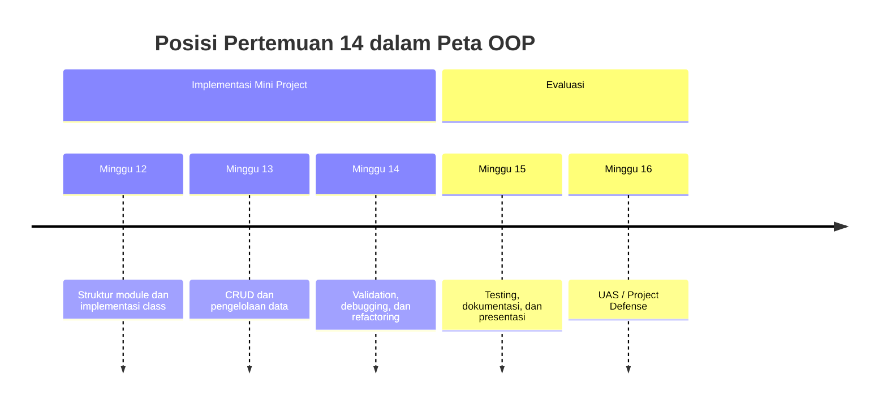
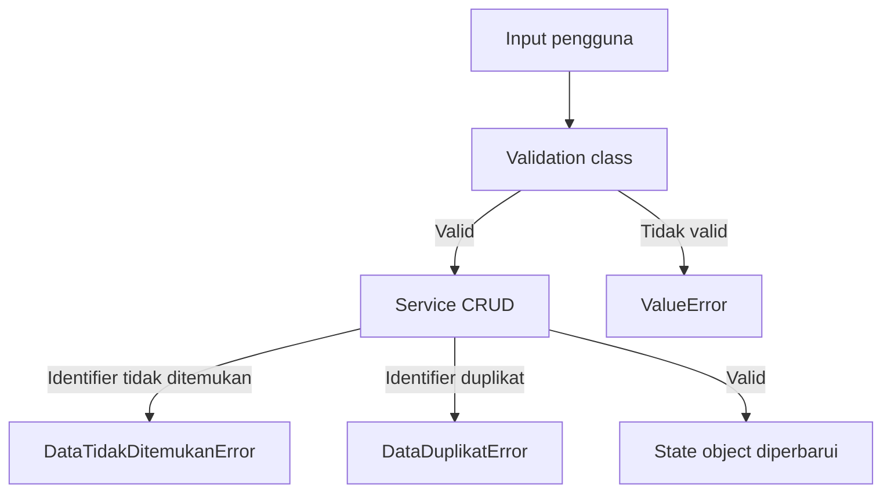

# Pertemuan 14 — Exception Handling, Validation, Debugging, dan Refactoring

| | |
|:--|:--|
| **Mata Kuliah** | USA-WP2360214 — Pemrograman Berorientasi Objek |
| **Pertemuan** | 14 dari 16 |
| **Tanggal** | Rabu, 16 Desember 2026 |
| **CPMK** | CPMK115 |
| **Materi** | Exception handling, validation, debugging, dan refactoring pada mini project OOP |
| **Model Pembelajaran** | Project Based Learning / Problem Based Learning / Praktikum |
| **Stack** | Python 3 |

> **Catatan penting:** Pertemuan 14 memperbaiki keandalan mini project melalui exception handling, validation, debugging, dan refactoring. Anda akan membedakan kesalahan input, kesalahan aturan bisnis, dan kesalahan program, lalu memperbaiki struktur kode tanpa mengubah perilaku yang sudah benar.

---

## Daftar Isi

- [Pertemuan 14 — Exception Handling, Validation, Debugging, dan Refactoring](#pertemuan-14--exception-handling-validation-debugging-dan-refactoring)
  - [Daftar Isi](#daftar-isi)
  - [1. Keterkaitan Pertemuan dengan RPS OBE](#1-keterkaitan-pertemuan-dengan-rps-obe)
  - [2. Capaian Pembelajaran Pertemuan](#2-capaian-pembelajaran-pertemuan)
  - [3. Pemantik Kasus: Program Berjalan tetapi Belum Andal](#3-pemantik-kasus-program-berjalan-tetapi-belum-andal)
  - [4. Jenis Kesalahan pada Program Python](#4-jenis-kesalahan-pada-program-python)
  - [5. Exception Handling dengan `try` dan `except`](#5-exception-handling-dengan-try-dan-except)
  - [6. Custom Exception pada Domain](#6-custom-exception-pada-domain)
  - [7. Validation pada Class dan Service](#7-validation-pada-class-dan-service)
  - [8. `else` dan `finally`](#8-else-dan-finally)
  - [9. Debugging Berbasis Skenario](#9-debugging-berbasis-skenario)
  - [10. Refactoring Kode OOP](#10-refactoring-kode-oop)
  - [11. Studi Kasus: Mini Project Peminjaman Ruang](#11-studi-kasus-mini-project-peminjaman-ruang)
  - [12. Latihan Terbimbing: Memperbaiki Mini Project](#12-latihan-terbimbing-memperbaiki-mini-project)
  - [13. Aktivitas Kelompok](#13-aktivitas-kelompok)
  - [14. Latihan Individu](#14-latihan-individu)
  - [15. Pemanfaatan AI sebagai Coding Assistant](#15-pemanfaatan-ai-sebagai-coding-assistant)
  - [16. Kuis Formatif](#16-kuis-formatif)
  - [17. Asesmen dan Penugasan](#17-asesmen-dan-penugasan)
  - [18. Persiapan menuju Pertemuan 15](#18-persiapan-menuju-pertemuan-15)
  - [19. Referensi dan Kode Praktikum](#19-referensi-dan-kode-praktikum)

---

## 1. Keterkaitan Pertemuan dengan RPS OBE

Pertemuan 14 mendukung **CPMK115** dan `SUB-CPMK11506` pada RPS:

> Mahasiswa mampu memperbaiki, memvalidasi, dan melakukan refactoring pada aplikasi OOP berdasarkan hasil pengujian.

Pertemuan 13 menghasilkan operasi CRUD. Pertemuan 14 menambahkan perlindungan terhadap input dan kondisi gagal, kemudian menggunakan hasil debugging untuk memperbaiki struktur kode mini project.



---

## 2. Capaian Pembelajaran Pertemuan

Setelah mengikuti pertemuan ini, mahasiswa mampu:

| No. | Kemampuan | Indikator |
| :-: | --------- | --------- |
| 1 | Membedakan jenis kesalahan | Mengidentifikasi syntax error, runtime error, dan kesalahan aturan bisnis |
| 2 | Menerapkan exception handling | Menangani exception tanpa menutupi sumber masalah |
| 3 | Menerapkan validation | Menolak input yang tidak sesuai aturan domain |
| 4 | Melakukan debugging | Menelusuri input, state, alur method, dan hasil operasi |
| 5 | Melakukan refactoring | Memperbaiki struktur kode tanpa mengubah perilaku yang diharapkan |

---

## 3. Pemantik Kasus: Program Berjalan tetapi Belum Andal

Program CRUD peminjaman ruang dapat dijalankan, tetapi pengguna memasukkan data berikut:

- kapasitas ruang berupa teks;
- kode ruang kosong;
- status peminjaman di luar pilihan yang tersedia;
- kode peminjaman yang tidak ditemukan;
- ruang yang masih digunakan oleh pengajuan aktif dihapus.

Jika program hanya mengembalikan `False` tanpa informasi yang cukup, program utama sulit menjelaskan penyebab operasi ditolak. Jika program menangkap semua exception dengan `except Exception`, sumber kesalahan juga sulit ditelusuri.

Pertanyaan pemantik:

1. Input mana yang harus divalidasi sebelum object dibuat?
2. Kapan method sebaiknya mengembalikan `False` dan kapan perlu menaikkan exception?
3. Bagaimana membedakan kesalahan input dari kesalahan program?
4. Bagaimana menemukan method yang mengubah state secara tidak sesuai?
5. Bagian kode mana yang dapat dirapikan tanpa mengubah perilaku?

---

## 4. Jenis Kesalahan pada Program Python

| Jenis | Contoh | Strategi pemeriksaan |
| ----- | ------ | -------------------- |
| Syntax error | Tanda kurung atau indentasi tidak lengkap | Jalankan interpreter atau compile |
| Runtime error | `KeyError`, `AttributeError`, `TypeError` | Jalankan skenario yang memicu error |
| Validation error | Kapasitas `0` atau kode kosong | Periksa input sebelum disimpan |
| Business rule error | Ruang aktif dihapus | Periksa state dan relasi object |
| Logic error | Hasil total atau status salah | Bandingkan hasil aktual dengan expected result |

Tidak semua kondisi gagal adalah exception. Operasi yang ditolak karena aturan bisnis dapat mengembalikan `False` atau custom exception sesuai kontrak service.

---

## 5. Exception Handling dengan `try` dan `except`

Gunakan `try` untuk kode yang mungkin menimbulkan exception dan `except` untuk menangani jenis exception yang diketahui.

```python
try:
    kapasitas = int(input_pengguna)
except ValueError:
    print("Kapasitas harus berupa bilangan bulat.")
```

Tangani exception secara spesifik:

```python
try:
    ruang = layanan.cari_ruang(kode)
    print(ruang.nama)
except AttributeError:
    print("Ruang tidak ditemukan.")
```

Namun, pengecekan `None` sering lebih tepat jika method `cari_ruang()` memang mendokumentasikan bahwa data tidak ditemukan akan menghasilkan `None`. Jangan menggunakan `except` untuk menutupi kesalahan desain atau kesalahan penamaan attribute.

---

## 6. Custom Exception pada Domain

Custom exception membuat kondisi gagal domain lebih mudah dibedakan dari kesalahan teknis.

```python
class DataTidakDitemukanError(Exception):
    """Exception untuk identifier yang tidak ditemukan."""


class DataDuplikatError(Exception):
    """Exception untuk identifier yang sudah digunakan."""
```

Service dapat menggunakannya:

```python
    def cari_ruang_wajib(self, kode):
        ruang = self.__ruang.get(kode)
        if ruang is None:
            raise DataTidakDitemukanError(f"Ruang {kode} tidak ditemukan")
        return ruang
```

Program utama menangani exception pada batas interaksi:

```python
try:
    ruang = layanan.cari_ruang_wajib("R999")
except DataTidakDitemukanError as error:
    print(f"Peringatan: {error}")
```

Gunakan custom exception jika pemanggil perlu membedakan beberapa kondisi domain. Untuk operasi sederhana yang memang mengharapkan hasil boolean, `True` dan `False` tetap dapat digunakan secara konsisten.

---

## 7. Validation pada Class dan Service

Validation memastikan data memenuhi aturan sebelum disimpan atau digunakan.

```python
class Ruang:
    """Menyimpan data ruang yang telah divalidasi."""

    def __init__(self, kode, nama, kapasitas):
        if not kode or not nama:
            raise ValueError("Kode dan nama ruang wajib diisi")
        if not isinstance(kapasitas, int) or kapasitas <= 0:
            raise ValueError("Kapasitas harus bilangan bulat positif")
        self.kode = kode
        self.nama = nama
        self.kapasitas = kapasitas
```

Validation pada class menjaga invariant object. Validation pada service menjaga aturan yang melibatkan beberapa object, misalnya ruang harus terdaftar sebelum pengajuan disimpan.

---

## 8. `else` dan `finally`

`else` dijalankan jika blok `try` tidak menimbulkan exception. `finally` dijalankan baik terjadi exception maupun tidak.

```python
try:
    kapasitas = int(input_pengguna)
except ValueError:
    print("Input tidak valid.")
else:
    print(f"Kapasitas diterima: {kapasitas}")
finally:
    print("Pemeriksaan input selesai.")
```

Gunakan `finally` untuk pekerjaan yang harus tetap dilakukan, misalnya menutup resource. Pada mini project sederhana, gunakan struktur ini hanya jika ada kebutuhan yang jelas.

---

## 9. Debugging Berbasis Skenario

Debugging dilakukan dengan langkah yang dapat ditelusuri:

1. Tulis input dan expected result.
2. Jalankan program pada satu skenario.
3. Bandingkan output dengan expected result.
4. Periksa state object sebelum dan sesudah method dipanggil.
5. Periksa identifier dan collection yang digunakan.
6. Perbaiki satu penyebab pada satu waktu.
7. Jalankan kembali skenario yang sama.

| Skenario | Expected result |
| -------- | --------------- |
| Kapasitas `30` | Object `Ruang` dibuat |
| Kapasitas `0` | `ValueError` |
| Kode ruang duplikat | Operasi Create ditolak |
| Kode ruang tidak ditemukan | Custom exception atau `False` sesuai kontrak |
| Ruang aktif dihapus | Operasi Delete ditolak |

Catat hasil debugging pada tabel agar perubahan dapat dibandingkan dan tidak menghapus perilaku yang sudah benar.

---

## 10. Refactoring Kode OOP

Refactoring adalah perbaikan struktur internal kode tanpa mengubah perilaku yang diharapkan. Contoh refactoring:

- memecah method yang terlalu panjang;
- mengganti nama variable agar lebih jelas;
- memindahkan validation ke class pemilik data;
- menghilangkan duplikasi pencarian object;
- memisahkan class domain dari class layanan.

Sebelum refactoring, catat perilaku yang harus dipertahankan:

```python
# Sebelum refactoring: pencarian diulang pada beberapa method.
ruang = self.__ruang.get(kode)
if ruang is None:
    return False
```

Dapat dirapikan menjadi helper yang memiliki tanggung jawab jelas:

```python
def _cari_ruang(self, kode):
    return self.__ruang.get(kode)
```

Refactoring harus diikuti pengujian ulang. Struktur yang lebih pendek tidak otomatis benar jika aturan bisnis berubah tanpa sengaja.

---

## 11. Studi Kasus: Mini Project Peminjaman Ruang

Perbaiki mini project Pertemuan 13 dengan aturan berikut:

1. `Ruang` menolak kode kosong, nama kosong, dan kapasitas tidak positif.
2. `Peminjaman` hanya menerima status `diajukan`, `disetujui`, atau `ditolak`.
3. Service membedakan data tidak ditemukan dan data duplikat.
4. Ruang yang masih digunakan oleh pengajuan tidak dapat dihapus.
5. Program utama menangani exception pada batas input.
6. Method yang berulang dapat direfactor menjadi helper.



Diagram tersebut menunjukkan pemisahan validation, aturan service, dan perubahan state object.

---

## 12. Latihan Terbimbing: Memperbaiki Mini Project

Latihan terbimbing menggunakan contoh pada [`../code/pertemuan-14/exception_peminjaman.py`](../code/pertemuan-14/exception_peminjaman.py).

```bash
python3 ../code/pertemuan-14/exception_peminjaman.py
```

Kemudian lengkapi scaffold pada [`../code/pertemuan-14/latihan_exception.py`](../code/pertemuan-14/latihan_exception.py).

```bash
python3 ../code/pertemuan-14/latihan_exception.py
```

Periksa hal berikut:

- validation dijalankan sebelum data disimpan;
- custom exception digunakan untuk kondisi domain yang dipilih;
- `try` dan `except` menangani exception pada batas program;
- skenario berhasil dan gagal memiliki expected result;
- refactoring tidak mengubah perilaku CRUD.

---

## 13. Aktivitas Kelompok

Bentuk kelompok 3–4 orang:

1. Pilih satu service dari mini project.
2. Identifikasi minimal tiga validation rule.
3. Tentukan kondisi yang menggunakan `False` dan kondisi yang menggunakan exception.
4. Buat tabel debugging berisi input, expected result, actual result, dan penyebab.
5. Lakukan satu refactoring pada method yang memiliki duplikasi.
6. Jalankan kembali skenario sebelum dan sesudah refactoring.

---

## 14. Latihan Individu

Lengkapi scaffold exception handling dengan ketentuan berikut:

1. Buat custom exception untuk data tidak ditemukan dan data duplikat.
2. Tambahkan validation pada class `Ruang` dan `Peminjaman`.
3. Tangani exception pada program utama dengan `try` dan `except` spesifik.
4. Uji minimal enam skenario berhasil dan gagal.
5. Refactor satu method tanpa mengubah hasil operasi CRUD.
6. Catat expected result, actual result, dan perubahan kode.

---

## 15. Pemanfaatan AI sebagai Coding Assistant

**AI assistant (GitHub Copilot, ChatGPT, Claude, Gemini) boleh dipakai — dengan cara yang benar:**

**✅ Gunakan AI untuk:**

- Menjelaskan perbedaan `ValueError`, `TypeError`, dan custom exception.
- Membantu menyusun tabel debugging berdasarkan pesan error.
- Mereview validation rule dan skenario pengujian.
- Membandingkan struktur kode sebelum dan sesudah refactoring.

**❌ Hindari penggunaan AI untuk:**

- Menangkap semua exception dengan `except Exception` tanpa memahami penyebabnya.
- Menghapus validation agar program tidak menampilkan error.
- Melakukan refactoring tanpa membandingkan expected result dan actual result.
- Memasukkan data pribadi, kredensial, atau data pengguna nyata ke dalam prompt.

**Etika di kelas ini:**

1. Anda wajib dapat menjelaskan jenis exception, aturan validation, langkah debugging, dan alasan refactoring yang diserahkan.
2. Cantumkan penggunaan bantuan AI pada komentar kode atau refleksi latihan. Contoh yang sesuai dengan materi exception handling:

   ```python
   # Bantuan: GitHub Copilot — penjelasan custom exception untuk data tidak ditemukan.
   ```

3. AI digunakan sebagai alat bantu pembelajaran. Anda tetap bertanggung jawab memahami, menjelaskan, dan menguji kode yang digunakan dalam tugas. Penggunaan AI tidak menggantikan proses debugging dan validasi program.

---

## 16. Kuis Formatif

Kerjakan [Quiz Pertemuan 14](./02-Quiz-Pertemuan-14.md) setelah menyelesaikan pembahasan dan praktikum. Kuis mengukur exception handling, validation, debugging, dan refactoring.

---

## 17. Asesmen dan Penugasan

| Komponen | Bentuk | Keterangan |
| --------- | ------ | ---------- |
| Exception handling | Program Python | Menangani kondisi gagal secara spesifik |
| Validation | Class dan service | Menolak input dan state yang tidak valid |
| Debugging | Tabel skenario | Membandingkan expected result dan actual result |
| Refactoring | Perbaikan source code | Memperbaiki struktur tanpa mengubah perilaku |
| Kuis formatif | Uraian dan analisis kode | Mengukur pemahaman Pertemuan 14 |

Checklist:

- [ ] Validation dijalankan sebelum data digunakan.
- [ ] Exception ditangani secara spesifik.
- [ ] Kondisi domain memiliki pesan atau exception yang jelas.
- [ ] Expected result dan actual result dicatat.
- [ ] Refactoring tidak mengubah perilaku operasi.
- [ ] Program diuji dengan Python 3.

---

## 18. Persiapan menuju Pertemuan 15

Pada Pertemuan 15, mahasiswa akan mempelajari testing, dokumentasi, dan presentasi mini project.

Persiapkan hal berikut:

- kumpulkan daftar skenario pengujian dari Pertemuan 13–14;
- tinjau kembali hasil debugging dan refactoring;
- siapkan README mini project;
- pastikan program dapat dijalankan dari instruksi yang ditulis;
- pilih fitur utama yang akan didemonstrasikan.

---

## 19. Referensi dan Kode Praktikum

Referensi:

- [Python Docs — Errors and Exceptions](https://docs.python.org/3/tutorial/errors.html)
- [Python Docs — Built-in Exceptions](https://docs.python.org/3/library/exceptions.html)
- [Python Docs — Classes](https://docs.python.org/3/tutorial/classes.html)
- [Python Docs — Debugging](https://docs.python.org/3/library/pdb.html)
- [PEP 8 — Naming Conventions](https://peps.python.org/pep-0008/)

Kode praktikum:

- [`../code/pertemuan-14/exception_peminjaman.py`](../code/pertemuan-14/exception_peminjaman.py) — contoh exception handling dan validation.
- [`../code/pertemuan-14/latihan_exception.py`](../code/pertemuan-14/latihan_exception.py) — scaffold latihan debugging dan refactoring.
