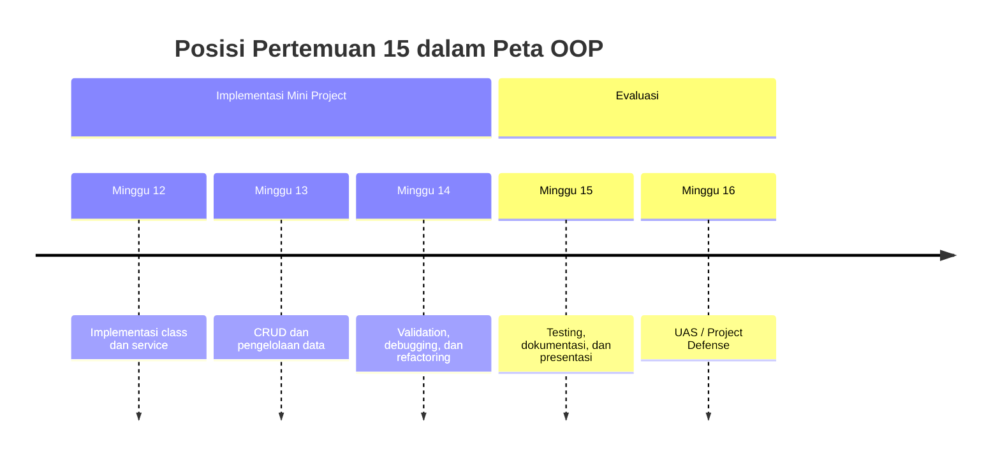
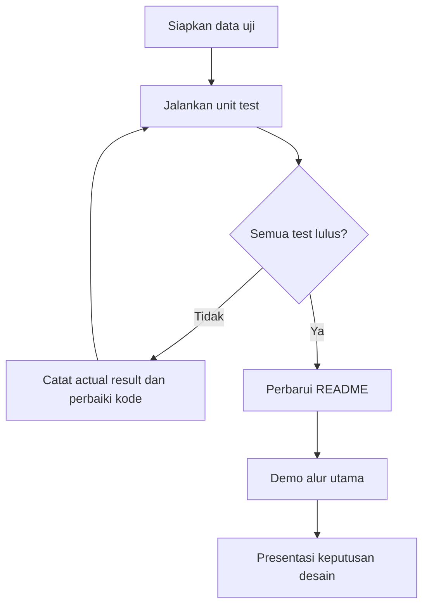

# Pertemuan 15 — Testing, Dokumentasi, dan Presentasi Mini Project

| | |
|:--|:--|
| **Mata Kuliah** | USA-WP2360214 — Pemrograman Berorientasi Objek |
| **Pertemuan** | 15 dari 16 |
| **Tanggal** | Rabu, 23 Desember 2026 |
| **CPMK** | CPMK116 |
| **Materi** | Test case, unit testing, dokumentasi, evaluasi aplikasi, dan persiapan demo |
| **Model Pembelajaran** | Project Based Learning / Case Based Learning / Praktikum |
| **Stack** | Python 3 |

> **Catatan penting:** Pertemuan 15 digunakan untuk memastikan mini project dapat diuji, dijelaskan, dan didemonstrasikan. Anda akan menulis test case, menjalankan `unittest`, memperbaiki dokumentasi, serta menyiapkan alur presentasi berbasis bukti.

---

## Daftar Isi

- [Pertemuan 15 — Testing, Dokumentasi, dan Presentasi Mini Project](#pertemuan-15--testing-dokumentasi-dan-presentasi-mini-project)
  - [Daftar Isi](#daftar-isi)
  - [1. Keterkaitan Pertemuan dengan RPS OBE](#1-keterkaitan-pertemuan-dengan-rps-obe)
  - [2. Capaian Pembelajaran Pertemuan](#2-capaian-pembelajaran-pertemuan)
  - [3. Pemantik Kasus: Program Harus Dapat Dibuktikan](#3-pemantik-kasus-program-harus-dapat-dibuktikan)
  - [4. Tujuan dan Level Testing](#4-tujuan-dan-level-testing)
  - [5. Test Case dan Expected Result](#5-test-case-dan-expected-result)
  - [6. Unit Testing dengan `unittest`](#6-unit-testing-dengan-unittest)
  - [7. Pengujian Berhasil dan Gagal](#7-pengujian-berhasil-dan-gagal)
  - [8. Dokumentasi Mini Project](#8-dokumentasi-mini-project)
  - [9. Persiapan Presentasi dan Demo](#9-persiapan-presentasi-dan-demo)
  - [10. Studi Kasus Evaluasi Mini Project](#10-studi-kasus-evaluasi-mini-project)
  - [11. Latihan Terbimbing](#11-latihan-terbimbing)
  - [12. Aktivitas Kelompok](#12-aktivitas-kelompok)
  - [13. Latihan Individu](#13-latihan-individu)
  - [14. Pemanfaatan AI sebagai Coding Assistant](#14-pemanfaatan-ai-sebagai-coding-assistant)
  - [15. Kuis Formatif](#15-kuis-formatif)
  - [16. Asesmen dan Penugasan](#16-asesmen-dan-penugasan)
  - [17. Persiapan menuju Pertemuan 16](#17-persiapan-menuju-pertemuan-16)
  - [18. Referensi dan Kode Praktikum](#18-referensi-dan-kode-praktikum)

---

## 1. Keterkaitan Pertemuan dengan RPS OBE

Pertemuan 15 mendukung **CPMK116** dan `SUB-CPMK11601` pada RPS:

> Mahasiswa mampu menguji, mendokumentasikan, mengevaluasi, dan mempresentasikan aplikasi OOP.

Pertemuan 12–14 menghasilkan mini project dengan class, CRUD, validation, exception handling, dan refactoring. Pertemuan ini mengubah hasil implementasi tersebut menjadi aplikasi yang dapat diverifikasi dan dijelaskan.



---

## 2. Capaian Pembelajaran Pertemuan

Setelah mengikuti pertemuan ini, mahasiswa mampu:

| No. | Kemampuan | Indikator |
| :-: | --------- | --------- |
| 1 | Menjelaskan tujuan testing | Membedakan pengujian manual dan otomatis serta memilih skenario yang relevan |
| 2 | Menulis test case | Menentukan input, langkah, expected result, dan actual result |
| 3 | Menggunakan `unittest` | Membuat test method dengan assertion dan menjalankannya melalui Python 3 |
| 4 | Mendokumentasikan aplikasi | Menulis tujuan, instalasi, cara menjalankan, fitur, dan batasan project |
| 5 | Menyiapkan presentasi | Menunjukkan alur fitur, bukti testing, keputusan desain, dan pembagian tugas |

---

## 3. Pemantik Kasus: Program Harus Dapat Dibuktikan

Mini project yang dapat dijalankan belum tentu memenuhi semua kebutuhan. Tim perlu menunjukkan bahwa operasi utama bekerja dan kondisi gagal ditangani.

Pertanyaan pemantik:

1. Fitur apa yang paling penting untuk diuji sebelum demo?
2. Bagaimana membuktikan bahwa kode duplikat ditolak?
3. Apa perbedaan expected result dan actual result?
4. Informasi apa yang harus tersedia agar orang lain dapat menjalankan project?
5. Bagaimana presentasi menjelaskan keputusan class dan relasi antar-object?

Testing bukan hanya mencari error. Testing juga mendokumentasikan perilaku yang diharapkan dari program.

---

## 4. Tujuan dan Level Testing

| Level | Fokus | Contoh |
| ----- | ----- | ------- |
| Unit test | Satu class atau method | `Ruang` menolak kapasitas tidak valid |
| Integration test | Interaksi beberapa object | Service menyimpan `Peminjaman` yang memakai `Ruang` |
| Acceptance test | Kebutuhan pengguna | Pengguna dapat membuat, membaca, dan memperbarui pengajuan |
| Manual exploratory test | Perilaku yang belum terwakili | Mencoba urutan menu dan input tidak terduga |

Untuk mini project Python, mulai dengan unit test pada aturan domain dan service. Tambahkan integration test untuk alur utama. Setiap test sebaiknya memiliki satu alasan kegagalan yang jelas.

---

## 5. Test Case dan Expected Result

Gunakan format berikut sebelum menulis kode test:

| ID | Skenario | Input | Expected result |
| -- | -------- | ----- | --------------- |
| TC-01 | Membuat ruang valid | `R001`, kapasitas `30` | Object tersimpan |
| TC-02 | Kapasitas tidak valid | `0` | `ValueError` |
| TC-03 | Kode duplikat | `R001` dua kali | `DataDuplikatError` |
| TC-04 | Mencari kode tidak ada | `R999` | `DataTidakDitemukanError` |
| TC-05 | Mengubah kapasitas | `R001` menjadi `40` | Kapasitas object menjadi `40` |

Test case yang baik menyebutkan kondisi awal, tindakan, dan hasil yang dapat diamati. Hindari expected result yang samar seperti “program berjalan dengan baik”.

---

## 6. Unit Testing dengan `unittest`

`unittest` menyediakan `TestCase`, assertion, dan test runner pada standard library Python.

```python
import unittest


class TestKalkulasi(unittest.TestCase):
    def test_penjumlahan(self):
        hasil = 2 + 3
        self.assertEqual(hasil, 5)

    def test_nilai_tidak_valid(self):
        with self.assertRaises(ValueError):
            int("bukan angka")


if __name__ == "__main__":
    unittest.main()
```

Assertion yang sering digunakan:

| Assertion | Penggunaan |
| --------- | ---------- |
| `assertEqual(actual, expected)` | Membandingkan dua nilai |
| `assertTrue(value)` | Memastikan kondisi benar |
| `assertIsNone(value)` | Memastikan hasil `None` |
| `assertRaises(Error)` | Memastikan exception terjadi |

Nama test method harus diawali `test_` agar ditemukan oleh test runner.

---

## 7. Pengujian Berhasil dan Gagal

Uji jalur normal dan jalur gagal. Jalur gagal bukan berarti test harus gagal; test dinyatakan berhasil jika program menghasilkan penolakan yang memang diharapkan.

```python
class TestRuang(unittest.TestCase):
    def test_kapasitas_positif_diterima(self):
        ruang = Ruang("R001", "Lab 1", 30)
        self.assertEqual(ruang.kapasitas, 30)

    def test_kapasitas_nol_ditolak(self):
        with self.assertRaises(ValueError):
            Ruang("R001", "Lab 1", 0)
```

Jangan menguji detail internal yang tidak menjadi kontrak class. Uji perilaku yang dapat diamati melalui public method, property, atau hasil exception.

---

## 8. Dokumentasi Mini Project

README mini project minimal memuat:

1. nama dan tujuan aplikasi;
2. anggota tim dan pembagian tanggung jawab;
3. fitur utama;
4. struktur folder atau module;
5. kebutuhan Python dan cara menjalankan program;
6. cara menjalankan test;
7. contoh alur penggunaan;
8. batasan aplikasi dan rencana pengembangan;
9. sumber referensi serta penggunaan AI.

Contoh instruksi yang dapat diverifikasi:

```text
python3 aplikasi.py
python3 -m unittest discover -s tests -v
```

Dokumentasi harus sesuai dengan kondisi kode. Jangan menuliskan fitur yang belum tersedia sebagai fitur selesai.

---

## 9. Persiapan Presentasi dan Demo

Susun presentasi dengan urutan berikut:

1. masalah dan pengguna sasaran;
2. kebutuhan utama dan batasan;
3. class, tanggung jawab, serta relasi object;
4. alur fitur utama;
5. potongan hasil testing;
6. demo skenario berhasil dan satu skenario gagal;
7. kendala, perbaikan, dan pembagian kontribusi;
8. kesimpulan dan pengembangan berikutnya.

Demo harus menggunakan data uji yang sudah disiapkan. Pastikan program dapat dijalankan dari kondisi awal dan siapkan langkah pemulihan apabila input demo tidak sesuai.

---

## 10. Studi Kasus Evaluasi Mini Project

Tim membuat Sistem Peminjaman Ruang. Fitur utama adalah menambah ruang, membuat pengajuan, mengubah status, dan menolak penghapusan ruang yang masih digunakan.



Bukti yang dikumpulkan:

- tabel test case;
- keluaran test runner;
- README yang dapat diikuti;
- diagram class atau struktur module;
- catatan perubahan setelah evaluasi.

---

## 11. Latihan Terbimbing

Gunakan contoh pada [`../code/pertemuan-15/test_peminjaman.py`](../code/pertemuan-15/test_peminjaman.py).

```bash
python3 ../code/pertemuan-15/test_peminjaman.py
```

Kemudian lengkapi scaffold pada [`../code/pertemuan-15/latihan_testing.py`](../code/pertemuan-15/latihan_testing.py).

```bash
python3 ../code/pertemuan-15/latihan_testing.py
```

Langkah latihan:

1. baca class domain dan kontraknya;
2. tulis tabel test case untuk jalur berhasil dan gagal;
3. lengkapi test method dengan assertion yang sesuai;
4. jalankan test dan catat hasilnya;
5. tambahkan satu bagian README mini project;
6. siapkan urutan demo berdurasi singkat.

---

## 12. Aktivitas Kelompok

Bentuk kelompok 3–4 orang:

1. pilih tiga fitur utama mini project;
2. buat minimal dua test case untuk setiap fitur;
3. tukarkan test case dengan kelompok lain untuk ditinjau;
4. jalankan test dan catat hasil aktual;
5. perbaiki satu bagian dokumentasi yang belum dapat diverifikasi;
6. lakukan simulasi presentasi dengan pembagian peran.

---

## 13. Latihan Individu

1. Buat minimal enam test case untuk mini project.
2. Implementasikan sekurang-kurangnya empat test method menggunakan `unittest`.
3. Sertakan satu test untuk exception dan satu test untuk perubahan state object.
4. Tulis README yang memuat cara menjalankan aplikasi dan test.
5. Buat catatan evaluasi berisi test yang lulus, masalah yang ditemukan, dan perbaikannya.
6. Siapkan penjelasan singkat tentang satu keputusan desain OOP.

---

## 14. Pemanfaatan AI sebagai Coding Assistant

**AI assistant (GitHub Copilot, ChatGPT, Claude, Gemini) boleh dipakai — dengan cara yang benar:**

**✅ Gunakan AI untuk:**

- Menjelaskan penggunaan assertion `unittest`.
- Mengusulkan variasi test case berdasarkan kontrak method.
- Mereview kejelasan README dan urutan demo.
- Membantu membaca pesan kegagalan test setelah Anda menjalankannya.

**❌ Hindari penggunaan AI untuk:**

- Menghasilkan seluruh test tanpa memahami expected result.
- Mengubah test agar lulus tanpa memperbaiki perilaku program.
- Menuliskan dokumentasi untuk fitur yang belum dibuat.
- Memasukkan source code atau data pribadi yang tidak boleh dibagikan.

**Etika di kelas ini:**

1. Anda wajib dapat menjelaskan setiap test dan alasan assertion yang digunakan.
2. Cantumkan penggunaan bantuan AI pada komentar kode atau refleksi. Contoh:

   ```python
   # Bantuan: GitHub Copilot — contoh penggunaan assertRaises untuk validation.
   ```

3. AI digunakan sebagai alat bantu pembelajaran. Anda tetap bertanggung jawab memahami, menjalankan, dan memverifikasi kode yang diserahkan.

---

## 15. Kuis Formatif

Kerjakan [Quiz Pertemuan 15](./02-Quiz-Pertemuan-15.md) setelah pembahasan dan praktikum. Kuis mengukur test case, `unittest`, dokumentasi, dan persiapan presentasi.

---

## 16. Asesmen dan Penugasan

| Komponen | Bentuk | Keterangan |
| --------- | ------ | ---------- |
| Test case | Tabel skenario | Input, kondisi awal, expected result, dan actual result |
| Unit testing | Program Python | Test berhasil dan gagal menggunakan `unittest` |
| Dokumentasi | README mini project | Instruksi menjalankan, fitur, struktur, dan batasan |
| Presentasi | Simulasi demo | Alur fitur, bukti test, keputusan desain, dan pembagian tugas |
| Kuis formatif | Uraian dan analisis kode | Mengukur pemahaman Pertemuan 15 |

Checklist:

- [ ] Test case mencakup jalur berhasil dan gagal.
- [ ] Test method memakai assertion yang sesuai.
- [ ] Test dapat dijalankan dengan Python 3.
- [ ] README sesuai dengan fitur yang tersedia.
- [ ] Demo memiliki data dan alur yang telah diuji.
- [ ] Setiap anggota memahami kontribusi dan keputusan desain.

---

## 17. Persiapan menuju Pertemuan 16

Pada Pertemuan 16, mahasiswa akan melaksanakan UAS / Project Defense.

Persiapkan hal berikut:

- pastikan semua test utama dapat dijalankan;
- finalisasi README dan diagram class;
- siapkan demo dari kondisi awal;
- siapkan pembagian presentasi dan jawaban atas pertanyaan desain;
- catat keterbatasan aplikasi serta pengembangan yang direncanakan;
- bawa bukti kontribusi dan hasil pengujian.

---

## 18. Referensi dan Kode Praktikum

Referensi:

- [Python Docs — unittest](https://docs.python.org/3/library/unittest.html)
- [Python Docs — Organizing test code](https://docs.python.org/3/library/unittest.html#organizing-test-code)
- [Python Docs — doctest](https://docs.python.org/3/library/doctest.html)
- [PEP 8 — Naming Conventions](https://peps.python.org/pep-0008/)

Kode praktikum:

- [`../code/pertemuan-15/test_peminjaman.py`](../code/pertemuan-15/test_peminjaman.py) — contoh domain dan unit test dengan `unittest`.
- [`../code/pertemuan-15/latihan_testing.py`](../code/pertemuan-15/latihan_testing.py) — scaffold latihan test case dan assertion.
